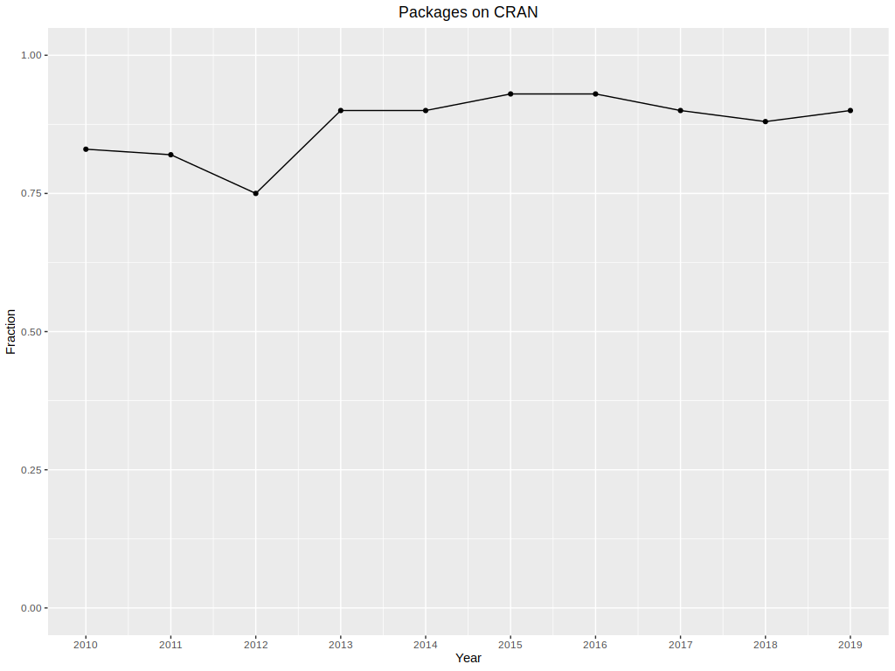

## Ways to reproduce articles in terms of release date and magazine

Authors: Mikołaj Malec, Maciej Paczóski, Bartosz Rożek

### Abstract

Reproducibility is a topic which is quite diminished in today's science world. Scientific articles should be current as long as possible. Their results should be achievable by readers and be the same. Thanks to that science and business world can take advantage of them. The more article is difficult to reproduce, the chance of using knowledge coming from it is smaller. Many researchers tried to define or give principles for reproducibility. There is article published in 2016: "What does research reproducibility mean?" [@Goodman2016] which tried to warn about reproducibility crisis. Article in 2017: "Computational reproducibility in archaeological research: basic principles and a case study of their implementation" [@Marwick2016], compared computational reproducibility to archaeological research and give guidelines for researches to use reproducibility in computing research. But these are just two of many articles about reproducibility. Some articles are about tools and techniques for computational reproducibility [@Piccolo2016]. They encourage researchers to compute data using environments like Jupiter [@Kluyver2016] or R markdown [@Marwick2017]. Thanks to that readers can reproduce finding on their own. What’s new about our approach to the subject of reproducibility is focusing on how can release date and magazine affect the amount of work needed to fully reproduce code or is it even possible. A comprehensive comparison of scientific magazines in terms of reproducibility is yet to be created and this article is our best effort to make it happen.

### Methodology

Our work was focused on analyzing journals as a whole, therefore we decided to choose three well known magazines: R Journal, JMLR Machine Learning Open Source Software and Journal of Statistical Software. Our aim was to define features that incense the reproducibility of a journal's article as well as the ones that impede it. We would like to create a list of rules that improve and enable reproducibility.

We divided the magazines, every one of us get one to look up. Every one of us get the different approaches to their magazine. Mostly it considered getting familiar with the magazine, like their style or rules for applying the article, but most importantly we looked at random articles to get a fill how one could replicate the results and would it worked.

Because reproducibility can be achieved in many ways, we didn't make specific rules when an article can be replicated. However, we believe that there are some features which help in replicating an article. An article is more likely to be able to be reproducitable if it has such features. We weren't keen on replicating whole articles. We were more interested in looking for features, which would help in reproducibility of an article.

Features mostly taken into consideration:

* Source code included in an article or added as a file ready to download

* Accessibility of data used in an article

* Availability of packages presented and used in an article

* Information about device and environment

We used many methods to extract quantity and quality of these features from magazines. In some cases, information was easy to get manually, so no more code was written.

In another case a scraper written in Python helped us collect required information. Scraper  for R and if the is on Cran respiratory. If not it checks when package was (for how long was this article was reproducible).

In case of JMLR information about link to author respiratory was by coping text on and counting words 'abs' and 'code'. All articles have '[abs]' and some has '[code]' if they have link to author respiratory.

We compare them by pointing their strengths and weakness, which we discovered. It will be automatically a set of guidelines for magazine publishers and researches which features should be included so their future articles would be reproducible easily.

### Results

R Journal

'The R Journal is the open access, refereed journal of the R project for statistical computing. It features short to medium length articles covering topics that should be of interest to users or developers of R.
The R Journal intends to reach a wide audience and have a thorough review process. Papers are expected to be reasonably short, clearly written, not too technical, and of course focused on R' ~ R Journal

It is well known magazine, which has a clear page and it is easy to find every article in archive which contains all previous releases. Every article has it own page with features such as short description, necessary CRAN packages and supplementary materials. List of packages contains links to CRAN. Here the first problem is spotted - not every package has current version on CRAN or the page has error 404 - "Object not found". When package is not easy to download, install and use, the reproducibility is significantly harder and when it is unobtainable reproducibility is simply impossible. The part of packages available on CRAN is shown in Figure 1.  As it is said on the main page of R Journal - 'Authors of refereed articles should take care to: (...) provide code examples that are reproducible', in 2016 'supplementary materials' were introduced. It contains link to download additional files such as R scripts, that allow reader to reproduce things contained in article e.g. plots and calculations. The link is located in every article's page and part of articles having it is higher every consecutive year (shown in Figure 2).

  

Journal of Statistical Software
As stated on journal website “The Journal of Statistical Software (JSS) publishes open-source software and corresponding reproducible articles…” articles published by JSS should be easy to reproduce. By going through all available articles we want to examine how much effort is put into keeping JSS articles reproducible.
Journal of Statistical Software first started publishing in 1997 and gradually increased both number of articles per year and percentage of articles discussing R. Starting from 13 articles per year they peaked at 2011 almost crossing barrier of 100 articles published that year (Figure 3). 

Thankfully growing scale of journal did not lead to less attention given to topic of reproducibility. Each of 744 articles discussing R packages is published alongside with R file containing example code and described version of R package. However as stated at JSS website, journal does not serve as a software repository for software distribution, so it is not possible to update code or articles once they were published. That is why JSS suggest that software should also be available in standard open-source repository. While trying to reproduce article, it is really discouraging to discover that described package in no longer available on CRAN. Nevertheless packages appearing in JSS articles are mostly available to download from CRAN (Figure 4).

Another interesting aspect of reproducibility of R related articles is difference between date of submission and publication. In other words how outdated was article when it appeared on JSS and if it is more difficult to reproduce such articles. Articles published and 2020 were on average submitted almost 3 years ago, which may result in some issues while traying to reproduce given code (Figure 5). 

In perfect scenario the version of package on which the article is based should always work with example code, therefore any updates on CRAN would lower the reproducibility. However in reality many things can change - dependencies can get updated or current R version may change. Based on that we will look at package updates as ability to adapt and keep software compatible with past code, and treat them as feature increasing reproducibility. As presented on figure average time since last update of package described in JSS article is not unreasonable and should not pose a threat to reproducibility  (Figure 6).

JMLR

The Journal of Machine Learning Research (JMLR) is an international forum for electronic and paper publication of high-quality scientific articles in all areas of machine learning. All published works are available free of charge on the Internet.

For the most part, the authors do not include code or references to their sites. Magazine administrators encourage you to post your code.

Unfortunately, few authors apply to it. This does not mean that content of the articles is unreliable, but it makes articles unreproducible. The items included in the articles that should be reproduced are experiments on data sets and the code that was used to create the final tables / charts.

However, there are articles that have the reference [code]. Most often it refers to the author's repository (e.g. GitHub). Reproduction of such an article then depends on the author and how he created his code. Links began to appear from 2011 (the first article was in 2001). Over the years, there are more and more articles with links with code, but these are still a minority. Administrators have created a special tab with articles that have a link with a code, probably to popularise such links.

Fortunately in the newest article (still in production) has record links with code. More than 20 and near a half of posted articles have this link. There could be a drastic change for this magazine.

Summary and conclusions

Careful analysis of mentioned journals revealed which features while writing and publishing article lead to boost to reproducibility and which make task of code reproducing more difficult. Good practices such as publishing articles alongside with R file containing example code and supplementary data. Unified way of naming and hosting those files is also welcomed. Solutions like distributing articles including links to authors Github profile or to described package CRAN website are increasing journals reproducibility. Journal board may also take actions like encouraging authors to ensure if package is compatible with published code or simply supplying readers with easily accessible contact with writer. One thing that journals lack is clear way of informing readers whether article is ready to be reproduced, for example if all required files and data is available for download. Below is our vision of accomplishing that  (Figure 8). 

  