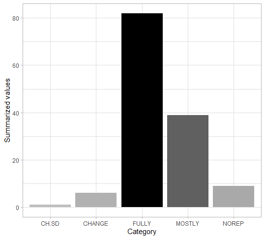

## Reproducibility of outdated articles about up-to-date R packages

*Authors: Zuzanna Mróz, Aleksander Podsiad, Michał Wdowski (Warsaw University of Technology)*

### Abstract

The inability to reproduce scientific articles may be due to the passage of time. Factors such as changes in data or software updates - whether author-dependent or not - may make it difficult to reproduce the results after a long time. It would seem obvious that old scientific articles about R-packages are usually difficult to reproduce. But what if this package is still supported? In what way the continuous support changes the possibility of reproducing these articles? In this article we will look at examples of still updated R-packages from 2010 or older in order to analyse the type and degree of changes.

### Introduction and Motivation

The problem of the inability to reproduce the results of research presented in a scientific article may result from a number of reasons - at each stage of design, implementation, analysis and description of research results we must remember the problem of reproducibility - without sufficient attention paid to it, there is no chance to ensure the possibility of reproducing the results obtained by one team at a later time and by other people who often do not have full knowledge of the scope presented in the article. Reproducibility is a problem in both business and science. Science, because it allows credibility of research results [@McNutt679]. Business, because we care about the correct operation of technology in any environment [@Anda407]. 
As cited from “What does research reproducibility mean?” [@Goodman2016];
“Although the importance of multiple studies corroborating a given result is acknowledged in virtually all of the sciences, the modern use of “reproducible research” was originally applied not to corroboration, but to transparency, with application in the computational sciences. Computer scientist Jon Claerbout coined the term and associated it with a software platform and set of procedures that permit the reader of a paper to see the entire processing trail from the raw data and code to figures and tables. This concept has been carried forward into many data-intensive domains, including epidemiology, computational biology, economics, and clinical trials. According to a U.S. National Science Foundation (NSF) subcommittee on replicability in science, “reproducibility refers to the ability of a researcher to duplicate the results of a prior study using the same materials as were used by the original investigator. That is, a second researcher might use the same raw data to build the same analysis files and implement the same statistical analysis in an attempt to yield the same results…. Reproducibility is a minimum necessary condition for a finding to be believable and informative.”

### Related Work

Other notable articles about reproducibility include “Variability and Reproducibility in Software Engineering: A Study of Four Companies that Developed the Same System” [@Anda407], “Reproducible Research in Computational Science” [@Peng1226] and “A statistical definition for reproducibility and replicability” [@Patil066803].
“Variability and Reproducibility in Software Engineering: A Study of Four Companies that Developed the Same System” focuses on the variability and reproducibility of the outcome of complete software development projects that were carried out by professional developers.
“Reproducible Research in Computational Science” is about limitations in our ability to evaluate published findings and how reproducibility has the potential to serve as a minimum standard for judging scientific claims when full independent replication of a study is not possible.
“A statistical definition for reproducibility and replicability” provides formal and informal definitions of scientific studies, reproducibility, and replicability that can be used to clarify discussions around these concepts in the scientific and popular press.
In our article we focus on the reproduction of old scientific articles on R and packages, which are still being developed. We want to explore how the passage of time affects the ability to reproduce results using the currently available updated tools. We are therefore testing backward compatibility for different packages and checking what affects the reproducibility of the code.
We were unable to find scientific articles on this exact issue. There are articles that give ways to measure reproducibility, as well as articles about packages that help with reproduction. But there are yet no articles that summarize the set of packages in terms of their reproducibility. 

### Methodology

We have checked 13 articles with 16 R packages from at least 10 years ago to ensure that the code chunks match these categories:

* ade4: Implementing the Duality Diagram for Ecologists [@ade4]
* AdMit: Adaptive Mixtures of Student-t Distributions [@admit]
* asympTest: A Simple R Package for Classical Parametric Statistical Tests and Confidence Intervals in Large Samples [@asymptest]
* bio.infer: Maximum Likelihood Method for Predicting Environmental Conditions from Assemblage Composition [@bio]
* deSolve, bvpSolve, ReacTran and RootSolve: R packages introducing methods of solving differential equations in R [@solve]
* EMD: Empirical Mode Decomposition and Hilbert Spectrum [@EMD]
* mvtnorm: New Numerical Algorithm for Multivariate Normal Probabilities [@mvtnorm]
* neuralnet: Training of Neural Networks [@neuralnet]
* party: A New, Conditional Variable-Importance Measure for Random Forests Available in the party Package [@party]
* pls: principal Component and Partial Least Squares Regression in R [@pls]
* PMML: An Open Standard for Sharing Models [@PMML]
* tmvtnorm: A Package for the TruncatedMultivariate Normal Distribution  [@tmvtnorm]
* untb: an R Package For Simulating Ecological Drift Under the Unified Neutral Theory of Biodiversity [@untb]

All articles come from the R Journal and Journal of Statistical Software.

In our research on the subject we have decided to divide the code from the articles into chunks, according to the principle that each chunk has its own output, to which we give an evaluation according to the criteria we have set. In the process of testing and reproducing various articles, we have identified five categories, and marked them as follows:

 * **NO REP** (no reproducibility, either due to changes through time or problems with the article that had already been there, regardless of differences in R across years),
 * **HAD TO CHANGE STH** (when we had to modify the code to produce correct results that will work in our current R version and can be neatly displayed in a document generated by markdown),
 * **MOSTLY REP** (when the results were not ideally identical to the original, but in our opinion the chunks were working according to their  purpose in the context of their article),
 * **HAD TO CHANGE & STILL SOMEWHAT DIFFERENT** (the code had to be changed and the results were not perfect, but they were correct in the terms of the aforementioned category **MOSTLY REP**, but we could consider them as satisfactory),
 * **FULLY REP** (no reproductive problems - the results were identical to original results shown in the article).
 
These criteria can be considered not subjective, but setting such boundaries does not cause confusion in categorisation, thus we decided to use them in order to research and describe the introduced number of articles about R packages from at least 10 years ago.

In some of the articles we found specific types of problems:

 * There was no access to data or objects referred to in later calculations,
 * The results were similar to the original, but the differences were most often due to the random generation of objects. This error was usually reduced later, when the package created some kind of data summary - then the result had a very small relative error with the original result.
 * The names of individual variables or some of their attributes changed (e.g. column names in the data frame).
 
When data or objects were unaccessible and there could not be found any alternative or history of the dataset, we classified this chunk as **NO REP**. What is more, in most cases chunks dependent on such objects automatically became **NO REP** too. However, if the code was only partially dependent on the lost dataset, it was classified as **MOSTLY REP**.

When we stumbled upon problems with randomly generated objects, where the values were obviously different, but after aggregating the data summaries were close to original, such chunks were marked as **MOSTLY REP**. As we were reproducing various articles, this has become quite significant problem that a large number of publications were struggling with.

If data could be somehow fixed - for example by changing column names, it was given **HAD TO CHANGE STH** mark, and the dependent chunks' marks were not influenced by this change, which theoretically was allowing them to be marked even as **FULLY REP**.

### Results

[Here](1-5-files/raport.html) can be seen the in-depth report. Below are the summarised results of our research.

As it can be seen, the vast majority of chunks are fully reproducible. Even if the chunk is not executed identically to the original one, in most cases it differs only slightly, and the package itself serves its purpose. 88.3% (121/137) of the chunks are executed perfectly or correctly (within our subjective category of being acceptably incorrect), while 93.4% (128/137) of the chunks are working well enough not to throw errors. In practice, only 6.6% (9/137) of chunks were completely irreproducible, which would seem surprising for more-than-a-decade-old articles. 

However, given that we have focused particularly on packages that are still being developed, this is quite a feasible result. This can be seen quite clearly by the percentage of the chunks that required minor changes or slightly differed from the results shown in the article - there were 33.6% (46/137), which is clearly a result of the updates or changes that occured in the ever evolving R environment. Of course during our research we stumbled upon numerous packages that have not been updated since years or that have even been deleted from CRAN repository, so they were not within our field of interest. Nonetheless, we would like to emphasize that the results should not suggest that one-decade-old articles are reproducible.

### Summary and conclusions 

To sum up, in most cases the packages we examined performed their tasks correctly. The packages themselves have of course changed, but its idea remained the same. Usually new features or improvements were added, but the idea behind the package was the same as it used to be. As a result, most of the packages still managed to cope with the problems of the old ones, in reproduction usually suffering from missing external data or unavoidable changes in the R language itself. All in all, almost in all cases the package does the job in spirit, differing from its old good ways only in vague confusion caused by neverending winds of change.

It can therefore be concluded that most packages that we’ve checked are fully backward compatible, which is good programming practice. In order to increase the reproducibility of articles, this should definitely be taken care of. Additionally, authors should include supplements to their articles, that always help you understand and copy the code.
