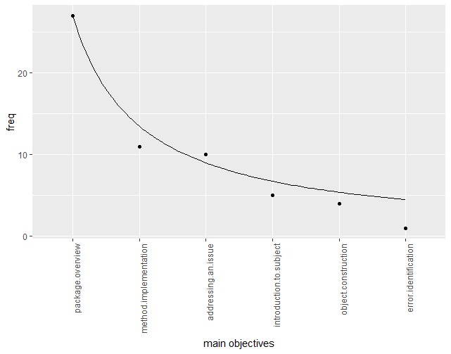
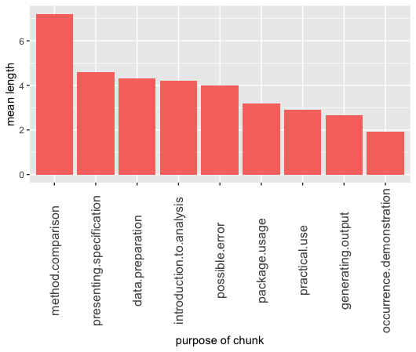
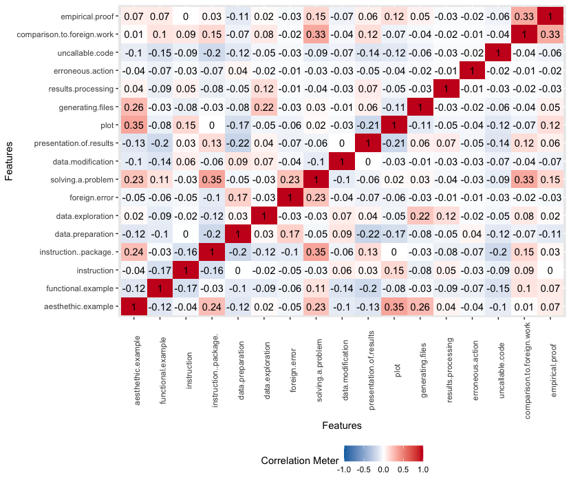

## Correlation between reproducibility of research papers and their objective

*Authors: Przemysław Chojecki, Kacper Staroń, Jakub Szypuła (Warsaw University of Technology)*

### Abstract

Reproducibility is a quality of research crucial for modern science. But is perfect reproducibility an ultimate requirement for every element of scientific process to be valid? Not necessarily, it is possible that important factor in this case will be purpose of given part of research. In this article we will attempt to provide a system of analyzing reproducibility of scientific papers involving mainly the purpose of theirs elements and search for dependencies between those variables.

### Introduction and Motivation
It is common knowledge that reproducibility is a way for science to evolve. It is the heart of the scientific method to revisit pre-existing measurements and to try to reproduce its results. However, the term „reproducibility” itself, as well it is crucial to the scientific methodology, it can be also universal at the expense of unambiguousness and usability. \
For the purpose of this paper we will have recourse to the definition introduced by ACM:\
"*Reproducibility -  The measurement can be obtained with stated precision by a different team, a different measuring system, in a different location on multiple trials. For computational experiments, this means that an independent group can obtain the same result using artefacts which they develop completely independently*".\
This particular definition illustrates perfectly how in the course of establishing the meaning of term „Reproducibility”, the level of importance of auxiliary measurements and settings of the experiment to the overall results is omitted. It is notably significant misconception, especially in the experiments from the field of  computational science, when reproducing or even maintaining precise operating conditions is usually impossible.\
In the following chapters we will attempt to perform an analysis of reproducibility of the papers submitted to the RJournal, regarding especially presumed objectives of enclosed auxiliary computations and artifacts (i. e. code chunks) in overarching structure of a given paper.\
### Related Work
Although there are many research papers related to this article, the following three could be perceived as a "basis" for our study. \
1. [@Mendez2019defRepr] provide a definition of reproducibility this article uses, and distinguish it from replicability. \
2. [@Goodman341ps12] define multiple interpretations of reproducibility. It further divides and classifies reproducibility, and provides a basis on how one can do it. \
In their search the authors have not encountered other research papers that study the aspect of reproducibility this article focuses on. If said papers do not actually exist, then this article could provide insights on previously unexamined aspects of reproducibility.\


### Methodology

#### General approach
The methodology presented in the following section is a direct consequence of how we approach scientific article as an experience devised by an author for the reader. Our focus is to determine, how author alter this experience by using code chunks instead of plain text. In other words, we ask a question "Why have the authors used the `R` code?"
Assumption that execution of enclosed code is an integral part of said experience and by extension code chunks supposed to be reproducible for reader to percept the article as intended seems to be reasonable.
However it may not be correct in every case. 
Let us consider a situation, where generated output is essential to the thesis stated in the article. If the code is irreproducible, the reader cannot believe the authors. It devastates their credibility.
But what if a goal of the code was to illustrate general tendency in data and output is reproducible only to some degree? Then it may still fulfill its purpose in the article and the lack of full reproducibility does not intefere with experience for a reader.
Following this thought process inevitably leads to new questions, f.e. is it possible for executable code to serve its purpose in article while being completely unreproducible?

To explore this topic we decided to focus on objectives of code in scientific papers.
We have decided that the most accurate and reliable way of finding the purposes of code chunks in scientific articles is by examples. That is why we have analyzed over $30$ papers from `The R Journal` [https://journal.r-project.org]. \
We have gathered the code chunks into groups and considered a three degree of purpose: the whole article, the group of chunks, and the single chunk of code. We have prepared a list of possible purposes for every level and assign them to our examples. The whole list of purposes is explained in the next chapter. \
Then we have produced our measure of reproducibility, which is also detailed later. \


#### Objectives 

Since this article is centred around objectives, our understanding of them is of utmost importance. That is why we divided them into three categories, further divided into classes. We described them in detail in the sections below. To limit our individual biases in assessing what the intended objective is, we referred to relevant paragraphs in the original research paper. It has to be noted, that an object (let it be an article, a group of chunks or a chunk) can have more than one objective.

##### Main Objectives
Both code chunks by themselves and performed computations corresponding with them can provide wide variety of information. However we can identify and describe reasons why the programming language is present in general in a given paper. All code chunks serve together as a vital element supporting narration of the article and its objective usually can be identified with main objective of narration in article as a whole.

We systematized main objectives and grouped them into the following general objectives:

* package overview - presenting general structure of specific package, providing example of aplications implemented functions and discussing its performance
* object construction - presenting process of constructing and developing virtual object
* introduction to subject - using performing code as a complement to educational resource concerning given topic
* method implementation - presenting in-depth process of developing solution and explaining it
* addressing an issue - presenting solution to specific scientific/computational problem
* error identification - recognising and presenting error in existing package, possibly submit alternative solution covering mentioned error 

##### Intermediate Objectives

Since code chunks in research papers seldom appear on their own, but rather are part of a larger group of chunks serving a certain purpose. For instance, let there be three chunks, named A, B, and C. Let A load data from an external source, B modifies the data and extract a subset of it, and let C generate a plot, based on the data obtained from the two previous chunks. While each chunk has its own distinct objective, together they have at least common one - in this example this is generating a plot. Plot generated by A, B and C can be used to compare between performance of various functions. These chunk group's objectives we define as intermediate objectives.

We systematized intermediate objectives and grouped them into the following general objectives:

* package usage - examples on how does an R package operate, how one can use functions provided by the package, in what manner output is generated etc.
* practical use - underscoring of the practical usage of code used in code chunks in that group.
* method comparison - comparison between functions and/or methods. For example, a microbenchmark between base R functions and functions from a presented package.
* generating output - generating an output, for example plots, .csv files, images etc.
* presenting specification - presentation on what package specification looks like.
* data preparation - preparation of data that may be used later in the paper. This includes both loading the data and modifying it.
* occurrence demonstration - demonstration of an occurrence described earlier in the article. 
* introduction to analysis - introduction to analysing a certain topic and data related to it.
* possible error - description of a possible error one can encounter and how one can solve it.

##### Chunk Objectives

Each chunk has a role - it serves one or more purposes, which we define as chunk objectives. 

We systematized chunk objectives and grouped them into the following general objectives:

* aesthethic example - an example showcasing how output generated by the code chunk looks like. 
* functional example - an example of how functions showcased in the chunk work.
* instruction - an instruction on how one achieves desired effect using R code.
* instruction (package) - same as above, but using functions from the package introduced in the article containing the chunk.
* data preparation - preparation of data for the following chunks.
* data exploration - merging, subsetting, summarisation of data and other types of data manipulation used in order to explore data.
* foreign error - turning attention to an error in work done by other author(s).
* solving a problem - description of how one solves a given problem using R code.
* data modification - modifying data in order to achieve desired effect.
* presentation of results - presenting result of computation within the article. This can be done by specific summarising functions (e.g. summarise) or simply printing base R vectors.
* plot - plotting graphs in the article.
* generating files - generation of files, this includes graphical, text and other files.
* results processing - processing of results in order to improve their aesthethic value or to make them more readable.
* erroneous action - presenting code that does not run properly as an example of an action should be avoided.
* uncallable code - code that, in principle, is impossible to run. This includes pseudocode.
* comparison to foreign work - comparation of authors' work (functions, methods etc.) with work of others, that achieves the same effect. This includes benchmark performance comparisons.
* empirical proof - validation of what is mathematically described in earlier sections.

#### Reproducibility

The sole purpose of this paper is to explore interactions between purposes of code chunks usage and reproducibility aberrations. That requires a system of classification of reproducibility.
We provide simple categorization of forms of reproducibility into the 6 types. This classification system shall serve as a tool for initial phase of our analysis, thus it is not directly involving purpose of discussed code at this stage. 

* 1 - perfect reproducibility - code perform flawlessly and after initial configuration precise output is recreated
* 2 - margin of error - after initial configuration code provides output matching expectations within acceptable margin of error (f.e. difference in rounded decimals, default parameters of generated graphics)
* 3 - editorial correction - code requires minor corrections to be executable and viable due to editorial error or changes in naming conventions
* 4 - environment setup - code to execute properly requires major and time-consuming setup and environment changes or may be not able to provide expected results at all
* 5 - unreproducible - code undoubtedly cannot be reproduced (f.e. due to unavailable data, unavailable package, unsupported fatal error) 
* -1 - missing point of reference - article does not provide (or vaguely provides) expected performence and determining reproducilibity is impossible


#### Tables description
For analysis purposes we have gathered data from randomly selected scientific papers in `The R Journal` and arranged them into 3 distinct tables stored in 3 .csv files. 

##### Table of articles
Every row represents one article contains information about sum of lengths of the code chunks in given article and its general purpose, one-hot encoded (6 categories).


| length | package overview | object construction |  ...  | error identification |
|--------|------------------|---------------------|-------|----------------------|
| 15     | TRUE             | FALSE               |  ...  | FALSE                |
| 2      | TRUE             | TRUE                |  ...  | FALSE                |
| 9      | TRUE             | FALSE               |  ...  | FALSE                |


##### Table of groups
Every row represents one group of chunks and cointains information about sum of lengths of the code chunks in given group and its general purpose, one-hot encoded (9 categories). 

| length | package usage | practical use |  ...  | possible error |
|--------|---------------|---------------|-------|----------------|
| 15     | TRUE          | FALSE         |  ...  | FALSE          |
| 2      | TRUE          | TRUE          |  ...  | FALSE          |
| 9      | TRUE          | FALSE         |  ...  | FALSE          |


##### Table of chunks
Every row represents one chunk and contains information its length, reproducibility and its general purpose, one-hot encoded (17 categories). 

| length | reproducibility scale | aesthethic example |  ...  | empirical proof |
|--------|-----------------------|--------------------|-------|-----------------|
| 5      | 2                     | FALSE              |  ...  | FALSE           |
| 5      | 2                     | FALSE              |  ...  | FALSE           |
| 5      | 4                     | FALSE              |  ...  | FALSE           |

##### Length assessment
To objectively determine a length of code we have decided to count it according to the following rules: \
* ignore all empty and commented lines \
* ignore assignments, unless it contains the execution of a function \
* ignore executions of functions `library` and `data` \
* ignore lines containing only parenthesis \

### Results
In this section, we perform a basic analysis of the data we have gathered during our study.

#### Preliminary analysis

The data can be loaded by:

```{r, eval=TRUE, cache=TRUE, include=TRUE}
art <- read.csv("./1-6-files/articles.csv")
chnk <- read.csv("./1-6-files/chunks.csv")
grp <- read.csv("./1-6-files/groups.csv")

library(dplyr)
library(ggplot2)
library(reshape2)
```

Frequency of every reproducibility score can be obtained by:

```{r, eval=TRUE, cache=TRUE, include=TRUE,  warning=FALSE, message=FALSE}
# frequency of every reproducibility score
chnk %>% pull(reproducibility.scale) %>% table()
```

As we can see, most chunks were fully reproducible, with total areproducibility being the second most common occurence. 
 What further can be analysed is how reproducible is each objective, how often it occurs and the total length of each objective (i.e. sum of length in lines of all chunks containing specific objective). This analysis can be achieved by the following code:

```{r, eval=TRUE, cache=TRUE, include=TRUE, warning=FALSE, message=FALSE}
# mean reproduciblity scale score for reach objective
mean_repr <- chnk[-1,] %>% 
  sapply(function(x){x*chnk[-1,]$reproducibility.scale}) %>% data.frame %>%
  select(-reproducibility.scale, -length)
mean_repr[mean_repr==0] <- NA
mean_repr[mean_repr==-1] <- NA
mean_repr <- summarize_if(mean_repr, is.numeric, mean, na.rm = TRUE) %>% melt
colnames(mean_repr)[2] <- "mean_repr_score"

# length for every objective
licznik <- chnk %>% select(-length, -reproducibility.scale) %>% summarise_all(sum) %>% melt
tot_length <- chnk %>% select(-reproducibility.scale) %>% melt(id.vars = "length") %>%
  filter(value) %>% select(-value) %>% group_by(variable) %>% summarise(total_length = sum(length))
mean_repr <- inner_join(inner_join(tot_length, licznik), mean_repr, by = "variable")
arrange(mean_repr, mean_repr_score)
```

As it is shown, objectives vary in their mean reproducibility score with examples scoring worse than instructions and results presentation better than plots. 


On the following plot higher the value of variable - worst level of reproducibility. Exact values should not be interpreted as continuous variable, legitimite information can be obtained by analyzing order of categories sorted with regard to their avarage reproducibility score.


\

On this plot we can observe difference in values of `plot` and `presentation of results`. Clearly `plot` is more likely to be irreproducible than a showcase of results in any other way 
Moreover, both `aesthetic example` and `functional example` values are almost the highest, what may indicate that in general authors put relatively low effort into them, since their perfect reproducibility may not be essential to the article as a whole.
During our analysis `result processing` chunks were encountered only $4$ times and all of them were reproducible, which in our opinion is not a basis for stating any meanigful conclusions.


#### Frequency of objectives

Next, we will visualize the frequency of occurences of every objective, for every category.





After the objectives are sorted with regard to their frequency, one can see that they appear to be similar to 1/x function plot. It indicates that certain objectives are far more frequent than others, while the less popular ones remain at similar levels of frequency.


#### Average length

Average length of a code chunk with a specific objective:


\

`erroneous action` generally requiring a small amount of code suggests that standard aproach to this objective is simply execution of one line of code, just to trigger the error. \


Average length of a group of chunks with a specific objective:


\

The code for `method comparison` has to show a solution offered by a described package as well as how to approach such a problem with other sources. What is more, the author has to show the differences between them, which as we can see usually requires additional lines of code. \


Average length of all of the code chunks in an article with a specific objective:


\

Clearly `error identifaction` articles include the gratest amount of code, probably for the same reasons as `porownanie.metod` in the group objectives. It can be space and timeconsuming to showcase the solution to a problem with a package, without a package and point out precisely the difference between them. \


#### Objectives correlations matrices


Two important conclusions can be drawn from the correlation matrix. First - there is no strong correlation between individual objectives, which may imply that the objectives proposed by us do not overlap heavily. Second - correlation between the reproducibility score and individual objectives is also not that high. Because of that we cannot be certain whether there is a clear link between reproducibility score and objective of any given chunk. However, after closer inspection of the following matrices, we can formulate few additional general observations.



\
On featured chunks objectives correalation matrix we can observe how:
* There is a positive correlation between `comparison to foreign work` and `empirical proof`. However it is rather an effect of a small amount of data. There were only $7$ instances of `comparison to foreign work` and $4$ of them are also `empirical proof`.
* We found no correlation between `erroneous action` and `comparison to foreign work`. When an author shows a problem in someone's code or package, he does not compare it to his own. He would rather show it in the next chunk.


\
On featured intermediate objectives correalation matrix we can observe how:
* It is less likely to find a group that is both dzialanie.pakietu and przygotowanie.danych. It is because in the preparation of data most of the code is in plain `R` or other popular libraries and not in the one shown in the paper. \
* There is a big negative correlation between dzialanie.pakietu and prezentowanie.specyfikacji. When there is a code that is prezentowanie.specyfikacji, it is mostly a theoretical approach, while the dzialanie.pakietu underscore the practical approach. \


\
On featured main objectives correalation matrix we can observe how:
* All of the researched article present a package, therefore the correlation is not defined for it. \
* Articles serving as an introduction to the topic are also implementing additional features. \


### Summary, conclusions and encouragement
For purpose of research described in this article we developed an intuitive system of objectives classifaction of singular code chunks, groups of chunks and whole scientific papers concerning development of programming languageges (in this case - `R`). Initial analysis of the data acquired by using mentioned system may imply that lists of objectives proposed by us do not overlap heavily and therefore they indeed can be used as valid scientific method. 
To sum up the effects of applying this method for a selection of the scientific articles from `The R Journal`, correlation between the reproducibility score and individual objectives is not significantly high. It may indicate that dataset considered in this paper is simply not extensive enough. We sincerely encourage readers to perform their own analysis on wide variety of scientific articles not covered in this paper, preprocessed using developed system.

