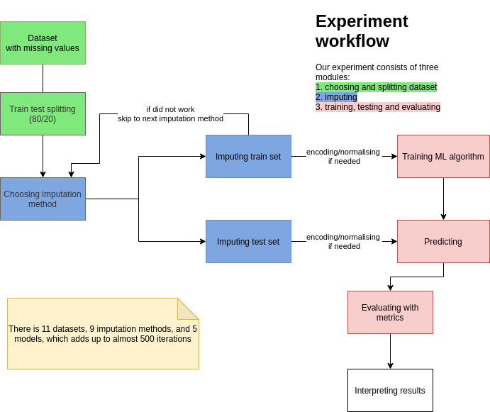
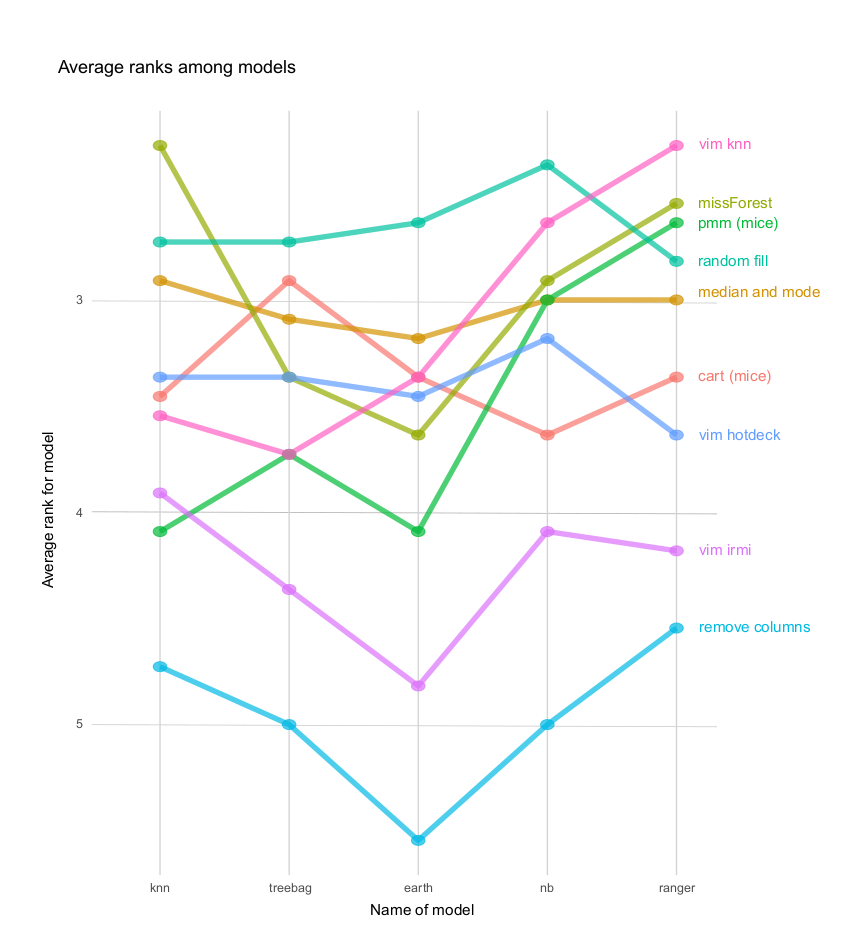
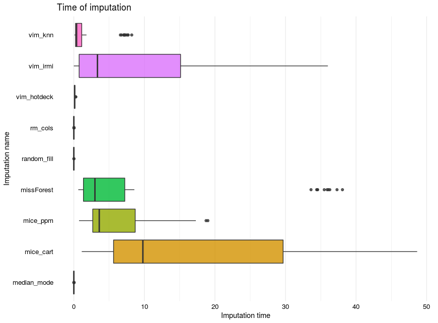

## Default imputation efficiency comparison

*Authors: Jakub Pingielski, Paulina Przybyłek, Renata Rólkiewicz, Jakub Wiśniewski (Warsaw University of Technology)*

### Abstract

Imputation of missing values is one of the most common preprocessing steps when working with many real-life datasets. There are many ways to approach this task. In this article, we will be using  3 different simple imputation methods and 6 more sophisticated methods from popular R packages but without changing or tuning their parameters. We will test how their imputation affects the score of models trained on classification datasets. Effectiveness of the imputations will be checked by measuring models' performance on different measures but focusing on one which is sensitive to class imbalance - Weighted TPR-TNR. We will try to answer the question of whether simple imputation methods are still insignificant for more complex methods with default parameters, or maybe in this case simple imputation methods are not only faster but more efficient?

### Introduction and Motivation

Data is becoming more and more useful and valuable in various industries. Companies started to gather data on a scale that has not been imagined before. But with more data comes more problems. One of them is missing values. Omitting observations affected by them is one way, but why doing it while the information that they possess might be still valuable? This is why the imputation of missing values is essential when dealing with real-life data. But there are various methods of imputation and for an inexperienced user, it might be confusing and hard to decide which one to use. It may be even harder to design metrics that allow comparing methods between them. We decided that we should judge the effectiveness on the performance score of the model which has been trained on dataset imputed using some method. So when model trained on data imputed with $method_1$ has a higher performance score than the same model trained on the same data but imputed with $method_2$, that means that $method_1$ is more effective. \
Sometimes omitting rows or even removing columns and NA can give satisfying results but the majority of the time, it is worse than simple imputation methods. For simple tasks mean/median and mode are fast and computationally efficient and can give good results. But they have no variance and because of that can give worse results on complex datasets than more robust methods. On the other hand, more complex models like for example random forests are in theory more advanced and despite adding algorithmic complexity and computational costs to training procedure, are thought to be better in quality of imputation. So models that had been trained on data that has been previously imputed with more complex methods are more likely to achieve higher performance scores. \
Furthermore, parameter changing and tuning can be difficult and time-consuming. Deciding which method is the best for an inexperienced user who will not be tuning hyperparameters is the purpose of this article. We are benchmarking methods that have different complexity from various packages along with simple imputation methods but without parameter tuning, so that casual users can benefit from it. The default methods from packages are easy to use and despite not living up to their potential they might acceptable results.

### Related Work

Missing data imputation is a challenging issue in machine learning (ML) and data mining. @2-1-little-rubin defined three main categories of missing values, but most more or less generic methods of imputation, which have been proposed in the last few decades, are suited for data from one of this category. This category is called missing at random, in short MAR. This assumes that the fact that a value is missing is not dependent on other features of the data. So we want to avoid a situation when for example occurrence of missing values in feature $X_i$ is highly correlated with some values in feature $X_j$. \
Many programmers are actively creating and looking for new strategies of data imputation that enable creating the best ML model possible. They use various packages to visualize and impute missing data with different methods like knn (k-Nearest Neighbor) or even different model for each feature with missing values [@2-1-VIM]. Some methods from popular packages follow a fully conditional specification approach where one variable with missing values becomes the target variable [@2-1-mice]. To our knowledge, there are not many available papers comparing different methods of imputations from different packages and measuring their efficiency on multiple models and datasets. The use of an appropriate metric is crucial for this task because not all metrics are suitable for all datasets. @2-1-weighted-tpr-tnr presented a new metric Weighted TPR-TNR for measuring the performance of ML models on imbalanced datasets, which according to the authors is the best overall metric available.

### Methodology

In our article, we compare different methods of imputations - simple and advanced methods (from several R packages) - and measuring their efficiency on multiple models and classification datasets. This section of the article contains information about selected datasets, methods of imputations, ML algorithms, and metrics used to assess the quality of the classification after applying imputation to given datasets. Also, at the end of the section, the workflow of our experiment is briefly presented.

---

#### *Datasets*

In the experiment, we used various OpenML datasets, some of them belong to OpenML100 repository [@2-1-OpenML100]. Datasets have been selected so that they have missing values and datasets differ in the number of observations, features, and percentage of data missing. All these datasets were designed for the classification task. The information about these datasets is given in Table \@ref(tab:2-1-statistics-tab).

```{r 2-1-statistics-tab, tidy=FALSE, echo = FALSE, warning=FALSE}
statistics <- data.frame('Dataset' = c('cylinder-bands','credit-approval','adult','eucalyptus','dresses-sales','colic',
                                       'sick','labor','hepatitis','vote','echoMonths'),
                         'Number of observations' = c(540,690,5000,736,500,368,3772,57,155,435,130),
                         'Number of features' = c(31,16,13,16,13,20,28,17,20,17,10),
                         'Imbalance ratio' = c(1.36842105263158,1.24755700325733,3.14593698175788,1.30721003134796,1.38095238095238,
                                                1.70588235294118,15.3290043290043,1.85,3.84375,1.58928571428571,1.03125),
                         'Percent of missing values' = c(5.299,0.607,0.958,3.864,14.692,16.291,2.171,33.643,5.387,5.301,7.462))

colnames(statistics) <- c("Dataset" , "Number of observations", "Number of features", "Imbalance ratio", "Percent of missing values" )

kableExtra::kable_styling(knitr::kable(statistics, caption = 'Datasets Information'))
```

Imbalance ratio is computed as follows $imbalance\_{ratio} = n/p$ where $n$ - negative class and $p$ - positive class.

---

#### *Imputing strategies*

We selected and analyzed nine different imputation strategies that are known and willingly used by programmers. Some of them belong to simple methods of imputation and others are more complex. A description of these methods is below.

1. *remove columns* - removing columns with any missing values from the dataset.
1. *random fill* - imputing with random values from the given feature.
1. *median and mode* - imputing with median (for numerical features) and mode (for categorical features) from the given feature.
1. *missForest* - imputing with Random Forests (using missForest package [@2-1-missForest]). Function from this package builds a random forest model for each feature with missing values. Then it uses the model to predict the value of missing instances in the feature based on other features.
1. *vim knn* - imputing with k-Nearest Neighbor Imputation based on a variation of the Gower Distance (using VIM package [@2-1-VIM]). An aggregation of the k values of the nearest neighbors is used as an imputed value.
1. *vim hotdeck* - imputing with sequential, random (within a domain) hot-deck algorithm (using VIM package). In this method, the dataset is sorted and missing values are imputed sequentially running through the dataset line (observation) by line (observation).
1. *vim irmi* - imputing with Iterative Robust Model-Based Imputation (IRMI) (using VIM package). In each step of the iteration (inner loop), one variable is used as a response variable and the remaining variables serve as the regressors. The procedure is repeated until the algorithm converges (outer loop).
1. *pmm (mice)* - imputing with Fully Conditional Specification and predictive mean matching (using mice package [@2-1-mice]). For each observation in a feature with missing values, this method finds observation (from available values) with the closest predictive mean to that feature. The observed value from this “match” is then used as an imputed value.
1. *cart (mice)* - imputing with Fully Conditional Specification and classification and regression trees (using mice package). CART models select a feature and find a split that achieves the most information gain. Splitting process is repeated until the maximum height is reached or branches have only samples from one class. 

The first three methods will be called simple imputation methods. They are self-explanatory and do not have any hyperparameters to tune. In contrast, algorithms provided in missForest, VIM, and mice packages are complex and may require costly hyperparameters tuning. We used default implementations in our experiments, based on the assumption that additional complexity and more hyperparameters might create a too steep learning curve for an average data scientist.

Since neither mlr nor caret package enables using custom imputing methods in modeling pipeline, the only way to avoid data leakage was to impute values separately for train and test datasets. This imposes a severe limitation on our imputation effectiveness, especially for small datasets, since information learned during imputing values in training data set cannot be used during test set imputation.

---

#### *Classification algorithms*

All models were based on classifiers from the caret package [@2-1-caret] with AUC being the summary metric that was used to select the optimal model. Our goal was to use classification models that are as different from each other as possible, to check if model complexity and flexibility have an impact on the effectiveness of imputation strategy. The most effective imputation strategy should enable models to achieve the highest performance scores.
Selected classification algorithms are listed below.

1. Bagged CART - simple classification trees with bootstrap aggregation. *treebag* builds multiple models from different subsets of data. At the end constructs a final aggregated and more accurate (according to the chosen metric) model.
2. Random Forest - very flexible, robust, and popular algorithm, with no assumptions about data. Multiple classification trees trained on bagged data. For this article implementation called *ranger* will be used because of its lower computing time leverage.    
3. Multivariate Adaptive Regression Spline - assumes that relation between features and response can be expressed by combining two linear models at a certain cutoff point - can be regarded as a model with flexibility between linear and nonlinear models. Implementation called *earth* will be used.
4. k-Nearest Neighbors - assumes that similar observations are close to each other in feature space, assumes a very local impact of features. *knn* is a simple algorithm and will be a good benchmark for others.
5. Naive Bayes - nonlinear model with the assumption that all features are independent of each other. Pros of *nb* are: fast in training, easily interpretable, has little hyperparameters to tune.

While some of these algorithms have multiple hyperparameters to tune it will not be covered in this article. Tuning for different data can be time-consuming especially when datasets are large and tuning them could mitigate the effect of data imputation. Based on this factor default implementations and parameters of those algorithms will be used. It might not get the best score in metrics but it will be fair for all the imputation methods. It can be argued that the impact of imputation will be even more visible without parameter tuning. All algorithms will be trained and tested on the same data but some will be encoded.

---

#### *Metrics*

We performed the aforementioned imputing methods for 11 datasets from the OpenML repository. Since all datasets were designed for binary classification problems and many of them were heavily imbalanced, we used 4 metrics to evaluate our models' performance (see Table below).

| Measure           | Formula                                                    |
|-------------------|------------------------------------------------------------|
| AUC               | Measures area under plot of Sensitivity against Specificity|
| Balanced Accuracy | $\frac{1}{2}(Sensitivity+Specificity)$                     |
| Geometric Mean    | $\sqrt{Sensitivity*Specificity}$                           |
| Weighted TPR-TNR  | $(Sensitivity*\frac{N}{P+N})+(Specificity*\frac{P}{P+N})$  |

Table: Classifier Evaluation Measures

Area under ROC curve (AUC) is used as a general performance metrics, while the rest is used to specifically evaluate model performance on imbalanced data sets.\
Accuracy measures how a good model is incorrectly predicting both positive and negative cases. If your dataset is imbalanced, then "regular" accuracy may not be enough (cost of misclassification of minority class instance is higher than for majority class instance). That is why we use Balanced Accuracy, which is the arithmetic mean of the TPR (Sensitivity) and FPR (Specificity). \
Geometric Mean (of Sensitivity and Specificity) is a metric that measures the balance between classification performances on both the majority and minority classes. \
Weighted TPR-TNR is a very promising new single-valued measure for classification. It takes into account the imbalance ratio of the dataset and assigns different weights to the TPR and TNR (where P is the total number of positive cases and N is the total number of negative cases).

---

#### *Experiment*

To sum up, in the experiment we used 5 different classification algorithms and 11 different datasets to assess the performance of the imputation of missing values using the previously described measures. The experiment workflow was presented in Figure \@ref(fig:2-1-workflow).

```{r 2-1-workflow, cache=FALSE, out.width="800", fig.align="center", echo=FALSE, fig.cap='Experiment workflow'}

```

The caret package in R programming was used to conduct the experiment. Classification algorithms used in this experiment were: *ranger*, *earth*, *treebag*, *knn*, *nb* existing in function train() from this package. 

The procedure followed to assess the performance of the imputation of missing values was as follows: 

1. The dataset was divided into train and test subsets with a split ratio of 80/20.
2. We imputed values separately in train and test datasets. This process was repeated for all nine different imputing strategies. The time of imputation was measured independently outside this workflow. 
3. All imputed train and test datasets were used in five classification algorithms. 
4. Numerical variables were centered and scaled to mean 0 and standard deviation 1. For *knn* datasets were also encoded with one-hot encoding.
5. The classifiers were built using transformed train datasets. 
6. The classification results were obtained using a transformed test datasets.

Before dividing into training and test subsets and building classifiers, seed equal to one was set.

### Results

Before analyzing the results, three caveats:

1. some of our datasets were quite small, with 100 or so observations
2. some of our datasets were heavily imbalanced
3. some imputations methods did not cover or generally impute data due to the specificity of the dataset. These methods are:
    * *remove columns*                 3/11 failed (labor, vote, and colic datasets)
    
    * *pmm (mice)* and *cart (mice)*   3/11 failed (cylinder-bands, credit-approval, and labor datasets)
    
    * *vim irmi*                       5/11 failed (all of the above)

For *removing columns* explanation is simple. In some datasets, missing values are in every column so after removing all columns model has no
data to be trained on. For other methods, it is more complicated to explain. Apart from removing columns methods they did not throw an error and tried
to imput the data but without success.

While analyzing the results we are looking at two things:

1. for which imputation method the metrics have the best results
2. time of imputation

Especially for big datasets, sophisticated imputation methods required many hours or even days of computing. For that reason datasets with tens of thousands of observations were truncated to 5000 (refers to the adult dataset).

---

#### *Imputation results*

##### ***Mean metrics***

With this first look at the results of imputations performance metric scores will be taken into consideration. In Table \@ref(tab:2-1-mean-metrics-tab) was presented this performance metrics ordered by Weighted TPR-TNR. Note that in this experiment methods that failed to impute data will be omitted so the whole picture of efficiency among imputation metrics might be distorted. This issue will be addressed in the next section.

```{r, 2-1-mean-metrics-tab, tidy=FALSE, echo = FALSE, warning=FALSE}
mean_metrics <- data.frame("Imputation name" = c("random fill","median and mode","vim hotdeck","missForest","vim knn","cart (mice)",
                                                 "pmm (mice)","vim irmi","remove columns"), 
                           "AUC" = c(0.871746663198522,0.867031291235047,0.85336054148361,0.851491959393823,0.866747911358773,0.85807903895841,
                                     0.856845325415753,0.821954454181618,0.764817836961549), 
                           "BACC" = c(0.803670962287246,0.79307495137731,0.783923572399923,0.787909448525383,0.777095385686391,0.788378168869293,
                                      0.784721235728978,0.747437037386756,0.662276668459216),
                           "GM" = c(0.790018916449302,0.778322400947019,0.770052388386246,0.761059255105526,0.756309219014969,0.770156052747905,
                                    0.767833086511603,0.721482052317815,0.554114810631319),
                           "Weighted TPR-TNR" = c(0.768714650736583,0.751629528238018,0.74862484965325,0.74531518294223,0.744533072910619,
                                                  0.737946696182217,0.736042793228206,0.681181315971951,0.552281243329081))
colnames(mean_metrics) <- c("Imputation name","AUC","BACC","GM","Weighted TPR-TNR")
kableExtra::kable_styling(knitr::kable(
  mean_metrics, caption = 'Mean metrics for each model'))
```

As seen above *random fill* is the best imputation method in all metrics. Second in place in all metrics was *median and mode*. *cart (mice)* was third 2 times (GM and BACC) and *vim knn* with *vim hotdeck* were third each one time. Simple imputation methods were superior for these datasets. The worst idea seems to be removing columns and using irmi.

##### ***Ranking of results***

Each model has its specific features and might be thriving after applying different imputation methods. Seeing which method was the best (and the worst) for each model should give a more wide perspective. For creating ranking only Weighted TPR-TNR will be taken into consideration. This is because this metric takes into account the imbalance ratio of the datasets and thanks to its equal evaluation for all datasets will be ensured. Rank feature here is average of ranks from all datasets so if some imputation was second in the metric it would be given rank 2. If two imputations had the same values in the metric they would both have the same rank. If the imputation method failed to impute it was assigned the last rank. Top 3 best imputations was presented in Table \@ref(tab:2-1-ranking-best-tab).

```{r, 2-1-ranking-best-tab, tidy=FALSE, echo = FALSE, warning=FALSE}
results_best <- data.frame('Model name' = c('ranger', 'earth', 'treebag', 'knn', 'nb'),
                          '1th metod imputation' = c('vim knn', 'random fill', 'random fill', 'missForest', 'random fill'),
                          '2th metod imputation' = c('missForest', 'median and mode', 'cart (mice)', 'random fill', 'median and mode'),
                          '3th metod imputation' = c('pmm (mice)', 'cart (mice)', 'median and mode', 'vim knn', 'missForest'))
colnames(results_best) <- c("Model name", "1th method imputation", "2th method imputation", "3th method imputation" )
kableExtra::kable_styling(knitr::kable(
  results_best, caption = 'Top 3 best imputations for each model'))
```

Random fill is the best in 3 out of 5 models. For ranger and knn the best are VIM knn and missForest respectively. In our top 3 ranking also appears median and mode and two mice methods - pmm and cart.

Now let's see the top 3 worst imputations in Table \@ref(tab:2-1-ranking-worst-tab).

```{r, 2-1-ranking-worst-tab, tidy=FALSE, echo = FALSE, warning=FALSE}
results_worst <- data.frame('Model name' = c('ranger', 'earth', 'treebag', 'knn', 'nb'),
                            '7th metod imputation' = c('vim hotdeck', 'pmm (mice)', 'vim knn', 'vim irmi', 'cart (mice)'),
                            '8th metod imputation' = c('vim irmi', 'vim irmi', 'vim irmi', 'pmm (mice)', 'vim irmi'),
                            '9th metod imputation' = c('remove columns', 'remove columns', 'remove columns', 'remove columns', 'remove columns'))
colnames(results_worst) <- c("Model name", "7th method imputation", "8th method imputation", "9th method imputation" )

kableExtra::kable_styling(knitr::kable(
  results_worst, caption = 'Top 3 worst imputations for each model'))
```

Removing columns is the worst choice when imputing data, which is not surprising. It removes vital information from data resulting in significantly worse performance. Second, from the end is almost for all models vim irmi.

Visualization in Figure \@ref(fig:2-1-ranking) shows the mean rank of imputation methods for each model. Ranks are a great way to visualize how effective the imputation really is. They are not sensitive to the dataset, the best rank will always be one, unlike some performance measure that might be significantly different between datasets. The average was measured on 11 datasets. The higher the rank, the better. Some trends and stability of methods are visible. 

```{r 2-1-ranking, cache=FALSE, out.width="800", fig.align="center", echo=FALSE, fig.cap='Average rank plot'}

```

*Random fill* is the best method. It was the best for three models and the second-best for one model. *Median and mode* and  *missForest* were also really good for all models. The worst without a doubt is *removing columns*. Some methods are really good for certain models but very bad for others (for example *pmm (mice)*) in contrary to *random fill* and *median and mode* which were equally good for all models but not the best for knn and ranger.

##### ***Similarity of imputations***

To see how similar are imputations to each other we used biplot. Biplot is using PCA to reduce the dimensionality of the data in our case of results. If imputation names are close to each other, it means that they produce similar results. The closer the arrows are to each other the more metrics values are correlated. Data came from our imputation results for all models without NA values. Then for each imputation data was averaged and processed by PCA (see Figure \@ref(fig:2-1-pca)).

```{r 2-1-pca, cache=FALSE, out.width="800", fig.align="center", echo=FALSE, fig.cap='Rank biplot'}
knitr::include_graphics('images/2-1-PCA.png')
```

Some imputation techniques seem to be distant from others. Mainly VIM's irmi, remove columns, pmm, and knn. Judging by the red arrows (loadings plot), there are similarities in ranks among treebag and earth models. Knn and ranger are not very correlated with ranks achieved by them. 

---

#### *Imputation time*

In imputation not only results matter. While having small dataset imputation time is not something worth considering. But when having tens or hundreds of thousands of observations some more complex imputations might take a really long time. In this case, maximum samples in data are 5000 but differences are already visible. This experiment was repeated 10 times to ensure higher reliability of data.

##### ***Mean time***

```{r 2-1-time-tab, cache=FALSE, out.width="800", fig.align="center", echo=FALSE}
time_tab <- data.frame('Imputation name' = c('remove columns', 'random fill', 'median and mode', 'vim hotdeck', 'vim knn',
                                             'pmm (mice)', 'missForest', 'vim irmi', 'cart (mice)'),
                       'Time' = c(0.0140456936918613, 0.0153625878420743, 0.0271519964391535, 0.248407602310181, 1.68328549645164,
                                  8.18669043887745, 8.96935062589068, 10.1300411119606, 20.0550151358951))
colnames(time_tab)[1] <- "Imputation name"

kableExtra::kable_styling(knitr::kable(
  time_tab, caption = 'Average results - time'))
```

As one might predict, imputation with mean and mode removing columns or filling NA's with random value are the fastest methods (see Table \@ref(tab:2-1-time-tab)). Imputations from the VIM package also have small computation time. Imputing with missForest package or using predictive mean matching in mice package is more than 1000 times slower, whilst using cart instead of pmm in mice package additionally increases computation time more than threefold.

##### ***Distribution of time***

```{r 2-1-time, cache=FALSE, out.width="800", fig.align="center", echo=FALSE, fig.cap='Time distribution'}

```

Imputation time is shown in the shape of boxplots (see Figure \@ref(fig:2-1-time)). A clear distinction between mice, missForest, and VIM' irmi packages functions which are significantly slower than other methods. On contrary here imputation time was taken into consideration even when NA's were produced. 

##### ***Influence of amount of NA on time***

```{r 2-1-influence-NA, cache=FALSE, out.width="800", fig.align="center", echo=FALSE, fig.cap='Number of NA and imputation time'}
knitr::include_graphics('images/2-1-influence-NA.png')
```

The time needed to process NA's is very volatile (see Figure \@ref(fig:2-1-influence-NA)). For simple imputation methods and VIM's hotdeck time needed compared to the rest of the imputations seems to be constant. This plot was achieved by getting information from datasets and imputing ten times. Then the median was taken from times of dataset imputation. Fluctuations might be the effect of different data types, a number of factors, continuous variables distribution. 

### Summary and conclusions

Our experiments have unexpected results - it turns out that using a naive strategy of imputing with random values resulted in models with the best performance. The reason for the poor performance of more complex imputation methods might be the fact that we used default values of hyperparameters and some tuning may be required to show the full potential of these methods. Some datasets were simple and small therefore potential imputation leverage could be insignificant. What we did prove was that simple imputation methods might still be valuable despite their apparent flaws.  What was significant was the big overhead that simple imputations had in terms of results achieved in time. While having a big dataset with a limited number of missing values they might be the best solution because some methods use whole data to train it's missing value imputation. \
We might not ignore huge computational overhead that is the result of using complex computing methods. The point of this paper was to test those methods for inexperienced users and find the most valuable one for them. As for now considering both performance and time the best for most models are *random fill*, *median and mode*. They achieve more than satisfying results, are reliable and work for every dataset. Judging by the results it is better to use simple imputation methods than more complex methods with default parameters from various packages.

