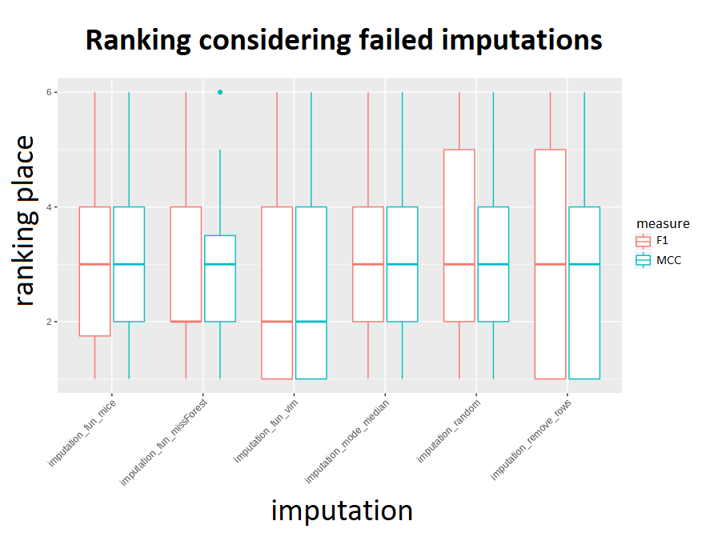
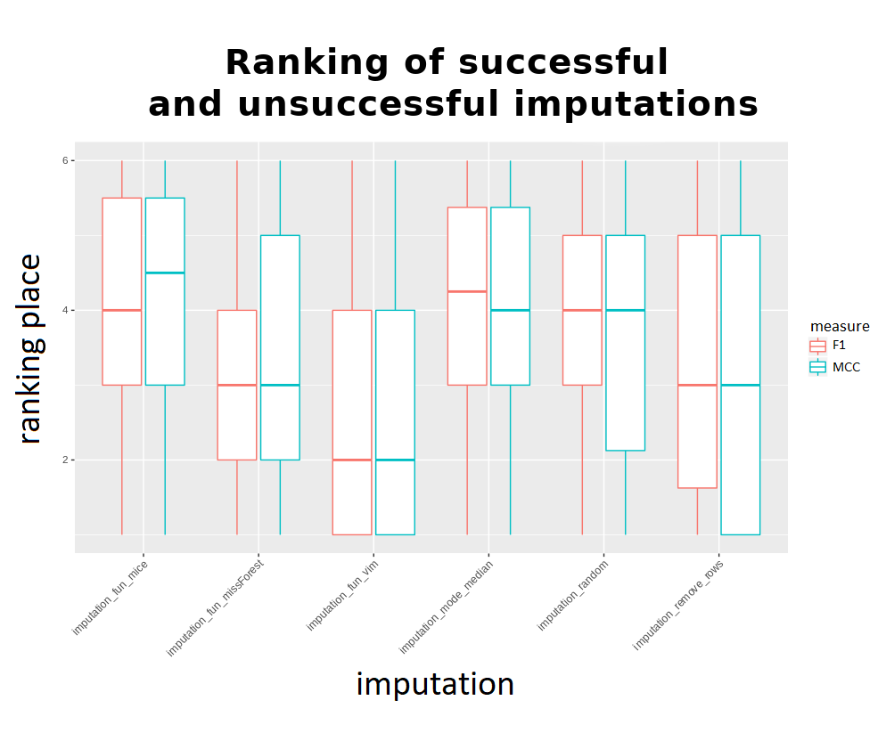

## The Hajada Imputation Test

*Authors: Jakub Kosterna, Dawid Przybyliński, Hanna Zdulska (Warsaw University of Technology)*

### Abstract

There are many different ways of dealing with missing values. Depending on their quantity and properties, various methods turn out to be the best. Using one and the same solution for each dataset is certainly not the best option, but sometimes it is convenient or even necessary to focus on one particular method without much insight into its effect. In this chapter we will take a look at several popular imputation methods and try to compare them with each other, including ranking algorithms and finally choosing the best one. For this purpose, we will analyse imputation times and predictions scores for several machine learning classification algorithms on various datasets.

### Introduction and Motivation

In statistics, imputation is the process of replacing missing data with substituted values. Over the years, humanity has created many different methods accomplishing that, including the simple and instinctive ones, but also more advanced and hard to be easily explained. Choosing the best-suited imputation method for the dataset with missing values is still the daily dilemma of every data scientist and there isn't one universally recognized best technique. Some scientists believe the crux lies in the most advanced and sophisticated algorithms, others trust the simplest of all possible. In a way, both sides are right - the first naturally win in speed of execution, but the second ones do not have advanced operations implemented for nothing and this usually results in data that more accurately reflects reality or what might be expected from it. How do the individual popular ways fall on the famous collections from OpenML100? 
In this test, which we decided to name *The Hajada Imputation Test* (taken from the first two letters of creators' names), we will find the answer to this question, by delving into how well classification on imputed datasets can perform and when predictions are the best, rank algorithms taken into account and finally choosing the best one. Hajada Test depends on prediction scores and imputation times. Obviously its result will not be the final verdict declaring which imputation algorithm is clearly better or worse, but considering the comparison of their quality on different datasets, we will be able to assess their collective performance and effectiveness against the backdrop of the whole.

### Methodology

To rank imputation methods fourteen datasets were taken into account, imputed by six different methods and each used to train five classification algorithms. Based on the predictions scores and imputation times methods were rated 1-6 grouped by datasets and algorithms, where 1 is the best method and 6 is the worst.

#### Imputation functions

Six different methods have been taken into consideration. Their selection is well thought out - they are all widely known in the world of Data Science, and at the same time they differ significantly in approach, implementation, concept and results. Comparing them not only results in a fair view of the strictly indicated implementations, but also what result subsequent approaches result in.

Three simple imputation methods and three more advanced algorithms offered by popular packages were taken to consideration and their comparison. The clash of implementations with such a degree of diversity of complexity gives a clear message whether it pays off to reach for an advanced algorithm from the package prepared by professionals for many hours, conducted on many tests, or rather stay with minimalism and write easy code solving the problem in a trivial way.

Methods compared in subsequent stages are:

1. *mode / median replace* - basic process which puts in a place of missing data median cells from their columns for numerical values and dominants for categorical ones.
2. *remove rows* - trivial solution of removing rows containing any missing data.
3. *'bogo' random replace* - simple algorithm replacing each NA value with a random entry from its feature. (chosen independently for every missing value)
4. *mice* [@2-2-mice] - advanced method creating multiple imputations for multivariate missing data, based on *Fully Conditional Specification*, where each incomplete variable is imputed by a separate model. Standard imputation with *maxit* parameter of value 0 and default 5 number of imputed datasets.
5. *VIM* [@2-2-VIM] - standard k-nearest neighbors algorithm taken from the library.
6. *missForest* [@2-2-missForest] - imputation based on random forest offered by the package.

#### Datasets

The fourteen data frames were taken from OpenML100 collection and were corrected specifically for this research. Both small and simple frames were chosen as well as more complex and containing a lot of information, difficult to explain or present. They can be found under the following identifiers with the following names and statistics:

|Id     |Name             |   No. rows|  No. columns| No. missings|
|:------|----------------:|----------:|------------:|------------:|
|1590   |            adult|      48842|           15|         6465|
|188    |       eucalyptus|        736|           20|          448|
|1590   |   dressess-sales|        500|           13|          835|
|29     |  credit-approval|        690|           16|           67|
|38     |             sick|       3772|           30|         6064|
|40536  |      SpeedDating|       8378|          123|        18372|
|41278  |     okcupid-stem|      50789|           20|       154107|
|56     |             vote|        435|           17|          392|
|6332   |   cylinder-bands|        540|           40|          999|
|1018   |ipums_la_99-small|       8844|           57|        34843|
|27     |            colic|        368|           23|         1927|
|4      |            labor|         57|           17|          326|
|55     |        hepatitis|        155|           20|          167|
|944    |       echoMonths|        130|           10|           97|

These above have been placed in individual directories identified by id in the prepared directory. The six imputations mentioned earlier were conducted on all fourteen of them, but only for six, all of the methods were successful.

#### Binary classification algorithms

In order to compare the quality of the imputed data and see how this supplementation of deficiencies works in practice, five binary classification algorithms have been selected. Their choice was made after careful analysis and extensive discussion, in order to find models that are both widely known and used, but also apply to different approaches and give reasonably distinguishable results using different techniques. The final choice fell on:

* *classification tree from rpart* [@2-2-rpart] - classic algorithm which uses a decision tree to go from observations about an item to conclusions about the item's target value,
* *k-Nearest Neighbors from class package* [@2-2-class] - standard knn model attributing a given observation to a target corresponding to its closest observations in space,
* *naive Bayes from e1071* [@2-2-e1071] - well-known classification computing the conditional a-posterior probabilities of a categorical class variable given independent predictor variables using the Bayes rule.
* *random forest from ranger* [@2-2-ranger] - algorithm consisting of many decisions trees uses bagging and feature randomness when building each individual tree trying to create an uncorrelated forest of trees whose prediction by committee is more accurate than that of any individual tree.
* *Support Vector Machine from e1071* [@2-2-e1071] - a discriminative classifier formally defined by a separating hyperplane.

In order to automise our code we developed it in such a way so that it is possible to easily conduct further experiments with entirely new datasets, imputation methods and classification models. Plenty of time neccesary for imputation and modelling was saved using parallel processing.

#### Metrics functions

In order to test the same test-train splits we used random seed 1357 for all datasets. For each machine learning model after every imputation was created confusion matrix and the values of four basic metrics:

* *accuracy* - $\frac{TP+TN}{TP+FP+FN+TN}$
* *precision* - $\frac{TP}{TP+FP}$
* *recall* - $\frac{TP}{TP+FN}$
* *f1* - $2*\frac{Recall * Precision}{Recall + Precision}$

For the final conclusion, ranking concerned only the last one. Additionally, Matthews correlation coefficient measures were also computed.

${\displaystyle {\text{MCC}}={\frac {{\mathit {TP}}\times {\mathit {TN}}-{\mathit {FP}}\times {\mathit {FN}}}{\sqrt {({\mathit {TP}}+{\mathit {FP}})({\mathit {TP}}+{\mathit {FN}})({\mathit {TN}}+{\mathit {FP}})({\mathit {TN}}+{\mathit {FN}})}}}}$

These two give great information about the quality of imputation and a good comparison. It resulted in simple and clear information about which observations are well classified, which ones are wrong and how they should be. The main advantage of them is accounting for target variable's inbalance. Considering sets' different properties, even when it comes to balancing, comparing those measures, the fact that they show the pros and cons of given result will additionally be worthwhile to compare them.

### Results

In order to analyse and create results, except for comparing imputations' time and effectiveness for ML models, we need to take into account that not all of imputations were successful for all datasets. In further rankings they will have to be considered as the worst for a given dataset. 

#### Comparing imputation times

A dataframe containing information about imputation methods was built.

For a better view a boxplot was also created:

Judging by the logarithmic scale, there is no surprise that removing rows and mode/median replenishment are definitely the fastest methods, with removing rows being several times faster. What would you expect, also "random values" imputation was quite fast, but slower than the two mentioned. Looking at more advanced ones, definitely *VIM* turned up to be the fastest - times usually being approximately 5-10 times shorter than *missForest* and *mice*. These last two are quite slow, with the former appearing to be slightly faster.

Taking into account all the imputations which have been implemented, it is clearly seen that removing rows as well as replacing with mode or median really stand out. However, we cannot fully compare the other four - due to the fact that missForest failed on three datasets, and mice - up to seven, mostly for datasets greater in size.

Considering such a large spread of data size, there is a very interesting difference between median and mean for VIM's  time - the first is almost seven minutes, the second - barely a second and a half. In general, however, it is certainly much longer than methods for removing incomplete rows and filling with mode/median.

Also time was compared for those datasets for which all imputations were successful - these are ids 27, 38, 55, 56, 944, 188  (dataset with id 4 failed on removing rows, because each of rows had at least one missing entry). Taking into account the mean time of imputation, definitely *missForest* was the slowest, but also its standard deviation seemed to be incomparably large - this is probably due to the fact that for smaller sets it is doing well, but due to its complexity, its slowdown can be seen for very sizeable datasets. *VIM* turned out to be better for quick calculations than *missForest* and *mice*; considering the median imputation time, *mice* is comparable to *missForest* - so for small datasets there is not much difference between them, and a lot of time was definitely needed to devote to these larger data frames.

#### Best measures

In order to compare *F1* and *MCC* measures, mean results on all sets for all imputations were calculated. Then, for each machine learning algorithm a ranking was created - so that the imputation with best results obtained the first rank, second best - 2nd, etc. The rank's distributions for every imputation came out as shown by the following boxplot: (rankings omit failed imputations)

It might seem that the results of the methods are very close to each other, but the above visualization takes into account rankings only for successful imputations - to get the correct comparison there is a need to make a ranking with failing methods receiving the worst ranks instead of being omitted. The outcome was presented below:

Considering the imputation times and results, it can be said that the k-nearest neighbors algorithm from the VIM package proved to be "universally" the best. Out of the advanced methods it falls out the fastest, and its results are also the best. However, it is more difficult to choose second and subsequent places - looking at the results, the simple methods are very quick, but they differ from the more advanced ones. Looking at the advanced ones, with the exception of VIM, MissForest stands out. However, his problem is time. So after VIM, it seems second best to use mean / median replenishment for a small amount of time and missForest for a large one. However, although mode / medain usually obtained worse ranks, there was no extensive difference in results between the methods - which is not visible in the charts. "removeRows" is characterized by large fluctuations, and therefore we advise against using it.

### Summary

The experiment can be considered successful when it comes to the datasets and tools made available to us. After examining fourteen datasets with NA values, imputated with six different methods (including three simple and three more advanced), as well as tested for output quality on five binary classification algorithms, we obtained valuable results. Our work resulted in calculated measures and visualizations, which led us, among others, to the following intuition:

* The use of VIM in all conditions results in a fairly satisfactory result in terms of classification's quality and time, which makes it the best tested imputation.
* Supplementing the missing values with mode/medians from columns is not such an unwise idea as it may seem - not to mention the rapid action time, the results of this strategy also give good results.
* *missForest* is also noteworthy - if one has time for running it and the dataset isn't too sizeable.

### Conclusions

Unfortunately, it is impossible to draw an objective conclusion based on such a small number of tested data - with as few as 14 sets, problems with imputations on some of them or too little data in frames not giving a satisfactory answer. Nevertheless, the code is certainly very valuable and for more datasets it could confirm one or another belief. Ready solutions and valuable code can be used to study the effects of imputation on a larger number of datasets, which would give even greater scientific value. Examining even all data sets from OpenML100 could more confidently answer the question of which imputations are doing better and which are worse. Looking at our small input, it would seem that VIM is a better method than missForest and definitely more effective than mice, but we can not be sure about such a conclusion due to the lack of a sufficiently large sample from a statistical point of view.
