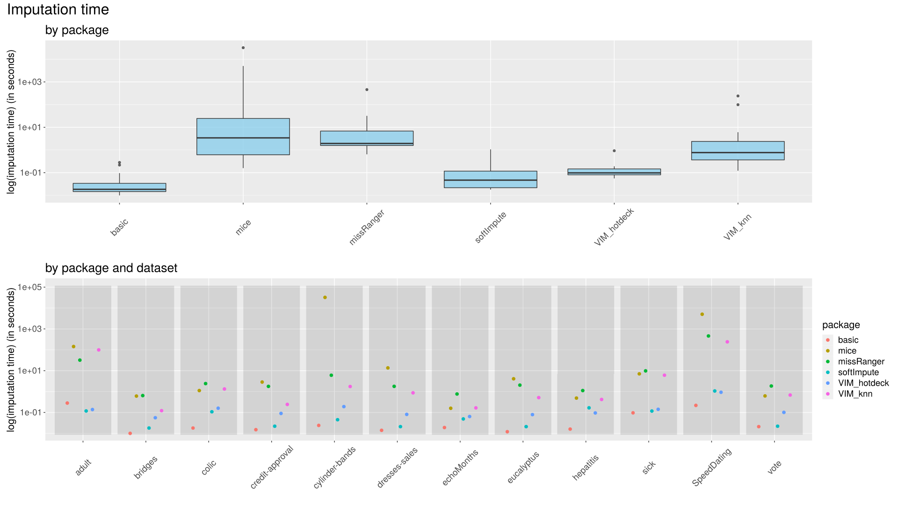
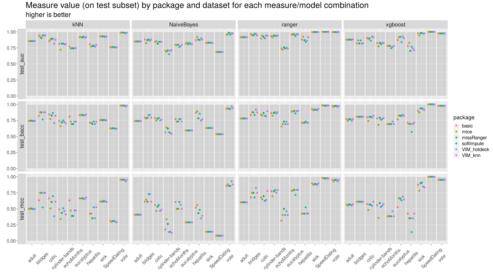
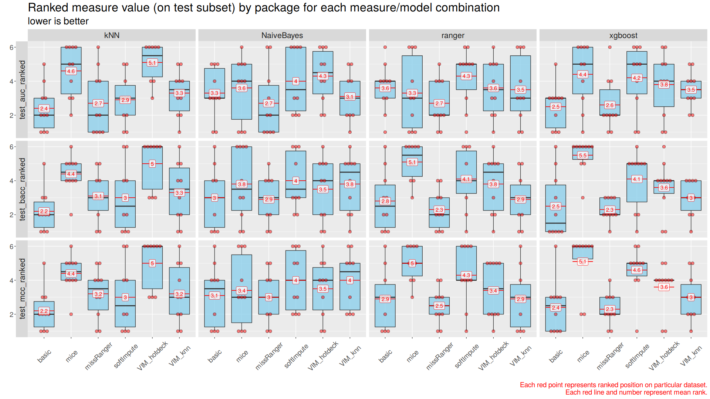

## Comparison of performance of data imputation methods in the context of their impact on the prediction efficiency of classification algorithms

*Authors: Ada Gąssowska, Mateusz Grzyb, Elżbieta Jowik (Warsaw University of Technology)*
  
### Abstract
  
It is very common for datasets to contain incomplete observations. The analysis conducted by ignoring cases with missing data and considering only complete instances is perceived as naive, inefficient, and exposed to bias, as incomplete ones may also convey valuable information. To incorporate these sketchy observations, various methods of handling missing data may be considered, including both less and more sophisticated approaches.

It turns out, that the performance of machine learning classification models moderately depends on the approach that is applied to the imputation problem, while the time of the imputation when using different techniques, is highly diverse. During this study, we considered ten data sets, six imputation methods, and four classifiers. Mentioned imputation methods contain one basic technique (median/mode imputation) and five more sophisticated ones, which origin respectively from mice, VIM, missRanger, and softImpute R packages. For testing purposes, as the classification algorithms, we used Ranger Random Forests, XGBoost, K Nearest Neighbors, and Naive Bayes classifiers. To evaluate the performance of each imputation method/classification algorithm combination on a given dataset, we used raw Area Under the Curve (AUC), Balanced Accuracy Score (BACC), and Matthew's Correlation Coefficient (MCC) measures, as well as rankings based on them. Times of each imputation were also verified and compared.

The actual differences in prediction correctness are slight in general. In respect to the rankings, for the Ranger Random Forests, XGBoost, and Naive Bayes classification algorithms, the missRanger imputation method turned out to be the best, while for the K Nearest Neighbors - it was the basic one.  As for the time of imputation, it highly depends on the technique complexity, so the basic method turns out to be the fastest one. However, the hot-deck method from the VIM package is also noteworthy, as it performs only a little worse.

The analysis shows, that selecting the best imputation method/classification algorithm combination, that will work best globally, is extremely difficult, because a lot depends on the structure of the dataset, the prediction correctness assessment technique, and the amount of computational power available. In the last section of this article, we suggest a sensible approach to this problem.
  
### Introduction and motivation
  
Dealing with missing data is a substantial part of feature engineering, as most of the machine learning algorithms do not accept incomplete datasets. Data imputation, especially replacing missing values with a value based on other available cases, is the solution for that problem. However, despite the acknowledged importance of it, in many practical cases, it is not handled with proper caution. Basic median/mode imputation is often used, as well as deleting rows with missing data (if the number of missing values is low). 

As there are many different imputation techniques, choosing which one to use is complicated, but it may be beneficial. There are no objective rules to follow, the only way to choose the best one is to perform numerous comparisons. The purpose of our experiment is to gather knowledge about the best ways to impute data while using specific classification algorithms.
  
### Methodology

Most of the algorithms that we used for tests do not accept missing values. To find, which one from all tested imputation methods is best for each tested classification algorithm, we decided to perform the following experiment.

Firstly, we created six different imputation functions:

* **basic method** using impute() function from imputeMissings package. It imputes missing numeric values with a  median and categorical variables with a mode of other records.
* **mice()** function from mice package [@2-3_mice]. The function uses Predictive Mean Matching to impute missing values.
* **missRanger()** function from missRanger package [@2-3_missRanger]. The technique uses the Ranger Random Forests to do fast missing value imputation by chained random forests.
* **hotdeck()** function from VIM package [@2-3_VIM]. Each missing value is replaced with an observed response from a “similar” unit.
* **kNN()** function from VIM package [@2-3_VIM]. It finds the k closest neighbors to the observation with missing data and then imputes them based on the non-missing values from its neighbors.
* **softImpute()** function combined with mode imputation [@2-3_softImpute]. The first method originates from the softImpute package and is applied to impute numeric variables. Mode imputation is used for categorical features imputation. 

To automatize our work, we also created two specialized functions - **split_and_impute()** and  **train_and_test()**.

* The first function divides given dataset into train and test sets (with configurable proportions and with stratification on the target variable) and imputes it with specified imputation function (one of the above). It returns imputed train and test sets and the time of the imputation (all of which are can be saved to files automatically).

* The second function performs cross-validation on train set (the default number of folds is 5) and makes the predictions for the test set (that is, after training the model on the whole train set), with a specified classification algorithm. The target variable and label of the positive class must also be passed before the function call. Based on the mentioned predictions, it calculates AUC [@2-3_AUC], BACC [@2-3_BACC], and MCC [@2-3_MCC] measures for both cross-validation and test set testing stages. It also returns plots of ROC curve, AUC, BACC, and MCC measures achieved during the cross-validation stage. 

All ten benchmarking datasets were obtained from https://www.openml.org/ and can be found there with detailed descriptions.

Then, we proceeded in the following way:

Firstly, all benchmarking datasets were split and imputed with all imputation methods using **split_and_impute()** function. All the resulting subsets were then saved to corresponding files. This way, all results differences observed later did not depend on any splitting or imputation randomness, as these steps were taken only once for each benchmarking dataset. The time of each imputation was also measured and taken into consideration.

Secondly, for all imputation method/dataset combination **train_and_test()** function was called four times - once for each classification algorithm. All returned values were then used for two purposes: to create a specialized report (available here - https://github.com/PlentyCoups/WB-article-extras/blob/master/report.html) used for checking process correctness (mostly by looking at cross-validation scores variances) and, more importantly, to create aggregated plots of test set scores for further inference.

The following diagram may also help to visualize our methodology - https://github.com/PlentyCoups/WB-article-extras/blob/master/methodology.png.

### Results

Raw results were processed and assessed in the following way.

Imputation times were compared in correspondence to each imputation method and dataset. Times logarithms had to be used instead of raw data, due to high differences. (Figure 1)

Raw measures were compared in correspondence to each imputation method, classification algorithm, and dataset. (Figure 2)

Rankings of measures were compared in correspondence to each imputation method, classification algorithm, and dataset. Each imputation method/classification algorithm combination was ranked three times on every dataset, once for each of the three used measures. The given combination gets a 1 if it gives the best result on a dataset, and a 6 if it gives the worst one. Then, such rankings were visualized through multiple boxplots with mean and median ranking calculated and marked on them. (Figure 3)

Moreover, as it was already mentioned before, cross-validation scores were merged in a specialized report used for checking process correctness, that is available here - https://github.com/PlentyCoups/WB-article-extras/blob/master/report.html.

It should be mentioned once again, that any differences in results are only due to a change of either the imputation method, the classification algorithm, or the dataset. Divisions into train and test sets for a given dataset were always identical. Because of that, even small scores differences should be taken into consideration.

Another important fact is that we took into consideration only datasets on which all of the imputation methods worked, so that all of them may be compared fairly.

Below figures are best to be viewed with a slight zoom.

### Summary and conclusions 

After analyzing the results, especially the plots, it became clear, that it is not possible to pick the best imputation method for all classification algorithms.

For K nearest neighbors classifier the best AUC, BACC, and MCC scores were gained for the basic median/mode imputation method. For three other algorithms (Naive Bayes, XGBoost, and Ranger Random Forest) the missRanger imputation turned out to be the best one, but the basic median/mode imputer was second in most of the rankings. It was also the quickest one as can be seen in Figure 1.

The imputer that turned out to be globally the worst, and also the slowest, was the one from mice package.

It is very important to note, that even though we can pick globally best and worst techniques, most imputation method/classification algorithm combinations ended first on at least one dataset. Because of that, if the best possible prediction correctness is an absolute priority, it is always the best to consider all available options.

In conclusion, it seems that it is a good idea to use basic median/mode imputation as a solid and fast to obtain starting point, and then, when possible and desirable, to evaluate more sophisticated methods, in search of even better ways.
