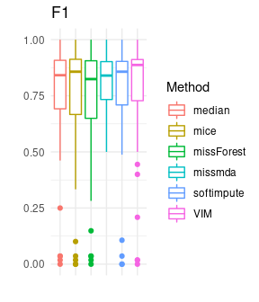
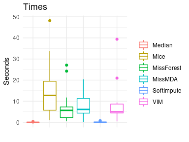

## Various data imputation techniques in R

*Authors: Jan Borowski, Filip Chrzuszcz, Piotr Fic  (Warsaw University of Technology)*

### Abstract

There are many suggestions on how to deal with missing values in data sets problem. Some solutions are offered in publicly available packages for the R language. In our study, we tried to compare the quality of different methods of data imputation and their impact on the performance of machine learning models. We scored different algorithms on various data sets imputed by chosen packages. Results summary presents packages which enabled to achieve the best models predictions metrics. Moreover, the duration of imputation was measured. 

### Introduction and Motivation

#### Background and related work

Missing observations in data sets is a common and difficult problem. In the field of machine learning, one of the key objects is the data set. Real-world data are often incomplete, which prevents the usage of many algorithms. Most implementations of machine learning models, available in popular packages, are not prepared to deal with missing values. Before creating a machine learning model, it is essential to solving the problem of missing observations. This requires user pre-processing of data. Some researches examined the similarity between original and imputed data, in terms of descriptive statistics [@2_4_musil2002impcomp]. Missing data are common in medical sciences and the impact of different imputation methods on analysis was measured [@2_4_bono2007medical]. Some studies show that imputation can improve the results of machine learning models and that more advanced techniques of imputation outperform basic solutions [@2_4_gustavo2003impclasif] [@2_4_su2008impclasif].    

#### Motivation

Various imputation techniques are implemented in different packages for the R language. Their performance is often analyzed independently and only in terms of imputation alone. Because of a variety of available tools, it becomes uncertain which one package and method to use, when a complete data set is needed for a machine learning model. In our study, we would like to examine, how methods offered by some popular packages perform on various data sets. We want to consider the flexibility of these packages to deal with different data sets. The most important issue for us is the impact of performed imputation on later machine learning model performance. We are going to consider one specific type of machine learning tasks: *supervised binary classification*. Our aim is a comparison of metrics scores achieved by various models depending on the chosen imputation method. 

#### Definition of missing data

In the beginning, clarifying the definition of missing data is necessary. Missing data means, that one or more variables have no data values in observations. This can be caused by various reasons, which we can formally define as follows, referring to @2_4_rubin1976mar:

- MCAR (Missing completely at random)\
Values are missing completely at random if the events that lead to lack of value are independent both of observable variable and of unobservable parameters. The missing data are simply a random subset of the data. Analysis performed on MCAR data is unbiased. However, data are rarely MCAR.
- MAR (Missing at random)\
Missingness of the values can be fully explained by complete variables. In other words, missing data are not affected by their characteristic, but are related to some or all of the observed data. This is the most common assumption about missing data.
- MNAR (Missing not at random)\
When data are missing not at random, the missingness is related to the characteristic of the variable itself.

#### Techniques of dealing with missing data

In case of preparing a data set for machine learning models, we can generally distinguish two approaches. The first method is **omission**. From the data set, we can remove observations with at least one missing value or we can remove whole variables where missing values are present. This strategy is appropriate if the features are MCAR. However, it is frequently used also when this assumption is not met. It is also useless when the percentage of missing values is high. The second approach is **imputation**, where values are filled in the place of missing data. There are many methods of imputation, which we can divide into two groups. **Single imputation** techniques use the information of one variable with missing values. A popular method is filling missings with mean, median or mode of no missing values. More advanced are predictions from regression models which are applied on the mean and covariance matrix estimated by analysis of complete cases. The main disadvantage of single imputation is treating the imputed value as true value. This method does not take into account the uncertainty of the missing value prediction. For this reason **multiple imputation** was proposed. This method imputes *k* values, which leads to creating *k* complete data sets. The analysis or model is applied on each complete data set and finally, results are consolidated. This approach keeps the uncertainty about the range of values which the true value could have taken. Additionally, multiple imputation can be used in both cases of MCAR and MAR data.

### Methodology
Experiment like this one can be performed involving many techniques we decide to divide our tests into 4 steps:

- Data Preparation,
- Data Imputation,
- Model Training,
- Model Evaluation.

Below we will explain every step in detail.

#### Data Preperation 
For test purposes we used 14 data sets form OpenML library [@2_4_R-OpenML]. Every data set is designed for binary classification and most of them contain numerical and categorical features. Most of the sets have a similar number of observations in both classes but some of them were very unbalanced. Before data imputation data set was prepared specific preparation are different for each data set but we commonly do:

- Removing features which didn't contain useful information (for example all observation have the same value)
- Correcting typos and converting all string to lower case to reduce the number of categories 
- Converting date to more than one column (for example "2018-03-31" can be converted to three columns: year, month and day)
- Removing or converting columns with too many categories

After cleaning data sets were transferred to the next step. 

#### Data Imputation
Clean data sets were split into two data sets, training and testing, in proportion $1/4$ respectively. This split was performed randomly and only once for every data set that's mean every imputation technique used the same split. Imputation was performed separately for train and test sets. Before split, we also remove the target column to avoid using it in imputation. For our study, we decided to choose five packages designed for missing data imputation in the R language and one self-implemented basic technique:

- **Mode and median**: Simple technique of filling missing values with mode (for categorical variables) and median (for continuous variables) of complete values in a variable. Implemented with basic R language functions.
- **mice**[@2_4_mice2011]: Package allows to perform multivariate imputation by chained equations (MICE), which is a type of multiple imputation. The method is based on Fully Conditional Specification, where each incomplete variable is imputed by a separate model.
- **missMDA**[@2_4_missMDA2016]: Package for multiple missing values imputation. Data sets are imputed with the principal component method, regularized iterative FAMD algorithm (factorial analysis for mixed data). Firstly estimation of the number of dimensions for factorial analysis is essential.
- **missFOREST**[@2_4_missForest2012]: Package can be used for imputation with predictions of the random forest model, trained on complete observations. The package works on data with complex interactions and non-linear relations. Enables parallel calculations.
- **softImpute**[@2_4_R-softImpute]: Package for matrix imputation with nuclear-norm regularization. The algorithm works like EM, solving an optimization problem using a soft-thresholded SVD algorithm.  Works only with continuous variables.
- **VIM**[@2_4_VIM2016]: Package for visualization and imputation of missing values. It offers iterative robust model-based imputation (IRMI). In each iteration, one variable is used as a response variable and the remaining variables as the regressors.

First, we use median/mode imputation, which is a very simple method and it is used as a base result for more complex algorithms to compare.
Imputation method form mice package don't require any form of help because can impute numeric and categorical features.
SoftImpute package works only with numeric features. To compare it with other algorithms on the same data we use softImpute for numeric variables and mode for categorical variables. Alternatively, it is possible to use SoftImpute for numeric features and different algorithms for categorical variables, but we decided that this approach may lead to unreliable results.
MissForest algorithm can be used on both numeric and categorical features and is capable of performing imputation without any help of other methods.
Imputation method from Mice package also can be run on all types of data.
Iterative Robust Model-Based Imputation method from VIM package can impute all types of data. This method additionally creates new columns with information whether the observation was imputed or not. We decided to do not use these columns, because other methods do not create them.
The last method which we covered is missMDA which also can be used to input numeric and categorical features.
After imputation, we add back target variable to both sets. All methods work on the same parameters for all data sets. In case when for some reason method can't input some data set it was treated like "worst result" more information about it can be found in section 4. Model evaluation.

#### Model traing 
For classification task we use four classification algorithms:

- Extreme Gradient Boosting, 
- Random Forest, 
- Support Vector Machines,
- Linear Regression 

All methods were implemented in **mlr** package [@2_4_mlr] for hyperparameters tuning, we also used methods from the same package. For all data sets, four classifiers were trained and tuned on the same train sets. To select parameters we used Grid Search. We will not focus on this part of the experiment. The most important part of this step is that every model training was carried out the same way. This means that differences in results can be caused only by the influence of previously used imputation technique. 

#### Model evaluation 
After previous steps, we have got trained models and test sets. In the final, step we evaluate model and imputation. For every imputation and algorithm we calculate F1 score expressed by formula $2\frac{(precision)\cdot(recall)}{precision + recall}$ and accuracy. In case when imputation algorithm fails to impute some data set, results for this set are thread as "the worst result". It means if you try to create a ranking it is always last (if more then one imputation fail, all of them is placed last). A detailed discussion about results in the next section.

### Results

After the long and tedious process of data imputation, it is finally time to evaluate our methods of imputation. Methods were trained and tested on 14 data sets and evaluated strictly using 2 methods mentioned earlier. Before score analysis, it is worth mentioning that all algorithms were tested with optimal parameters, so the score should be quite meaningful. The table below presents average metrics achieved by model, depending on the imputation method. As described earlier, we decided to use two measures of algorithm effectiveness:

- F1 score
- Accuracy

These two measures complement each other well because they allow us to measure well the effectiveness of our imputations and algorithms on both balanced and unbalanced sets.

|Method     | Accuracy|   F1|
|:----------|--------:|----:|
|median     |     0.83| 0.75|
|mice       |     0.85| 0.75|
|missForest |     0.85| 0.74|
|missmda    |     0.82| 0.80|
|softimpute |     0.86| 0.75|
|VIM        |     0.85| 0.76|

Our experiment did not find out the best imputation algorithm, but we can derive some interesting conclusions from it.
First of all, we can think about the median/mode imputation as kind of our baseline because it will be useful later. Surprisingly it seems to perform quite well, among the others, often quite sophisticated methods. It achieved over 80% of accuracy on average. However, it is hard to decide whether it is a high score or not, because we are only able to compare algorithms between the others. To say anything more meaningful about our methods we shall look at the distribution of the scores to make a better analysis of performance. It is also worth noting that not all algorithms managed to perfomrm imputations on all datasets, but differences in that issue were so little, that tey will not affect our scores.\

\newpage
##### Distributions of scores

Taking a brief look at the distributions of accuracy score it seems quite unclear which algorithm performs the best. All medians seem to be approximately on the same level and also the first and third quartile of almost all of the plots have the same value. Only missMDA is a bit lower than the others, but this is too early to derive any conclusions.\

F1 scores give us much more information. The first thing that becomes apparent after looking at that plot is the fact that we do have some very low values for every type of imputation. However, this is simply because some of our data sets were very small, saw neither of our algorithms was able to achieve recall above 0. Besides from that once again scores of all algorithms were quite close to each other. This is why we decide to use two different methods of comparing and classifying these algorithms so that we will be able to choose our winner.

#### Median/mode baseline score

So to begin with we decided to treat the median/mode as the basic form of imputation and we will compare it to all other methods. We want to check how much the average prediction measured made by other algorithms differed from the median/mode. As one prediction, we understand the average F1 score made by of all imputation methods on one data set. 

|Method     | score|
|:----------|-----:|
|softimpute |  0.02|
|missForest |  0.01|
|mice       | -0.02|
|missmda    | -0.11|
|VIM        | -0.11|

Results achieved here are quite surprising. First of all the maximum gain in F1 score is only 0.02 and it is achieved by softImpute. But what can bewilder the most is the fact that only 2 out of 5 algorithms managed to perform better than the median/mode. Score achieved by SoftImpute may be in some way caused by the fact, that it is using median imputation in some situations. These scores can raise questions about the whole purpose of using sophisticated algorithms, but of course, we are unable to say anything harsh about them yet. We can definitely note that we need to be we careful while using these algorithms, because they may lead to huge loss in scores, even up to -0.11, as here it is shown with missMDA. It is worth noting the order of the algorithms here, as we will use another method to compare the scores. 

#### Second approach

As a second approach, we decide to simply rank each algorithm score on each data set, and then award points for each place. As a result, we sum up all of the points and the final score is the sum of the points across all data sets. Of course, the algorithm with the lowest amount of points wins.

|Method     | Score|
|:----------|-----:|
|softimpute |    38|
|median     |    39|
|missForest |    48|
|mice       |    49|
|VIM        |    58|
|missmda    |    69|

Scores achieved here resemble these achieved here. The order is not the same, but the winner remains the same. Once again median/mode imputation managed to perform very well, outperforming many complicated algorithms. We can say that our scores are stable, so conclusions taken from these scores can be taken seriously.

#### Times
As a final tool of comparing algorithms, we decided to compare times of imputation. Obviously, even the algorithm with the best score, but with awful imputation time is considered useless, so this is important to take that factor to final evaluation.

As we can see times of imputations made by each algorithm can vary heavily. There is no point in creating rankings like we did to analyze scores achieved by algorithms, but it is simply worth noting that our previous winner - softImpute is very quick, its plot looks the same as the median/mode plot, which is quite an achievement.
On the other side, there is Mice, which times can reach very high values.

### Summary and conclusions 

Summing up all of our work we can say, that we managed to find plenty of interesting things about all of these imputation algorithms and the way they deal with different data. However, it is hard to issue the final judgments, because we only had 14 data sets available. Despite that, something definitely can be said. First of all, it is worth noting how well simple methods of imputation have managed to perform. Median/mode imputation was a tough competitor and have been outperformed rarely in our tests. The second issue is the matter of choosing the optimal metric for checking the performance of imputation algorithms. We have shown 2 different approaches and scores they achieved differed slightly. Taking that into consideration we cannot say that we have a clear winner in our competition, but we can give some sort of advice for all interesting in imputing their data sets. The advice is quite simple, but what we have managed to show quite powerful. The case is to start imputing your data set with the most basic method, which is median/mode imputing, and then trying to beat its score with a different algorithm, for example softImpute, which in our tests managed to perform quite well.
