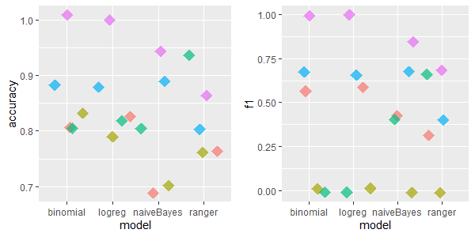
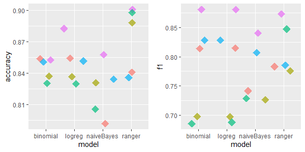

## Imputation techniques' comparison in R programming language

*Authors: Mikołaj Jakubowski, Marceli Korbin, Patryk Wrona (Warsaw University of Technology)*

### Abstract

Machine Learning (ML) models are nowadays routinely deployed in domains ranging from medicine to business. The majority of them do not accept missing values in a dataset and this issue has to be dealt with using imputation. To address the problem of choice of imputation technique, we compare some of the imputation algorithms, basing on ML models' quality and considering different datasets' sizes and missing values percentages. The imputation methods can either be easily implemented or are offered in public R packages; they differ in both algorithmic and programming complexity.  Our results indicate that successful imputation does depend on used imputation methods or datasets we work with.

### Introduction & Motivation

Nowadays, the problem of missing data has become ubiquitous in our everyday lives in each domain, for example medicine, education, criminology, politics or business affairs. There are three main problems that missing data might cause: a substantial amount of bias, more arduous handling and analysis of the data and reductions in efficiency. Moreover, many machine learning models cannot be used because of missing data.

Imputation bases on replacing missing data with an estimated value based on other available information. There are numerous kinds of imputation methods which can be divided into simple methods as well as methods involving more sophisticated algorithms. Many programming and statistical environments support data imputation via libraries and packages.

In the past, there was some evaluation and testing on available imputation methods. Such research has been already done by @2-5-springer, not using machine learning models, or by @2-5-elsevier, using such models. Nevertheless, each research was conducted only on 1 dataset and using only 1 metric.

One could say that the testing imputation techniques with machine learning models is an open domain for research. Effectively, data science and statistical modelling are both much younger domains than mathematics or physics. Besides, it is hard to say if an imputation algorithm's output is the proper one, because there is no data to compare with. In order to assess an imputation method, one could make use of some statistical approach like evaluating machine learning predictions, changing data by intentionally removing a part of it, or combining both processes.

In this work, we compare imputation techniques by using predictions of machine learning models, as well as confronting the amount of time each algorithm took to perform an imputation task. We have used RStudio due to its numerous packages giving access to implementation of various imputation methods. The whole evaluation is repeated on several datasets, varying by size and missing data percentage. All these datasets are available online and come from OpenML. Our goal was to find the best and the worst imputation method in function of input data and the amount of time to impute, that is, the imputation real-life circumstances. We evaluate the methods basing primarily on the quality of machine learning models, which is measured by means of two measurement methods. We used R language in RStudio environment because of packages and libraries having already implemented imputation algorithms as well as multiple machine learning models.

### Methodology

#### Imputation methods and classification algorithms

Throughout the whole time of carrying out the study, the following imputation methods were being used:

- **IRMI**: during the whole iteration, one variable is used as a response variable, whereas the rest are used as the regressors. The whole information is used to impute the response column [@2-5-templIRMI].  
- **hotDeck**: replacing missing values in an instance with the values present in a similar row. The record to copy values from may be chosen randomly or deterministically [@2-5-HDreview].  
- **k nearest neighbours**: a point value is approximated by the values of the closest points, based on other variables [@2-5-knn].  
- **missForest**: a random forest is used as a multiple imputation scheme composed by classification and regression trees. Its error estimates deliver the independent imputation error calculation, without a test set necessary [@2-5-mforest].  
- **mean, median or dominant**:  a simple, easily implementable function, which replaces all the missing values in every column independently, the value choice method being based on the datatype. Continuous features (e.g. float values) have their NAs replaced by the mean of all the present values; categorical ordinal variables (e.g. integer values) are imputated by the median, while categorical nominal columns (character values) become completed with the dominant value among remaining ones.

The first three were imported from the R package _VIM_, whereas missForest imputation is based on another R package of the same name.

The machine learning algorithms we evaluated during the study are the following classification algorithms:

- **logistic regression** (package _stats_)  
- **naive Bayesian classificator** (package _e1071_)  
- **binomial regression** (package _stats_)  
- **random forests** (package _ranger_)

#### Datasets

We used the following seven datasets available in the _OpenML_ package to carry out all the calculations.

| name | number of features | number of rows | number of missing values |
| :--- | :---: | :---: | :---: |
| _**labor**_ | 17 | 57 | 326 |
| _**colic**_ | 20 | 368 | 1199 |
| _**credit-approval**_ | 16 | 690 | 67 |
| _**hepatitis**_ | 20 | 155 | 167 |
| _**vote**_ | 17 | 435 | 392 |
| _**eucalyptus**_ | 16 | 736 | 455 |
| _**echoMonths**_ | 10 | 130 | 97 |

#### Algorithm

Given all of the above tools and resources, we developed an algorithm in order to study the imputations' effectiveness.

Each imputation method is carried out on a given dataset. The operation is run in a given number of iterations, during each of which the length of imputation is measured through reading the current time with the R base function _Sys.time_, immediately before and after the imputation being performed. After all iterations, the mean time is calculated.

In the next step, every machine learning algorithm is tested. The dataset is divided into training data and test data, with a size ratio 9:1. Then, the current model is trained on the former and evaluated on the latter, through the use of _mlr_ functions: _makeClassifTask_, _makeLearner_, _train_ and _predict_. Having the model evaluated on a dataset, we measure its performance by means of _accuracy_ and _F1 score_. We chose these two measures as the most symmetric ones, while discarding widely used _precision_ and _recall_, due to the _F1 score_ being more concise and giving just as many useful information on the dataset balance as a harmonic mean of the former two.

All the imputation time and model evaluation score measurements are systematically written down and eventually output in a list of three matrices.

### Results

#### Performance for each dataset
All charts are self-explanatory. We tried to visually separate all 5 imputation methods by using random jitter. We created plots for each respective dataset. Based on the results below, and knowing characteristics of a dataset, it should be easy to estimate which method of imputation is the best for a desired use.

##### _**labor**_: 17 features, 57 rows, 326 missing values 

For this dataset **IRMI** & **kNN** are relatively good, except for naiveBayes model, where kNN was the worst.

##### _**colic**_: 20 features, 368 rows, 1199 missing values 

For *colic* dataset the results are similar - **IRMI** and **kNN** have the highest accuracy and F1 metrics' values.

##### _**credit-approval**_: 16 features, 690 rows, 67 missing values

This dataset was different - the best imputation methods are **hotdeck** and **missForest**.

##### _**hepatitis**_: 20 features, 155 rows, 167 missing values

For this dataset the **missForest** imputation was irrevocably the best. Besides, **mean/med/dom** imputation method performed quite well.

##### _**vote**_: 17 features, 435 rows, 392 missing values

The best imputation method for *vote* dataset is hard to discern. However, **IRMI** method seems to averagely perform in the best way. **kNN** and **missForest** were again the worst imputation methods for *naiveBayes* ML model.

##### _**eucalyptus**_: 16 features, 736 rows, 455 missing values

There were cases where simple **mean/med/dom** imputation revealed to be much better than other imputation methods - it performed surprisingly fine. **IRMI** achieved high scores as well.

##### _**echoMonths**_: 10 features, 130 rows, 97 missing values

For *echoMonths* dataset, the excellent performance of **IRMI** can be easily seen. After **kNN** imputations, the models achieved low accuracy and F1 scores comparing to other imputation methods.

##### Overall performance

Considering all datasets and taking the average Accuracy and F1 metrics' scores, one could deduce good performance of **missForest** algorithm as well as a surprisingly high scores of a simple **mean/median/dominant** method. On the other hand, **kNN** and **IRMI** achieved relatively poor scores. Nevertheless, there were such datasets such as a small dataset called *labor* where the latter two imputation methods performed much better.

#### Charts conclusions and average time measurements

Taking a glance at all charts, we are able to conclude which methods work best in which instances. Note that this recipe for choosing imputation method is partially subjective. That is, only certain amount of datasets were measured and there might exist some out there not following the rules we provide.  
  
* Having a small dataset with middling amount of missing data (~5%) - use IRMI.
* Having a small dataset with significant amount of missing data (over 15%) - use IRMI or kNN. For this instance they are both quite competitive.
* Having a medium dataset with middling amount of missing data (~5%) - use MissForest.
* Having a big dataset with significant amount of missing data (over 15%) - again, IRMI and kNN provide simmilar results.
* Having a big dataset with tiny amount of missing data (below 1%) - hotdeck and MissForest preform equally as good.
* Having a big dataset with middling amount of missing data (~5%) - once again, IRMI seems to be the safest choice.
* Wanting to choose the safest option regardless - MissForest is the safest option overall.

Other than performance measurements, we also provide average time taken by each algorithm, whose computation has already been mentioned as a part of our methodology. We are excluding _mean, median or dominant_ method as the only one not being the most advisable in any case, according to the aforementioned rules.

| ML algorithm | average time |
| :--- | :---: |
| _**IRMI**_ | 5,96s |
| _**missForest**_ | 0,94s |
| _**kNN**_ | 0,9s |
| _**hotdeck**_ | 0,22s |

For the biggest explored dataset, the highest *IRMI* time was 17 seconds. Generally, none of these algorithms are highly time consuming. However, it may be worth to acknowledge that sometimes, when we are dealing with a huge dataset and do not dispose a lot of time, *IRMI* might not be a good choice - especially since *missForest* most often produces better results.

#### Ranking

We also created a leaderboard of imputation methods in function of used machine learning model. We used 2 metrics separately to evaluate classification models - Accuracy and F1 Score. Imputation methods with the highest Accuracy and F1 Score obtain the lowest ranking - that is the best. We summed up the rankings when considering multiple datasets - drafts obtained the same that is a better ranking. 

The data used for classification was divided into small and big datasets to determine whether the imputation methods' scores vary among the size of the dataset. All datasets have similar number of features, so  we set the threshold of a big and small dataset as **10,000 values**.

In the result, as small datasets (with less than 10,000 values each) we chose _**labor**_, _**colic**_, _**hepatitis**_, _**vote**_ and _**echoMonths**_: 

*Accuracy ranking*

| ML algorithm | logreg | naiveBayes | binomial | ranger |
| :--- | :---: | :---: | :---: | :---: |
| _**IRMI**_ | 3 | 1 | 3 | 1 |
| _**missForest**_ | 4 | 2 | 4 | 2 |
| _**hotdeck**_ | 5 | 4 | 5 | 2 |
| _**kNN**_ | 1 | 5 | 1 | 2 |
| _**mean/median/dominant**_ | 2 | 3 | 2 | 5 |

*F1 Score ranking*

| ML algorithm | logreg | naiveBayes | binomial | ranger |
| :--- | :---: | :---: | :---: | :---: |
| _**IRMI**_ | 3 | 1 | 3 | 1 |
| _**missForest**_ | 3 | 1 | 3 | 2 |
| _**hotdeck**_ | 5 | 5 | 5 | 5 |
| _**kNN**_ | 1 | 4 | 1 | 3 |
| _**mean/median/dominant**_ | 2 | 3 | 2 | 4 |

We can deduce from the above ranking that *missForest* beats other imputation methods when we deal with small datasets. **Mean/median/dominant** imputation is also convenable in this case - in exception of naiveBayes model. The worst model is **kNN**.

Bigger datasets (with 10,000 or more values) are _**credit-approval**_ and _**eucalyptus**_: 

*Accuracy ranking*

| ML algorithm | logreg | naiveBayes | binomial | ranger |
| :--- | :---: | :---: | :---: | :---: |
| _**IRMI**_ | 3 | 1 | 3 | 1 |
| _**missForest**_ | 4 | 2 | 4 | 2 |
| _**hotdeck**_ | 5 | 4 | 5 | 2 |
| _**kNN**_ | 1 | 5 | 1 | 2 |
| _**mean/median/dominant**_ | 2 | 3 | 2 | 5 |

*F1 Score ranking*

| ML algorithm | logreg | naiveBayes | binomial | ranger |
| :--- | :---: | :---: | :---: | :---: |
| _**IRMI**_ | 3 | 1 | 3 | 1 |
| _**missForest**_ | 3 | 1 | 3 | 2 |
| _**hotdeck**_ | 5 | 5 | 5 | 5 |
| _**kNN**_ | 1 | 4 | 1 | 3 |
| _**mean/median/dominant**_ | 2 | 3 | 2 | 4 |

**IRMI** and **kNN** revealed to be the most accurate as far as the bigger datasets are concerned. It is also important to notice that **hotdeck** imputation from VIM package was unanimously the worst independently of used model. 

All datasets: 

*Accuracy ranking*

| ML algorithm | logreg | naiveBayes | binomial | ranger |
| :--- | :---: | :---: | :---: | :---: |
| _**IRMI**_ | 5 | 2 | 5 | 1 |
| _**missForest**_ | 2 | 1 | 2 | 1 |
| _**hotdeck**_ | 4 | 4 | 4 | 3 |
| _**kNN**_ | 3 | 3 | 3 | 5 |
| _**mean/median/dominant**_ | 1 | 5 | 1 | 3 |

*F1 Score ranking*

| ML algorithm | logreg | naiveBayes | binomial | ranger |
| :--- | :---: | :---: | :---: | :---: |
| _**IRMI**_ | 3 | 2 | 3 | 2 |
| _**missForest**_ | 2 | 1 | 2 | 1 |
| _**hotdeck**_ | 5 | 5 | 5 | 5 |
| _**kNN**_ | 3 | 3 | 3 | 4 |
| _**mean/median/dominant**_ | 1 | 4 | 1 | 3 |

The above ranking shows that the **missForest** imputation algorithm from the package of the same name has achieved the best scores independently of dataset's size. On the other side, hotdeck performed the worst and the bigger the dataset is, the lower its performance was.

### Conclusions

From the ranking, one can deduce that depending on dataset's size, missForest, kNN and IRMI imputation achieved the best scores. *missForest* was the most appropriate to deal with small datasets, while *kNN* and *IRMI* were outstanding at bigger datasets' imputation.

Moreover, from the ranking we deduce that if we use random *hotdeck* imputation from VIM package, the bigger the dataset is, the lower this imputation method's performance is. Enough to say that we gain time in exchange for imputation corectness but the difference is almost negligeable and requires future testing. **An appropriate choice of imputation method** is very important and should be made depending on the given task. Nevertheless, we are aware of the necessity of future tests on higher number of datasets. Our number of big datasets is 2 and that is why our reasoning was limited.