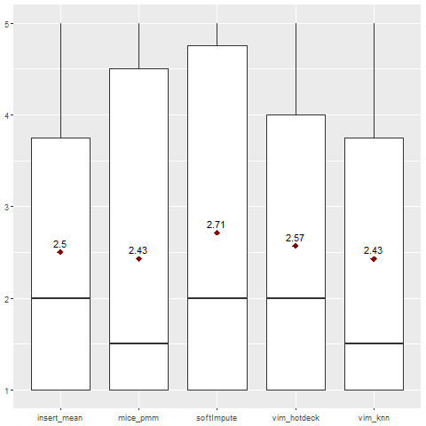
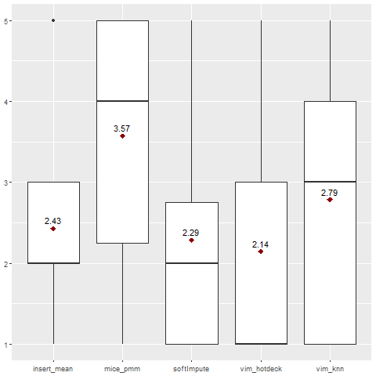
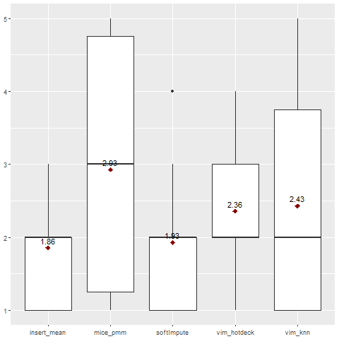
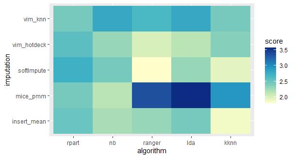

## How imputation techniques interact with machine learning algorithms

*Authors: Martyna Majchrzak, Agata Makarewicz, Jacek Wiśniewski (Warsaw University of Technology)*

### Abstract

Imputation of missing values is a common step in the machine learning process. Many real-life datasets contain incomplete observations and dealing with them is a key part of modelling as most of the algorithms provided by R packages require complete data.
This report aims to measure the influence of five different imputation methods on the performance of selected classification models. Simple methods such as mean, median, and mode are compared with advanced imputation techniques from specialized R packages - mice, VIM, and softImpute.
As tested algorithms, Recursive Partitioning And Regression Trees, Naive Bayes, Ranger (Random forest),  Linear Discriminant Analysis, and k-Nearest Neighbours were chosen.
Their prediction effectiveness is assessed by F1 score to provide a proper measure for both balanced and imbalanced data.\

### Introduction and Motivation

Missing data occurring in datasets is a common and sometimes difficult problem. Many real-world datasets, such as, for instance, medical records, are often incomplete. Unfortunately, in the field of machine learning, this is an issue which must be handled because many algorithms cannot work with missing values. Therefore, dealing with them is an important part of reprocessing data in the machine learning process.
\

The first important step is to identify the missing data pattern (or mechanism). We commonly distinguish 3, according to @Rubin : Missing Completely at Random (MCAR), Missing at Random (MAR) and Missing Not at Random (MNAR), however, we will not focus on them in this study.
\

One way of getting rid of missing data is "omission" - removing observations or variables with at least one missing value. However, this strategy is frequently inappropriate because we can lose some important data or significantly reduce it if the percentage of missing values is high.
Fortunately, imputation serves the need better. By definition, imputation is a process of replacing missing data with substituted values. We can distinguish 2 types of imputation. First one is single imputation - we the information from only one variable to impute missing values. 
It includes the basic methods such as imputing with mean or mode, which are fast and easy to implement, however they do not guarantee a very good performance. The second one is multiple imputations, in which we impute many values (perform imputation many times), leading to creating many complete datasets. This type includes more sophisticated strategies for instance the ones using tree-based models, which usually result in better models, but enhance the algorithm's complexity and computational time.
\

For the R language, there are implemented multiple imputations techniques in many different packages. It is often hard to choose the best approach. Our goal is to examine how these methods perform on different datasets and how they interact with different classification algorithms. In order to do that, we impute each dataset with five chosen imputations and then on each one we execute modelling with selected algorithms. We base our conclusions about imputations influence on the values of F1 measure and our own ranking.\

### Methodology

Our work can be divided into 4 major stages: data preparation, imputation, classification models' training, and finally, evaluation of their performance. All of them are outlined in detail in the following paragraphs.

#### Data preparation

In the following table are presented the datasets used for this experiment, along with their OpenML ID number, name, number of instances, number of features and number of missing values. The datasets vary in size and number of missing values. 

| Dataset ID | Name              | Instances | Features | Missing | Percentage of missing |
|------------|-------------------|:---------:|:--------:|:-------:|:---------------------:|
| 1018       | ipums_la_99-small | 8844      | 56       | 34843   | 0,07                  |
| 1590       | adult             | 48842     | 13       | 6465    | 0,01                  |
| 188        | eucalyptus        | 736       | 16       | 455     | 0,04                  |
| 23381      | dresses-sales     | 500       | 13       | 955     | 0,15                  | 
| 27         | colic             | 368       | 20       | 1199    | 0,16                  |
| 29         | credit-approval   | 690       | 16       | 67      | 0,01                  |
| 38         | sick              | 3772      | 28       | 2293    | 0,02                  |
| 4          | labor             | 57        | 17       | 326     | 0,34                  |
| 40536      | SpeedDating       | 8378      | 123      | 18570   | 0,02                  |
| 41278      | stem-okcupid      | 45907     | 20       | 139693  | 0,15                  |
| 55         | hepatitis         | 155       | 20       | 167     | 0,05                  |
| 56         | vote              | 435       | 17       | 392     | 0,05                  |
| 6332       | cylinder-bands    | 540       | 34       | 999     | 0,05                  |
| 944        | echoMonths        | 130       | 10       | 97      | 0,07                  |

*Tab. 1. OpenML datasets used in the study*

As seen in the table, we used 14 datasets from OpenML library, all of which are designed for binary classification. Before starting the experiment, each of them was individually preprocessed, what usually included reducing the number of categories (for instance by converting strings to lower case or dividing date column into more features) or simply removing features with too many of them, removing features which didn't contain any useful information, and correcting some spelling mistakes.

#### Imputation strategies

Each prepared dataset was split into train set (80% of observation) and test set (20% of observation).
They are imputed separately, using the methods described below, to avoid data leakage.
The imputations, that were performed and analyzed in our study include:

* **mean/mode imputation**\
  One of the basic techniques replaces missing values with a mean (for continuous variables) and mode (for categorical variables) of complete values in the given variable. Implemented with basic R functions.

* **mice (predictive mean matching)**\
   Performs multivariate imputation by chained equations, meaning it creates multiple imputations (replacement values) for multivariate missing data. Implemented with mice() function (with method parameter set to "pmm") from mice package [@MicePackage].

* **k-nearest neighbours**\
  An aggregation of the non-missing values of the k nearest neighbours is used as an imputed value. The kind of aggregation depends on the type of the variable. Implemented with kNN() function from the VIM package [@VIMPackage].
  
* **hotdeck** \
  Each missing value is replaced with an observed response from a “similar” unit. Implemented with hotdeck() function from VIM package [@VIMPackage].

* **softImpute combined with median/mode imputation**\
  For numeric variables function softImpute() from softImpute package [@softImputePackage] is used, fitting a low-rank matrix approximation to a matrix with missing values via nuclear-norm regularization. For remaining variables, missing values are imputed with median or mode, which is implemented with impute() function from the imputeMissings() package [@imputeMissingsPackage].
  
#### Classification algorithms

We chose five different algorithms: two linear classifiers (NB, LDA), two tree-based models (RPART, Ranger), and one kernel estimation (KNN). For each train set and for every imputation method all five classifiers were trained. The modelling was performed using the mlr3 package [@mlr3Package].

* **RPART (Recursive Partitioning And Regression Trees)**\
  Based on decision trees, works by splitting the dataset recursively, until a predetermined termination criterion is reached or no improvement can be made.  At each step, the split is made based on the independent variable that splits the data best (results in the largest possible reduction in the heterogeneity of the dependent (predicted) variable).
  
* **NB (Naive Bayes)**\
  Technique based on an assumption of independence between predictors (every pair of features being classified is independent of each other) and their equal contribution to the outcome, then the probability of an event occurring given the probability of another event that has already occurred is calculated.
  
* **Ranger (Random forest)**\
  Constructs a large number of individual decision trees that operate as an ensemble, each tree returns a class prediction and the class that is the mode of the classes (in case of classification) of the individual trees becomes our model’s prediction.
  
* **LDA (Linear Discriminant Analysis)**\
  Based on the dimension reduction technique, it finds a new feature space to project the data to maximize class separability. More precisely, it finds a linear combination of features that characterizes or separates two or more classes of objects or events. The resulting combination is used as a linear classifier, which uses Bayes’ Theorem to estimate probabilities of belonging to respective classes.

* **KNN (k-Nearest Neighbour)**\
  An object is classified by a majority vote of its neighbours, being assigned to the class most common among its k nearest neighbours. The neighbours are measured by a distance function.
  
After the training stage, the time has come to check how selected imputations and algorithms interact with each other. Again, for each - in this case - test set and every imputation all five classifiers listed above make a prediction. Assessing their performance is outlined in the next paragraph.

#### Model evaluation

The performance of algorithms is evaluated using **F1 Measure** -  the harmonic mean of the precision and recall.
 
 $$F_1=2*\frac{precision*recall}{precision+recall}$$
 
Due to that measure, a ranking of imputations for each dataset is created. Imputations are given ranks from 1 to 5:

 * if imputations have the same F1 measure, they receive the same rank
 
 * if imputation method failed to impute the data, it receives rank 5
 
The overall measure of the imputation performance is a mean of its ranks from all datasets.

#### Summary of the process

Before entering the results section, let's summarise the work that has been done up to this stage. 
Firstly, all datasets were simply preprocessed (if needed) to make the imputation easier. Next, each of them was split into train and test dataset. The ratio was 80 to 20, the same for all datasets, with the same random seed. Each train and test set was imputed separately, with 5 different methods. Then, on each train set 5 different classification models were trained and following, the prediction was made on test sets. Finally, each combination of a test set, imputation method and classification algorithm was assessed by F1 score and proposed ranking.

### Results

A missing value `NA` in the results table implicates, either that an imputation failed on this particular dataset, leaving missing values in it (when there are a few of them in a column), or that the model didn't manage to perform on the entire dataset, no matter what imputation (when there is a full row of missing values). Additionally, for each dataset, the best result is bolded.

```{r bold_function, echo=FALSE, warning=FALSE, message=FALSE, results='hide'}
library(dplyr)
format_cells <- function(df, rows ,cols, value = c("italics", "bold", "strikethrough")){

  # select the correct markup
  # one * for italics, two ** for bold
  map <- setNames(c("*", "**", "~~"), c("italics", "bold", "strikethrough"))
  markup <- map[value]  

  for (r in rows){
    for(c in cols){

      # Make sure values are not factors
      df[[c]] <- as.character( df[[c]])

      # Update formatting
      df[r, c] <- paste0(markup, df[r, c], markup)
    }
  }

  return(df)
}
```

####  Results of Rpart classification algorithm

```{r rpart, echo=FALSE}
rpart <- read.csv2("./data/2-6-data/rpart.csv")


rpart %>%
  format_cells(2, 2:6, "bold") %>%
  format_cells(3, 3, "bold") %>%
  format_cells(5, c(2,6), "bold") %>%
  format_cells(6, 2:6, "bold") %>%
  format_cells(7, 6, "bold") %>%
  format_cells(8, c(2,5), "bold") %>%
  format_cells(9, 2:6, "bold") %>%
  format_cells(11, 4, "bold") %>%
  format_cells(12, c(3,5), "bold") %>%
  format_cells(13, c(2,4,5,6), "bold") %>%
  format_cells(14, 3, "bold") %>%
  knitr::kable(., format = "markdown", caption = "Tab. 2. Results of Rpart classification algorithm.")

```

*Tab. 2. Results of Rpart classification algorithm.*

Rpart model failed on all imputations of 3 of the datasets. Within those 3 datasets, all imputations will receive rank '5', and therefore this will not affect their overall score within the Rpart model but will affect Rpart as a whole compared to the other models.

Most imputations received an F1 score within the range <0.6-0.99>. There are, however, two datasets that stand out - `SpeedDating` with score 1.0 (probable overfitting) and `labor` MICE pmm and softImpute are significantly lower.



*Fig. 1. Ranking for Rpart classification algorithm.*

Generally, VIM knn and MICE pmm imputations gave the best results when combined with the Rpart model.


#### Results of Naive Bayes classification algorithm

```{r nb, echo=FALSE}
nb <- read.csv2("./data/2-6-data/nb.csv")

nb %>%
  format_cells(1, 4, "bold") %>%
  format_cells(2, 4, "bold") %>%
  format_cells(3, 4, "bold") %>%
  format_cells(4, 6, "bold") %>%
  format_cells(5, 5, "bold") %>%
  format_cells(6, 2:6, "bold") %>%
  format_cells(7, c(2,4), "bold") %>%
  format_cells(8, c(5,6), "bold") %>%
  format_cells(9, 5, "bold") %>%
  format_cells(10, 3, "bold") %>%
  format_cells(11, c(2,3,4,6), "bold") %>%
  format_cells(12, 4, "bold") %>%
  format_cells(13, 4, "bold") %>%
  format_cells(14, 2, "bold") %>%
  knitr::kable(., format = "markdown",caption = "Tab. 3. Results of Naive Bayes classification algorithm.") 
```

*Tab. 3. Results of Naive Bayes classification algorithm.*

Naive Bayes was able to perform classification on all imputations of all the datasets. It is the only model to have done that.
The F1 measure values vary a lot more than in the Rpart model, from around 0.12 in the `ipums_la_99-small` dataset to 1.0 in two imputations of the `labor` dataset.


*Fig. 2. Ranking for Naive Bayes classification algorithm.*

Generally, MICE pmm imputation gave the best results when combined with the Naive Bayes model.

#### Results of Ranger classification algorithm

```{r ranger, echo=FALSE}
ranger <- read.csv2("./data/2-6-data/ranger.csv")

ranger %>%
  format_cells(1, 2, "bold") %>%
  format_cells(2, 3, "bold") %>%
  format_cells(3, 4, "bold") %>%
  format_cells(4, 6, "bold") %>%
  format_cells(5, 4, "bold") %>%
  format_cells(6, 5, "bold") %>%
  format_cells(7, 4, "bold") %>%
  format_cells(8, c(2,4,5,6), "bold") %>%
  format_cells(9, 4, "bold") %>%
  format_cells(10, 4, "bold") %>%
  format_cells(11, 4, "bold") %>%
  format_cells(12, 3, "bold") %>%
  format_cells(13, 5, "bold") %>%
  format_cells(14, c(2,5), "bold") %>%
  knitr::kable(., format = "markdown",caption = "Tab. 4. Results of Ranger classification algorithm.") 
```

*Tab. 4. Results of Ranger classification algorithm.*

The only missing values are for the MICE pmm imputation on 4 datasets, on which this imputation method failed, leaving missing values in the dataset. Those will all receive rank 5, decreasing the overall score of the MICE pmm imputation.
The other F1 measure values are mostly between 0.6 and 0.99, with some outliers like the `ipums_la_99-small` dataset with values around 0.15.


*Fig. 3. Ranking for Ranger classification algorithm.*

Generally, softImpute and VIM hotdeck imputations gave the best results when combined with the Ranger model.

####  Results of LDA classification algorithm

```{r lda, echo=FALSE}
lda <- read.csv2("./data/2-6-data/lda.csv")

lda%>%
  format_cells(1, 3, "bold") %>%
  format_cells(2, 4, "bold") %>%
  format_cells(3, 6, "bold") %>%
  format_cells(5, c(4,5), "bold") %>%
  format_cells(6, c(2,4), "bold") %>%
  format_cells(7, 4, "bold") %>%
  format_cells(8, c(2,5), "bold") %>%
  format_cells(9, 3, "bold") %>%
  format_cells(11, c(2,3,6), "bold") %>%
  format_cells(12, 2:6, "bold") %>%
  format_cells(13, 4, "bold") %>%
  format_cells(14, c(2,4,5,6), "bold") %>%
  knitr::kable(., format = "markdown",caption = "Tab. 5. Results of LDA classification algorithm.") 
```

*Tab. 5. Results of LDA classification algorithm.*

The LDA model failed to perform on 2 datasets. Besides that, there are 4 missing values in the second column, because this imputation method failed, leaving missing values in the dataset. Those will all receive rank 5, decreasing the overall score of the MICE pmm imputation.
The F1 score values are mostly between 0.6 and 0.99, with some outliers like the `ipums_la_99-small` dataset with values around 0.28.



*Fig. 4. Ranking for LDA classification algorithm.*

Generally, VIM hotdeck imputation gave the best results when combined with the LDA model.

####  Results of KKNN classification algorithm

```{r kknn, echo=FALSE}
kknn <- read.csv2("./data/2-6-data/kknn.csv")

kknn %>%
  format_cells(1, 4, "bold") %>%
  format_cells(2, 5, "bold") %>%
  format_cells(3, c(2,5,6), "bold") %>%
  format_cells(4, c(2,3,4,5), "bold") %>%
  format_cells(5, 4, "bold") %>%
  format_cells(6, c(2,4,5), "bold") %>%
  format_cells(7, 4, "bold") %>%
  format_cells(8, 6, "bold") %>%
  format_cells(9, 4, "bold") %>%
  format_cells(10, 2:6, "bold") %>%
  format_cells(11, 3, "bold") %>%
  format_cells(12, 5, "bold") %>%
  format_cells(13, 6, "bold") %>%
  format_cells(14, 5, "bold") %>%
  knitr::kable(., format = "markdown",caption = "Tab. 6. Results of KKNN classification algorithm.") 
```

*Tab. 6. Results of KKNN classification algorithm.*

The KNN model managed to perform on all dataset, except for the MICE pmm imputations of 4 datasets, which failed, leaving missing values in the dataset. Those will all receive rank 5, decreasing the overall score of the MICE pmm imputation.
The F1 score values are mostly between 0.65 and 0.99, with some outliers like the `ipums_la_99-small` dataset with values around 0.28 and `colic` dataset with values around 0.57.



*Fig. 5. Ranking for Rpart classification algorithm.*

Generally, mean/mode imputation gave the best results when combined with the Weighted KNN model. VIM knn and softImpute were second best.

#### Comparing Models

The heatmap below presents the mean from ranks of given imputation on all the datasets, combined with each classification model.



*Fig. 6. Heatmap of the ranking of all classification algorithms and imputations.*

It clearly shows, that no imputation performs the best with every model. Every model has one or two imputations, that interact with it better than the others, but those are different for every classifier. 

The efficiency of the model combined with a particular imputation depends on numerous factors. In the next chapter the impact of one possible factor - the percentage of missing values in the dataset before the imputation - will be discussed.

#### The impact of the percentage of missing values

During the study, it was brought to the researchers' attention, that some of the unusual results appeared for the datasets, that originally had a higher than average percentage of missing values.
Therefore, an analogical chart was created, using only the following 4 datasets with the highest percentage of missing values.

| Dataset ID | Name              | Instances | Features | Missing | Percentage of missing |
|------------|-------------------|:---------:|:--------:|:-------:|:---------------------:|
| 23381      | dresses-sales     | 500       | 13       | 955     | 0,15                  |
| 27         | colic             | 368       | 20       | 1199    | 0,16                  |
| 4          | labor             | 57        | 17       | 326     | 0,34                  |
| 41278      | stem-okcupid      | 45907     | 20       | 139693  | 0,15                  |

*Tab. 7. Datasets with a high percentage of missing data*
\


*Fig. 7. Heatmap of the ranking of all classification algorithms and imputations for selected datasets with a high percentage of missing data.*

The results suggest, that the Weighted KNN model generally performs better than other classification models on those datasets, no matter what imputation method it is combined with. Similar results are achieved for the Ranger model combined with VIm hotdeck, softImpute and mean/mode imputations and Naive Bayes model combined with VIM knn, MICE pmm and mean/mode imputation.

The appearance of such dependence may suggest, that number of missing values in a dataset may be a contributing factor to the efficiency of an imputation method combined with a classification model.


### Summary and conclusions 

The conclusions from this study can be divided into those, that apply to choose the best imputation method if the model is imposed, and those which can help to choose a classification model in the first place.

#### Choosing an imputation for a model

The choice of the best imputation technique for a particular classification model is not a simple task and it should be made considering a multitude of factors. From this study it seems that the best methods for the following models are:

* Rpart - VIM knn

* Naive Bayes - MICE pmm

* Ranger - VIM hotdeck and softImpute

* LDA - VIM hotdeck

* KKNN - mean/mode imputation

This results may be affected by the specificity of the datasets and should not be treated as final recommendations.

However, when reliability is needed, the only method we do not recommend is MICE pmm - it failed to impute 4 of the 14 datasets.

#### Choosing a model

It is worth noting, that from all the models, only Rpart and Naive Bayes managed to perform on those datasets, that MiCE failed to impute, despite the fact, that they still had missing values. Besides, Naive Bayes was able to perform on every single one of the 14 datasets, which makes it the champion of this study, as far as the reliability of the model is concerned.

When choosing a classification model for a dataset with the percentage of missing values, Weighted KNN, Ranger and Naive Bayes may provide better results than Rpart and LDA models. 

#### Further reseach

There probably is no one imputation method that exceeds all the others in the matters discussed in this study. Although, further research, based on more datasets and imputation techniques, could help to provide more clearer guidelines for when to choose which imputation method, taking more than just the classification model used into consideration and when to choose which classification model.
