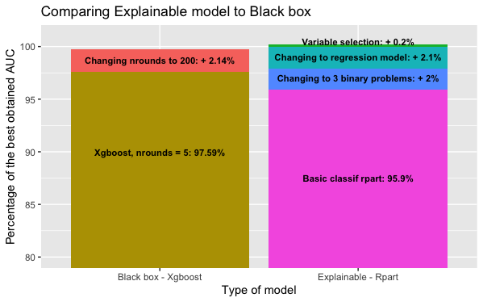

## Building an explainable model for ordinal classification. Meeting black box model performance levels.

*Authors: Karol Saputa, Małgorzata Wachulec, Aleksandra Wichrowska (Warsaw University of Technology)*

### Abstract

### Introduction and Motivation

In the classification problems, the main goal is to map inputs to a categorical target variable. Most machine learning algorithms assume that the class attribute is unordered. However, there are many problems where target variable is ranked, for example while predicting movie ratings. When applying standard methods to such problems, we lose some informaton, which could improve our model performance.

This paper presents various methods to make an explainable machine learning model for ordinal classification problem. The aim is to achieve better results than 'black box' model does. We will test some existing approaches to ordinal classification and take advantage of analysis and imputation of missing data, feature transformation and selection, as well as knowledge from exploratory data analysis. 

Our experiments are based on 'eucalyptus' dataset from OpenML. The dataset's objective is to find the best seedlot for soil conservation in seasonally dry hill country. Predictions are made depending on features such as height, diameter and survival of the plants. Target variable is ordered - it is represented by values 'low', 'average', 'good' and 'best'.

### Related Work

#### An approach to ordinal classification

##### Ordinal classification as a regression task

As described in [2], one of the most fundamental techniques is to cast target labels to a sequence of numbers. Then, a standard regression can be applied. There is an additional information about the classes in comparison to usual nominal classification. Also a metric used is different than in a classification task - mean square error used in a regression task takes into account similarities between two labels when conversion is applied. 

##### Transformation to multiple binary classification problems

#### Comparing black box to linear model

### Methodology

#### Initial preprocessing

The aim of this article was to build the best interpretable model for an ordinal classification problem and comparing it to a black box model. First undertaken step was dividing the data into training and test sets, consisting of 70% and 30% of all data, respectively. Since the considered dataset has a categorical target variable, the division was done using random sampling within each class of the target variable in an attempt to balance the class distributions within the splits. A seed was used to assure the same split in each tested model.

In order to get a legitimate comparison, the data was initially preprocessed in such a way as to assure that both models’ performances are compared on the same test set. This initial preprocessing included:

1. deleting the observations with ‘none’ value in the target variable from both the training set and the test set;

2. deleting observations with missing values from test set, resulting in a 6% decease of the test set observations.

It is important to note that missing values are still present in the training set. 

The reason why the missing data is deleted from the test set is that many of the explainable models cannot be run with missing data present. This means that the missing values will have to either be deleted or imputed later on. This leads to a possibility that the explainable model will impute missing data differently than the black box model, resulting in two different tests sets. And, if - instead of imputing missing data - we decide to delete it in order to make running explainable model possible, then the obtained test sets will differ in number of rows, making it impossible to draw any meaningful conclusions. Hence the missing data were deleted from the test set.

#### Running the black box model 

The black box model chosen for comparison is an extreme gradient boosting model. After the initial preprocessing the xgboost model was trained on the training set and used to predict results on the test set. As this model can only deal with numerical data, categorical (factor) variables were transformed using one hot encoding. The training proces and prediction were done using the mlr package in R, and the exact model specifications were the following:

* Learner classif.xgboost from package xgboost
* Type: classif
* Name: eXtreme Gradient Boosting; Short name: xgboost
* Class: classif.xgboost
* Properties: twoclass,multiclass,numerics,prob,weights,missings,featimp
* Predict-Type: response
* Hyperparameters: nrounds=200,verbose=0,objective=multi:softmax

The quality of prediction was measured using the AUC (area under ROC curve) measure. This provides the base for this research, to which other models’ results will be compared to.

#### Running the basic version the explainable model

We have chosen a tree model to be the considered explainable model, its exact specifications were the following:

* Learner classif.rpart from package rpart
* Type: classif
* Name: Decision Tree; Short name: rpart
* Class: classif.rpart
* Properties: twoclass,multiclass,missings,numerics,factors,ordered,prob,weights,featimp
* Predict-Type: response
* Hyperparameters: xval=0

As this model cannot be run with missing data, they were deleted from the training set before training the model. Another step was deleting one from each of the one-hot-encoded variables (the default function transforms variable with n factor levels into n columns, but n-1 columns are sufficient as the n-th column is a linear combination of the remaining n-1 columns). This model performed worse than the black box model - the outcomes are presented in the Results section of this article.

#### Improving the explainable model

As mentioned before, the explainable model was enhanced by applying existing approaches to ordinal classification, feature transformation and selection and missing data imputation. The refinement process consisted of, but was not limited to, the following:

1. Splitting a multiclass classification problem into 3 binary classification problems, like explained in the An approach to ordinal classification section of this article, and using the rpart model on each of the binary problems.
2. Changing the levels of the target variable:"low", "average", "good", "best" into numeric values: 1, 2, 3, 4, respectively and running a regression rpart model.
3. Imputing missing data in the training set.
4. Selecting variables: deleting the site names and specific location tags. 
5. Transforming Latitude variable from factor to numeric.

The fourth step has a scientific justification. The experiment for which the data was collected was focused on finding the best seedlot for soil conservation in seasonally dry hill country. All the data in this dataset comes from New Zealand, but there is a chance that the results of such experiment would be used for other geographical regions. So far our model was making the prediction based also on specific flat map coordinates and site names, that are present both in the training and the test set. This means it would be impossible to use this model for judging seedlots of eucalypti planted outside of New Zealand. To make this possible, we have decided to take away all the variables that give away the exact position of the seedlots, leaving features such as latitude and the characteristics of plants and their habitat.

After each improvement the model was retrained and the results obtained on the test set were saved and compared with the previous version of the model. If the new change has improved the model’s performance on the test set then it became the base for further development. Instead, if it has not improved the model’s performance, the previous version of the model was being further developed.

### Results

**Explainable models**:

| Model  | AUC | MSE | ACC | ACC1| Percent Best AUC | 
|-------|---|---|---|---|-----|
| Basic rpart | 0.8259145 | 0.5284076 | 0.5835207 | 0.9797400 | 95,89% | 
| Three binary rparts | 0.8430115 | 0.5392606 | 0.5816277 | 0.9826626 | 97,88% |
| Regression rpart | 0.86115629	| 0.4994688 |	0.5814851	| 0.93207583 |	99,99% | 
| Regression rpart  with imputation| 0.8597930 |	0.5038168 |	0.5798347 |	0.9306883 |	99,83% |
| Regression rpart  with no location | 0.8612852 |	0.4995913	| 0.5815428 |	0.9323226 |	100,00% |
| Regression rpart  with no location and numeric lattitide| 0.8612474 | 0.4993377 |	0.5816065 |	0.9322628 |	100,00% |

**Black box models**:

| Model  | AUC | MSE | ACC | ACC1| Percent Best AUC | 
|-------|---|---|---|---|-----|
| Xgboost | 0.8589771 | 0.4466546 | 0.6247675 | 0.9873244 | 99.73% |
| Xgboost with nrounds=5 | 0.8405102 | 0.4997935 | 0.6043936 | 0.9830193 | 97,59% | 

### Model explanantion

### Summary and conclusions 

### References

1. Frank, Eibe & Hall, Mark. (2001). A Simple Approach to Ordinal Classification. Lecture Notes in Computer Science. 2167. 145-156. 10.1007/3-540-44795-4_13
2. P. A. Gutiérrez, M. Pérez-Ortiz, J. Sánchez-Monedero, F. Fernández-Navarro and C. Hervás-Martínez, "Ordinal Regression Methods: Survey and Experimental Study," in IEEE Transactions on Knowledge and Data Engineering, vol. 28, no. 1, pp. 127-146, 1 Jan. 2016, doi: 10.1109/TKDE.2015.2457911.