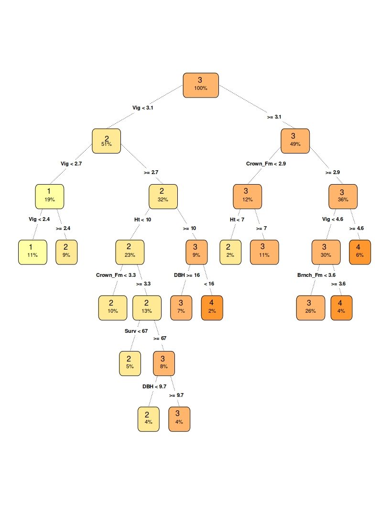

## Building an explainable model for ordinal classification on Eucalyptus dataset. Meeting black box model performance levels.

*Authors: Karol Saputa, Małgorzata Wachulec, Aleksandra Wichrowska (Warsaw University of Technology)*

### Abstract
It is popular nowadays to use black box models, which are complex and often unintuitive e.g. neural networks, in order to achieve high model performance without having to go in-depth into domain knowledge. However in some fields, e.g. banking or medicine it is crucial to understand not only what was the model outcome but also how was it obtained and why something was recommended - in other words we want to be able to explain models’ decisions. This is possible when using simpler models such as linear models or decision trees. 

In this article we argue that by using exploratory data analysis, domain knowledge, variable selection and other model improvements, it is possible to build simpler and easily interpretable models that are as accurate as black box models. For a specific task of ordinal classification and exemplary dataset of Eucalypti, we provide a model (with AUC metric better than considered black box model) with an explanation of techniques applied.

### Introduction and Motivation

In the classification problems, the main goal is to map inputs to a categorical target variable. Most machine learning algorithms assume that the class attribute is unordered. However, there are many problems where target variable is ranked, for example while predicting movie ratings. When applying standard methods to such problems, we lose some informaton, which could improve our model performance.

Main goal of machine learning models is predicting target with accuracy as high as possible. There are many complex ML models which, after sufficient amount of time, will give us very good predictions. Such models are called 'black boxes'. However, there are many situations when we want to know why each prediction was made. 'Black box' models usually do not give us such information. Hence, there is necessity of constructing simple, explainable machine learning models, which could be easily interpreted by non-technical person.
 
This paper presents various methods to make an explainable machine learning model for ordinal classification problem. The aim is to achieve better results than 'black box' model does. We will test some existing approaches to ordinal classification and take advantage of analysis and imputation of missing data, feature transformation and selection, as well as knowledge from exploratory data analysis. 

Our experiments are based on 'eucalyptus' dataset from OpenML [7]. The dataset's objective is to find the best seedlot for soil conservation in seasonally dry hill country. Predictions are made depending on features such as height, diameter and survival of the plants. Target variable is ordered - it is represented by values 'low', 'average', 'good' and 'best'.

This article is structured as follows: Section 2 provides a brief description of avaliable ordinal classification methods and existing black box to explainable model comparisons. Section 3 explaines the methodology used throughout our experiment. Section 4 shows the results obtained for various models and section 5 containes an explanation of the best achieved explaianble model. Section 6 sums up our findings. At the end, in section 7 there is a list of references we used in our research.

### Related Work

#### Ordinal classification as a regression task

As described in [1], one of the most fundamental techniques is to cast target labels to a sequence of numbers. For example $\{low, good, best\}$ changes to $\{0,1,2\}$. Then, standard regression can be applied. There is additional information about the classes in comparison to the usual nominal classification. Also, a metric used is different than in a classification task - mean square error used in a regression task takes into account similarities between two labels when a conversion is applied. 

#### Transformation to multiple binary classification problems

Ordinal classification taxonomy given in [1] specifies decompositions of classification task into binary problems as a separate technique to cope with ordinal classification. A more detailed algorithm and performance test are presented in [2] which suggests better scores obtained using binary decomposition than using a single model during a test on multiple datasets.

Based on [2], as a binary decomposition we define a conversion of a target classes $\{low, good, best\}$ into pairs of binary classes (True/False) $\{\{False, False\}, \{True, False\}, \{True, True\}\}$ determining whether outcome is better than $low$ and better than $good$. After classification is made, probabilites for original classes are calculated as explained in [1], [2]. 

#### Comparing black boxes and white boxes
As presented in the Introduction and Motivation section, we aim to achieve good results in a machine learning task using an explainable and interpretable model (white box). A black box model is used as a baseline model. Detailed justification of that approach can be found in [3]. Herein our work further develops this issue by presenting a model with the possibility to extract, understand and reuse of its decision logic for a specific task of ordinal classification.

### Methodology

The aim of this article is to build the best interpretable model for an ordinal classification problem and comparing it to a black box model. First undertaken step was dividing the data into training and test sets, consisting of 70% and 30% of all data, respectively. Since the considered dataset has a categorical target variable, the division was done using random sampling within each class of the target variable in an attempt to balance the class distributions within the splits. Since results obtained by the models were dependent on the random seed that was used when dividing the sets, the results compared thoughout this article are averaged out over 100 different random seeds, assuring a valid comparison could be done. 

#### Initial preprocessing

In order to get a legitimate comparison, the data was initially preprocessed in such a way as to assure that both models’ performances are compared on the same test set. This initial preprocessing included:

1. deleting the observations with ‘none’ value in the target variable from both the training set and the test set;

2. deleting observations with missing values from test set, resulting in a 6% decease of the test set observations.

It is important to note that missing values are still present in the training set. 

The reason why the missing data is deleted from the test set is that many of the explainable models cannot be run with missing data present. This means that the missing values will have to either be deleted or imputed later on. This leads to a possibility that the explainable model will impute missing data differently than the black box model, resulting in two different tests sets. And, if - instead of imputing missing data - we decide to delete it in order to make running explainable model possible, then the obtained test sets will differ in number of rows, making it impossible to draw any meaningful conclusions. Hence the missing data were deleted from the test set.

#### Running the black box model 

The black box model chosen for comparison is an extreme gradient boosting model. After the initial preprocessing the xgboost model was trained on the training set and used to predict results on the test set. As this model can only deal with numerical data, categorical (factor) variables were transformed using one hot encoding. The training proces and prediction were done using the mlr [5] package in R, and the exact model specifications were the following:

| Category | Specification |
| ---------------|----------|
| Learner| classif.xgboost from package xgboost |
| Type | classif |
| Name | eXtreme Gradient Boosting; Short name: xgboost |
| Class | classif.xgboost |
| Properties | twoclass,multiclass,numerics,prob,weights,missings,featimp |
| Predict-Type | response |
| Hyperparameters | nrounds=200,verbose=0,objective=multi:softmax |

Table: Parameters of extreme gradient boosting model

The quality of prediction was measured using the AUC (area under ROC curve) measure. We have also used other metrics suitable for ordinal classification task [4] and the results of all of the models are presented in table in the Results section of this article. However, AUC is the measure that we used to assess and compare each considered model. The AUC measure achieved by the black box is the one we tried to top using a simpler explainable model. 

#### Running the basic version the explainable model

We have chosen a tree model to be the considered explainable model, its exact specifications were the following:

| Category | Specification |
| --------|----------|
| Learner | classif.rpart from package rpart |
| Type | classif |
| Name | Decision Tree; Short name: rpart |
| Class | classif.rpart |
| Properties | twoclass,multiclass,missings,numerics,factors,ordered,prob,weights,featimp |
| Predict-Type |response |
| Hyperparameters | xval=0 |

Table: Parameters of decision tree model

As this model cannot be run with missing data, they were deleted from the training set before training the model. Another step was deleting one from each of the one-hot-encoded variables (the default function transforms variable with n factor levels into n columns, but n-1 columns are sufficient as the n-th column is a linear combination of the remaining n-1 columns). This model performed worse than the black box model - the outcomes are presented in the Results section of this article. The AUC measure achieved by this model provides the base for this research, to which other models’ results will be compared to.

#### Improving the explainable model

In the study, the explainable model was enhanced by applying existing approaches to ordinal classification, feature transformation and selection and missing data imputation. The refinement process consisted of, but was not limited to, the following:

1. Splitting a multiclass classification problem into 3 binary classification problems - binary decomposition with 3 rpart models (as described in section 2.2)
2. Changing the levels of the target variable:"low", "average", "good", "best" into numeric values: 1, 2, 3, 4, respectively and running a regression rpart model.
3. Imputing missing data in the training set.
4. Selecting variables: deleting the site names and specific location tags. 
5. Transforming Latitude variable from factor to numeric.

The fourth step has a scientific justification. The experiment for which the data was collected was focused on finding the best seedlot for soil conservation in seasonally dry hill country. All the data in this dataset comes from New Zealand, but there is a chance that the results of such experiment would be used for other geographical regions. So far our model was making the prediction based also on specific flat map coordinates and site names, that are present both in the training and the test set. This means it would be impossible to use this model for judging seedlots of eucalypti planted outside of New Zealand. To make this possible, we have decided to take away all the variables that give away the exact position of the seedlots, leaving features such as latitude and the characteristics of plants and their habitat.

After each improvement the model was retrained and the results obtained on the test set were saved and compared with the previous version of the model. If the new change has improved the model’s performance on the test set then it became the base for further development. Instead, if it has not improved the model’s performance, the previous version of the model was being further developed.

### Results

Results obtained for each model are shown in the tables below: 

**Explainable models**:

| Model  | AUC | MSE | ACC | ACC1| Percent Basic Explainable Model's AUC | 
|-------------------------|---|---|---|---|------------------------------|
| Basic rpart | 0.8259 | 0.5284 | 0.5835 | 0.9797 | 100.00% | 
| Three binary rparts | 0.8430 | 0.5393 | 0.5816 | 0.9827 | 102.07% |
| Regression rpart | 0.8611	| 0.4995 |	0.5815	| 0.9321 |	104.27% | 
| Regression rpart  with imputation| 0.8598 |	0.5038 |	0.5798 |	0.9307 |	104.10% |
| Regression rpart  with no location | 0.8613 |	0.4996 | 0.5815 |	0.9323 |	104.28% |
| Regression rpart  with no location and numeric lattitide| 0.8612 | 0.4993 |	0.5816 |	0.9323 |	104.28% |

Table: Metrics results for white-box models tested

**Black box models**:

| Model  | AUC | MSE | ACC | ACC1| Percent Basic Explainable Model's AUC | 
|-------------------------|---|---|---|---|-----|
| Xgboost with nrounds=5 | 0.8405 | 0.4998 | 0.6044 | 0.9830 | 101.77% | 
| Xgboost | 0.8590 | 0.4467 | 0.6248 | 0.9873 | 104.00% |

Table: Metrics results for black-box models tested

We have visualised the AUC measure improvements, in comparison to the basic rpart (decision tree) model, on the graph below. As shown on the graph, after adding the improvements, the explainable model was able to outperform the black box model, which was the point of this study. The best model is a decision tree, which is defined for a regression task, and which includes variable selection (taking away specific location tags as explained in the methodology section).

### Model explanantion

Our final explainable model is a simple regression decision tree. The interpretation of tree-based models is very simple: we start from the root node and go to the next nodes via the edges, basing on the decisions made by model. Subsequent decisions are connected by 'AND'. When we reach the leaf, we can read predicted value of the target. We can also easily compare the prediction of various "what if" scenarios. Moreover, there is no need to transform features used in model - there is no point in neither taking the logarithm of a variable nor normalize them in any other way. 

As described in [6], one of main advantages of decision trees is natural visualization: we create a graph based on choosen model. The graph is presented below. Depth of this model is 6. First divisions are made based on Vigour and Crown variables. We can conclude that small values of vigour leads to "low" or "average" utility feature. 

Looking into model features' importance we can extract variables used by our model. The most important features are:

- vigour (73.3%)
- stem form (7.9%)
- height (7.6%)
- seedlot number (4.1%)
- survival  (2.6%)
- crown form (2.3%)
- year of planting (2.2%)

### Summary and conclusions

In the study, three approaches to ordered classification were considered. On the studied Eucalyptus dataset, the ordinal classification as a regression task approach has given the highest AUC value. This could be due to the fact that the classes in the target variable were not equally distributed, and so the regression has performed better than multiclass classification or a set of binary classification problems. 

The final explainable model is a fairly simple decision tree, defined for a regression task, which includes variable selection. The variables excluded were mainly specific location tags, and deleting them means this model could be used for judging Eucalypti in other regions, not only the ones coming from New Zealand, where all the data comes from. 

Our goal was to build an explainable model that achieves results similar to a black box model. In fact, the model constructed in this article uses domain knowledge and application of different preprocessing and machine learning techniques and, as a result, performs better than a black box model. This shows that our goal was achievable and that explainable models can give comparable and sometimes even better results than black box models, in addition to a smaller computational cost and possibility to understand and explain decisions made to solve a problem. 

Different methods, as in [1] could also be applied in the future, to further improve the model built in this article.

### References

1. P. A. Gutiérrez, M. Pérez-Ortiz, J. Sánchez-Monedero, F. Fernández-Navarro and C. Hervás-Martínez, "Ordinal Regression Methods: Survey and Experimental Study," in IEEE Transactions on Knowledge and Data Engineering, vol. 28, no. 1, pp. 127-146, 1 Jan. 2016, doi: 10.1109/TKDE.2015.2457911.
2. Frank, Eibe & Hall, Mark. (2001). A Simple Approach to Ordinal Classification. Lecture Notes in Computer Science. 2167. 145-156. 10.1007/3-540-44795-4_13
3. Rudin, C. Stop explaining black box machine learning models for high stakes decisions and use interpretable models instead. Nat Mach Intell
4. Gaudette L., Japkowicz N. (2009) Evaluation Methods for Ordinal Classification. In: Gao Y., Japkowicz N. (eds) Advances in Artificial Intelligence. Canadian AI 2009. Lecture Notes in Computer Science, vol 5549. Springer, Berlin, Heidelberg
5. mlr package: Machine Learning in R. Accessed 17 June 2020 from https://mlr.mlr-org.com/
6. Molnar, C. Interpretable Machine Learning. A Guide for Making Black Box Models Explainable.
7. OpenML. Accessed 17 June 2020 from https://www.openml.org/d/188
