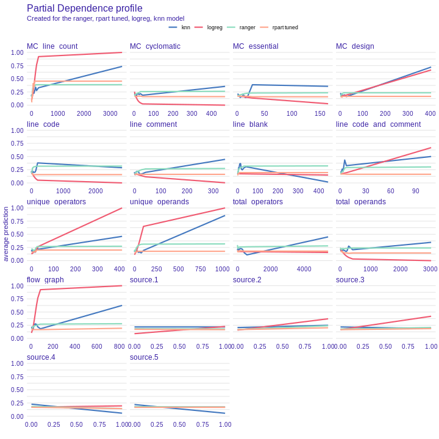

## Predicting code defects using interpretable static measures.

*Authors: Wojciech Bogucki, Tomasz Makowski, Dominik Rafacz (Warsaw University of Technology)*

### Abstract

In building machine learning models, sometimes more important than effectiveness is their easy explanation. In the case of data on defects in the code that this article concerns, explainability helps to justify decisions on whether or not to accept a given piece of work. In this project, we are looking at the code data from NASA systems to see if measures that are transformations of simple variables in combination with a white-box model can be effective enough to achieve comparable results to black-box models. We iteratively build the white-box models by applying different methods to them and preserving those changes that improve the score relative to the black-box random forest model. The comparison is made using crossvalidation. The most important modifications among those that we consider are adding the measurements both proposed by McCabe and Halstead as well as those generated by us.

We managed to build a decision tree model better than the black-box one, but contrary to expectations, neither the generated measures nor the original ones bring almost any improvement to the models' results. The tree has been heavily tuned, which makes it still interpretable, but not in so obvious way. Great improvement in score was provided by adding synthetical data to the minority class, which may also raise doubts about the interpretability. We conclude that the data from this set does not sufficiently describe the complexity of the problem, and as a consequence, the measurements themselves, although they may give some indication, are also not sufficient.

### Introduction and Motivation

Since the very beginning of the computer revolution there have been attempts to increase efficiency in determining possible defects and failures in the code. An effective method to do so could bring many potential benefits by identifying such sites as early as at the code development stage and eliminating costly errors at the deployment stage. McCabe and Halstead proposed a set of measures that are based on static properties of the code (including basic values, e.g. number of lines of code or number of unique operators, as well as transformations of them, [-@mccabe76] [-@halstead77]). In their hypotheses, they argue that these measures can significantly help to build models that predict the sensitive spots in program modules. However, it can be argued that the measures they propose are artificial, non-intuitive, and above all, not necessarily authoritative, not taking into account many aspects of the written code and program [@fenton97].

To support their hypotheses with, McCabe and Halstead collected information about the code used in NASA using scrapers and then used machine learning algorithms. In this article we use the above data sets to build a model that best predicts the vulnerability of the code to errors. We check whether static code measures (being transformations of basic predictors) significantly improve prediction results for the so-called white-box models (e.g. trees, linear regression and k nearest neighbors algorithm). Our goal is to build, using simple data transformations and easily explainable methods, such model that will achieve results comparable to the black-box model (such as neural networks or gradient boosting machines) used on data without advanced measures. We also want to compare the effectiveness of the measures proposed by McCabe and Halstead and compare them with the measures we have generated.

### Dataset

Our dataset comes from the original research of Halstead and McCabe. We obtain it by combining the sets from `OpenML` [@OpenML2013] and supplementing them with data from the `PROMISE` repository [@Sayyad-Shirabad+Menzies:2005].

It contains data collected from NASA systems written in `C` and `C++` languages. The data is in the form of a data frame containing more than $15000$ records. Each record describes one "program module". -- with this generic term, the authors defined the simplest unit of functionality (in this case, these are functions). Each record is described with a set of predictors, which can be divided into several groups:

* Basic measures (such as number of lines of code, number of operands, etc.).
* McCabe's measures how complex the code is in terms of control flow and cross-references .
* Halstead's measures for general code readability.
* Target column (1 if module contains defects, 0 if not).
* Source column we added, specifying from which subsystem the module came (the original 5 datasets came from different systems).

The dataset is slightly imbalanced -- about $20\%$ of records are classified as having defects.

In order to verify our hypotheses, we decide at the beginning to remove the Halstead's measures (which were transformations of the basic measures) from the collection to see if we are able to build an effective black-box model without them. We also wanted to remove McCabe's measurements, but the basic measurements that he used to calculate his measurements are not preserved in the dataset, so we decide to keep them.

There are not many records with openly missing data in the set ($< 1\%$), however, the values of some columns raise doubts -- in the column containing information about the number of lines of code of a given module in many cases there is a value $0$, which is not reliable. However, it turned out during the preliminary analysis that deleting those records significantly worsens the model score, so we decided to keep them. 

### Methodology

Our research consist of the following stages:

1. Data exploration.
2. Initial data preparation.
3. Building of black-box and white-box models and comparing them against the relevant measurements.
4. Repeating the cycle:
   
   (a) Improvement of white-box models by modifying their parameters or data.  
   (b) Measuring the effectiveness of the models built.
   (c) Analysis of the resulting models.
   (d) Keeping or rejecting changes for further work.
   
5. Selection of the best white-box model and final comparison with the black-box model.

During the step 4. in some cases we decide to take a step back and use other similar transformation or other order of transformations if we suspect that it can yield a better result.

We use `R` programming language and popular machine learning project management packages -- `mlr`  [@mlr] and `drake` [@drake]. 

#### Data exploration

At this stage, we take a closer look at what the data looks like and we are analyzing their distributions, gaps, correlations and simple relationships.

#### Initial data preparation

This stage consists mainly of merging the data sets, as mentioned earlier, and adding a source column (in fact, we add five indicator columns, which contain one-hot-encoded value, as models generally do not cope well with character columns). Since there is not much missing data, we impute them with the median, because this method is effective and fast.

Imputation is necessary from the very beginning, as many models cannot cope with missing values. Since there were very few missing values, it does not affect significantly the result of those models that would still work. We do not carry out further transformations at this stage because we do not want to disturb the results of the next stage.

#### Starting models

We build models on this almost unaltered data. We use one poorly interpretable model (black-box) -- random forest, specifically `ranger` package [@ranger], because it is fast and low-effort. Among well interpretable models (white-boxes) used in our work there are:

   * logistic regression (`lm`),
   * decision tree (`rpart`),
   * k-nearest neighbors algorithm (`kknn`).
   
We train the models into data that we have divided into five folds with a similar distribution of the decision variable, on which we will perform cross-validation. Then we compare the results using commonly used measure -- AUC (Area Under Curve) [@auc], which not only assesses whether the observations are well classified, but also takes into account the likelihood of belonging to a class. AUC is not the best measure to be used on imbalanced dataset. However, the unbalance here is not big enough to make this choice unreliable. We use AUC as the main comparative criterion of the models also in the further part of our work.

#### Improving white-boxes

This is a key part of our work. In the iterative cycle we use different methods to improve the quality of the white-box models. After applying each of these methods, we check whether it has improved our score and possibly analyze the model, using statistical methods (residuals analysis) and explanatory machine learning (`DALEX` package [@DALEX]), to draw indications of what should be done next.

We are trying the following methods:

* **Tuning hyperparameters of models** -- Default hyperparameters for models are generally good, but in specific cases using specific hyperparameters may yield in better results, so we use model-based optimization for tuning those parameters [@mlrmbo].
* **Reducing outliers** -- For each variable a two-value vector that indicates the thresholds for which the values are considered as outliers is generated. Then all outliers are changed to the nearest value of obtained earlier vector.
* **Logarithmic and exponential transformations of individual variables** -- So that linear relationships can be better captured and to reduce the influence of outliers, we transform variables using exponential and polynomial functions.
* **Discretization of continuous features** -- Some variables do not have a linear effect on the response variable, even if they are transformed by simple functions like exponential function, sometimes there are clear thresholds -- so we can replace the variable with indexes of individual segments. The `SAFE` algorithm helps with this [@gosiewska2019safe].
* **Generating new columns as functions of other columns** -- There may be interactions between variables that cannot be captured by linear models. In order to take them into account, we generate new columns, applying to the rest of them various transformations -- we take their inverses, products, quotients, elevations to power, and so on. As a result of these operations, a lot of new measures, potentially simillar to those proposed by McCabe and Halstead, are created, which we later evaluate. We also analyze their interpretability, i.e. to what extent they are translatable into an intuitive understanding of such a measure. At this point we also consider Halstead and McCabe's measurements. 
A model with thousands of variables is not well interpretable, so we need to select meaningful measures. We do this by training rpart and ranger models with these additional features and we use `DALEX`to select the significant ones. We do it twice so at the and we had around 10 of the most important features. 
* **Oversampling** -- On the basis of the data set, we generate more observations from the minority class using the `SMOTE` algorithm [@smote] so that the model more emphasizes the differences in characteristics of individual classes. In order to avoid model overfitting, we generate data within each fold separately and during crossvalidation we use 4 folds with synthetic data as a train set and the 5th fold without synthetic data as a test set.

Our goal is to beat black-box model. In our case we chose random forest model from package ranger. As a white-box model we used logistic regression. Results were tested on dataset with different transformations.

#### Selecting the best model

At the end of the process, we select the model that has the highest AUC score for crossvalidation on our dataset.

### Results

Our base black-box model result is $0.792$. The results of individual models after applying transformations are shown in the Table 1.

| Order | Applied operation                     | logreg  | kknn    | rpart   | Kept?   |
|-------|---------------------------------------|---------|---------|---------|---------|
| -     | Base                                  | $0.735$ | $0.728$ | $0.500$ | -       |
| 0     | `rpart` tuning                        | $0.735$ | $0.728$ | $0.737$ | **yes** |
| 1a    | Normalization                         | $0.735$ | $0.727$ | $0.737$ | no      |
| 1b    | Outlier reduction                     | $0.743$ | $0.732$ | $0.739$ | no      |
| 1c    | Logarithm                             | $0.744$ | $0.718$ | $0.725$ | no      |
| 2a    | Outlier reduction and normalization   | $0.743$ | $0.732$ | $0.739$ | **yes** |
| 2b    | Logarithm and outlier reduction       | $0.744$ | $0.717$ | $0.725$ | no      | 
| 3a    | Gain-ratio discretization             | $0.743$ | $0.732$ | $0.739$ | no      |
| 3b    | `rSAFE`                               | $0.744$ | $0.718$ | $0.734$ | no      |
| 4a    | New features selected by `ranger`     | $0.747$ | $0.729$ | $0.733$ | no      |
| 4b    | New features selected by `rpart`      | $0.745$ | $0.731$ | $0.739$ | no      |
| 4c    | Halstead's measures                   | $0.745$ | $0.731$ | $0.738$ | no      |
| 5a    | `SMOTE` with new features by `ranger` | $0.749$ | $0.737$ | $0.800$ | no      |
| 5b    | `SMOTE` with new features by `rpart`  | $0.747$ | $0.736$ | $0.793$ | no      |
| 5c    | `SMOTE` without new features          | $0.745$ | $0.736$ | $0.804$ | **yes** |

*Table 1: AUC in white-box models. Each row describes one of the operation that we apply in order to obtain improvement and results of individual models. The first column indicates the order in which we used these transformations. The letters "a, b, c" indicate that we used different transformations with "backtracking", i.e. we applied them parallel to the same model as they are similar. The last column informs if we decided to keep the change or reject it.*

Since at the beginning `rpart` had the AUC value of $0.5$, firstly we tuned its hyperparameters and there was significant improvement in result. 

Then as step 1a-1c we tried 3 basic transformations of data as normalization of all columns, outlier reduction and logarithm of nearly all columns (without one hot encoded source). As we can see the best improvement was achieved by using outliers reduction so in step 2a we tried to add normalization to that and in step 2b we tried to reduce outliers after applying logarithm. Only outliers reduction and normalization were good enough to be used in the following experiments. We were considering also keeping the logarithmic transformation as it improves `logreg` result, but we rejected it because it results in drop in the results of other models.

Next we used discretization of some columns. Unfortunately, any of the gain-ratio method from `funModeling` (3a) and `rSAFE` (3b) did not make statistically important better result. Using partial dependency plot on the black-box model do not show that there is variable which can be discretized.

Then we tried to create new measures based on basic Halstead measures. We selected best measures by `DALEX` variable importance on one of two learners: ranger or `rpart`. Then on we test the models after adding the best 10 measures to the dataset, but the results were not promising except from the logistic regression in 4a.

Use of the `SMOTE` algorithm gave a huge improvement especially in decision tree and the best result is in dataset with only outliers reduction and normalization without any new features.

### Summary and conclusions

Although we achieved the main goal and created the interpretable model that is better than the black-box the way to achieve that is not satisfying. The most improvement was gained from just hyperparameters tuning of decision tree and oversampling minority class, but the addition of new synthetical data to the minority class is not a questionable method of improving the model. The thing we really trusted that can make improvement was Halstead and McCabe's measures but any of them do not give any improvement in the model. So we can conclude that the hypotheses of both of them are wrong. Probably the features proposed in original datasets are not sufficient in this problem because there is hardly any improvement with the manipulation of these features. The most informative measure is just a number of code lines. Another possibility is that the code scrapers to create data had some mistakes and that concludes the low quality of data.

We visualize the best model based on `SMOTE`. Since we use the decision tree and in the last model do not create any new measures so it is an interpretable model. It is obvious how it works and why it predicts results because we can show the decision points. Unfortunately, this model is not very trivial. Its depth is usually around 6 nodes and in total it has around 50 nodes. That is why we do not include it in the article - it will not be readable. The created plot, as well as the code, can be found on the GitHub repository [@WBTMDR2020].
