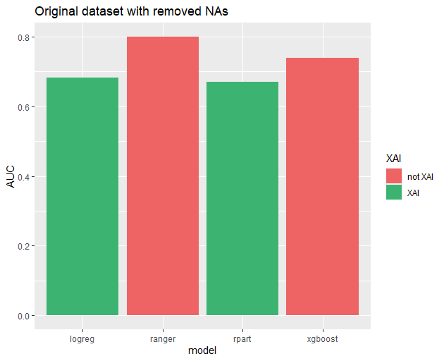
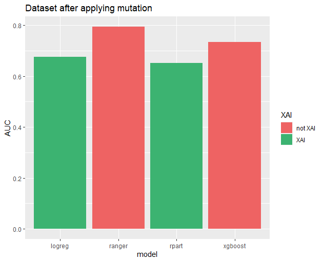
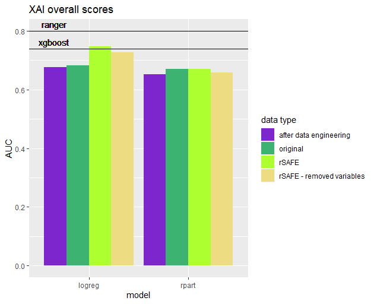
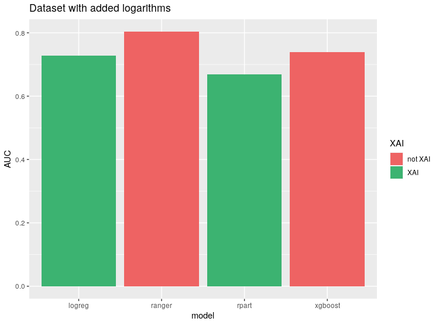

## Using interpretable Machine Learning models in the Higgs boson detection.

*Authors: Mateusz Bakala, Michal Pastuszka, Karol Pysiak (Warsaw University of Technology)*

### Abstract
This article focuses on comparing efficiency of explainable and black-box AI models in detection of the Higgs boson.
Furthermore, it discusses possible modification to data, aiming to improve the performance of explainable models including both manual and automated methots, the latter represented by the `rSAFE` package. It concludes that some improvement is possible, but limited without obscuring variables used to explain model, thus reducing explainability. It also leads to a remark that logistic regression is the most sensitive model to variable manipulation, allowing achieving scores comparable with black-box models with some data engineering.

### Introduction and Motivation
‘We fear that, which we do not understand’. This principle has often been used to portray artificial intelligence in popular culture. The notion that it is something beyond human comprehension became so common, that it started to affect the way we perceive computer algorithms. Because of that, it comes as no surprise that people become wary, hearing that the decisions which affect them directly were made by an AI.

Machine Learning models, regardless of the algorithm used, are often treated as a black box that takes some data as an input and returns a prediction based on said data. This approach is most often seen from people who are unfamiliar with the methods used. In many fields, where the only concern is achieving results that are as accurate as possible, this is not a concern. There are however situations, where the risk of unpredictable or unjustified results is unacceptable. This includes uses in medical and judicial systems, where an incorrect decision may have severe consequences. Artificial intelligence could find plenty of uses in those areas, but it would require creating models, which make decisions based on a transparent set of rules. Those include algorithms such as decision trees and linear regression.

That raises another problem. Such models often underperform in comparison to more advanced algorithms, notably artificial neural networks and ensemble based solutions, which are more capable at detecting nonlinearities and interactions in the data. Being able to achieve results comparable with said models, while retaining explainability would allow to increase the role of machine learning in fields where transparency is required. Furthermore, it would provide tools suitable for scientific analysis of relations between complex phenomena. Because of that, instead of using one of the popular medical datasets, we decided to test the viability of our approach on a set from a different field of science. The methods used will be tested on the Higgs [@Baldi2014] dataset described later in the article. The dataset comes from the OpenML [@OpenML2013] website.

The problem we study tackles methods of improving the predictions of simple models while retaining their transparency. In the rest of the paper we will describe methods of transforming the data to increase the quality of predictions. Most notably we will focus on a tool named rSAFE [@gosiewska2019safe], which allows us to extract nonlinearities in the data, based on predictions of a so called ‘surrogate’ model. We will also try to improve predictions based on our knowledge about the data.

### Related Work
Our work is based on earlier one focused on feasibility of usage of neural networks in this very problem [@Baldi2014]. However, it only concentrates on this question, testing various sizes and architectures of neural networks, but not in the context of interpretability of machine learning models. Thus we built our analysis on what was already achieved.

### Methodology

#### Data
Modern high energy physics is being done in colliders, of which the best known is Large Hadron Collider near Geneva. Here, basic particles are accelerated to collide at almost speed of light, resulting in creation of other, searched for particles. However, not every collision leads to desired processes and even then target particles may be highly unstable.

One of such tasks is producing Higgs bosons by colliding two gluons. If a collision is successful, two gluons fuse into electrically-neutral Higgs boson, which then decays into a W boson and electrically-charged Higgs boson, which in turn decays into another W boson and the light Higgs boson. The last one decays mostly into two bottom quarks. However, if a collisions isn’t successful, two gluons create two top quarks, decaying then into a W boson and a bottom quark each, resulting in the same end-products, but without a Higgs boson in an intermediate state. The first process is called ‘signal’, while the second -- ‘background’.

Our dataset is a dataset called ‘higgs’, retrieved from OpenML database. It contains about 100 thousand rows of data generated with an event generator using Monte Carlo method and is a subset of a [HIGGS dataset from UCI Machine Learning Repository](archive.ics.uci.edu/ml/datasets/HIGGS). The purpose of this data is to be used as a basis for approximation of a likelihood function, which in turn is used to extract a subspace of high-dimensional experiment data where null hypothesis can be rejected, effectively leading to a discovery of a new particle.

Each row describes event, which must satisfy a set of requirements. Namely, exactly one electron or muon must be detected, as well as no less than four jets, every of these with the momentum transverse to the beam direction of value $> 20 GeV$ and an absolute value of pseudorapidity less than $2.5$. Also, at least two of the jets must have b-tag, meaning than they come from bottom quarks.

Each event is described by its classification, 1 if a Higgs boson took part in the process or 0 if not. This column is our target, so it’s a two-class classification problem. There are 21 columns describing various low-level features, amongst which there are 16 describing momentum transverse to the beam direction (`jetXpt`), pseudorapidity (`jetXeta`), azimuthal angle (`jetXphi`) and presence of b-tag (`jetXb-tag`) for each of the four jets, as well as three first of these for the lepton (that is, electron or muon) and missing energy magnitude and its azimuthal angle.

There are also 7 columns describing reconstructed invariant mass of particles appearing as non-final products of the collision event. Names like `m_jlv` or `m_wbb` mean that the mass reconstructed is of a particle which products consist of jet, lepton and neutrino or a W boson and two bottom quarks respectively. In this case, these particles are namely top quark and electrically-charged Higgs boson. These columns are so-called top-level features.

#### Measures
The first measure that we will use is a simple accuracy. It can be misleading, especially when the target variable is unbalanced, but it is very intuitive and in our dataset the target variable is well-balanced. 

Second measure is the AUC score, which stands for Areas Under Curve of Receiver Operating Characteristic. It requires probabilities as an output of the model. We create the curve by moving the threshold of a minimal probability of a positive prediction from 0 to 1 and calculating the true positive rate to false positive rate ratio. This measure is much less prone to give falsely high scores than accuracy. The worst score in the AUC is $0.5$. We want to get AUC score as close as possible to $1$, however, close to $0$ is not bad, we just must invert the labels and we will get a close to $1$ AUC score. 

Our last measure is Mean Misclassification Error (mmce). It is defined as number of misclassified cases divided by total number of cases, that is $1-accuracy$. 

#### Models
The main goal of this research is to find a way of enhancing the performance of interpretable models, so now we will choose algorithms for this task. For the first test algorithm we chose the logistic regression. It is one of the simplest classification methods. Like in the linear regression algorithm we fit a function to the training data, just instead of a linear function we use a logistic function for the logistic regression algorithm. So the interpretability amounts to the understanding of how points are spread throughout the space. 

The second algorithm that we will use is a decision tree from the package rpart [@rpart]. It’s structure is very intuitive. We start our prediction from the root of a tree. Then we go up to the leaves basing our path on conditions stated in particular nodes. It is similar to how humans make their decisions. If we have to make one big decision we divide it into many smaller decisions which are much easier to make and after answering some yes/no questions we reach the final answer to the question, so to interpret this model we have to understand how these small decisions in every node are made. 

Black box models usually have very complex structure, which gives them advantage in recognising complex structures of the data. On the other hand, they are very hard to interpret and explain compared to white box models. There is a package in the R language named rSAFE that meets halfway between black box models and white box models. It is a kind of a hybrid that uses black box models for extracting new features from the data and then using them to fit interpretable models. We will use it for enhancing our interpretable model and compare them to pure white box models.

To have some perspective of what level of quality of predictions we can reach we will test some black box models. The black box model that we will use is ranger [@ranger]. This is a fast implementation of random forests. This is a light and tunable model, so we will try to reach the best performance as we can with this algorithm. As a second black box for comparison we used eXtreme Gradient Boosting [@XGBoost].

For easily comparable results we will use exactly the same training and testing dataset. However, we do not limit our feature engineering to only one process for all models, because every algorithm can perform better with different features than the rest. What is more, we will focus on augmenting data in a way that will enable us to get as much as we can from simple, interpretable models.

### Results

Our original scores were as follows:

| model   | Accuracy  | AUC       | MMCE      |
|---------|-----------|-----------|-----------|
| ranger  | 0.7220879 | 0.8004664 | 0.2779121 |
| rpart   | 0.6531224 | 0.6703391 | 0.3468776 |
| xgboost | 0.6781099 | 0.7387571 | 0.3218901 |
| logreg  | 0.6410977 | 0.6823442 | 0.3589023 |
Initial model performance.

We could not illustrate scores with all three measures at once, so we decided to use AUC in our barplots. It makes no difference, though, as every measures behaved similarly, that is, whenever model A had better score in metric X than model B, the same was true for metrics Y and Z. While it certainly isn't an universal behaviour, it was so prevalent in our results that we gladly embraced it.

We noticed several patterns in data and modified features accordingly.

Firstly, four jets are indistinguishable from each other, or at least we weren’t told they are. Thus our models should work equally well regardless of how we permute the order of jets in our data. However, this means that the coefficients should be equal, and that’s a serious limitation in our search space. Instead, we propose that each data point should be transformed to order jets by their $p_T$, transverse momentum.

Another thing we noticed relates to jets’ b-tags. One thing is that they are categorical values with three levels, where $0$ means background process unrelated to bottom quarks and is usually written down as $-1$, highest value means signal process, described as $1$, and that value in between is probably something like ‘unknown’, especially given the fact that it is depicted by $0$. Another important remark is that at most two of jets for given collision have b-tag value other than ‘background process’, sometimes even none of them. With these points in mind, our proposition is to replace four b-tags columns with a set of six columns. Four of them would be logical vectors, determining whether b-tag is present on given jet, denoted as `jetXb.tag`, where `X` is between $1$ and $4$. Remaining two would be named `b.tagYdet`, where `Y` is either $1$ or $2$ and also logical vector, where `TRUE` means that b-tag value is either ‘background process’ or ‘signal process’, while `FALSE` means, well, the opposite and is used to describe $0$, ‘unknown’ value. Note that in this proposition no b-tag can be safely marked by setting `FALSE` for all `jetXb.tag` columns. To avoid ambiguity, we propose that b-tags should be ordered by $p_T$ of their respective jets, which would be achieved by default, as jets would be already ordered at this point.

| model   | Accuracy  | AUC       | MMCE      |
|---------|-----------|-----------|-----------|
| ranger  | 0.7185489 | 0.7947530 | 0.2814511 |
| rpart   | 0.6422300 | 0.6516345 | 0.3577700 |
| xgboost | 0.6740201 | 0.7351031 | 0.3259799 |
| logreg  | 0.6379972 | 0.6760226 | 0.3620028 |
Performance of models after proposed transformations.

Applied transformations did not produce favourable results. Actually, every model performed slightly worse. Because of that, we decided to apply an automated method of transforming data using the `rSafe` package. As the ranger model performed significantly better than the others, we used it as a surrogate model to create new transformations. After that, we tested our models using the complete resulting data set, including both original variables and their transformations. The results are presented in the table.

| model  | Accuracy  | AUC       | MMCE      |
|--------|-----------|-----------|-----------|
| rpart  | 0.6488898 | 0.6705438 | 0.3511102 |
| logreg | 0.6805985 | 0.7481106 | 0.3194015 |
Performance of interpretable models after applying `rSAFE` transformations.

Although the scores of rpart dropped, we achieved a significant improvement in the performance of logistic  regression. It was still below the level of the ranger algorithm, but it managed to surpass xgboost. Increasing the number of variables lead, hovewer, to a decrease in interpretability. `rSAFE` includes a function, that selects the best subset of variables from it's resulting dataset. We applied it to our data and trained the models once again.

| model  | Accuracy  | AUC       | MMCE      |
|--------|-----------|-----------|-----------|
| rpart  | 0.6366817 | 0.6593928 | 0.3633183 |
| logreg | 0.6638212 | 0.7279496 | 0.3361788 |
Performance of interpretable models after applying `rSAFE` transformations and subsetting variables.

As it turns out, removing variables lead to a decrease in scores. Logistic regression still performed better than on original data, but it no longer surpassed any of the blackbox models.

After that, we decided to generate new variables as transformations of the existing ones. We tested raising numeric variables to different powers, and applying logarithms. While power transformations did not affect results, we noticed an improvement after adding logarithms in the performance of logistic regression.

| model   | Accuracy  | AUC       | MMCE      |
|---------|-----------|-----------|-----------|
| ranger  | 0.7256474 | 0.8031399 | 0.2743526 |
| rpart   | 0.6530306 | 0.6689441 | 0.3469694 |
| xgboost | 0.6768758 | 0.7388668 | 0.3231242 |
| logreg  | 0.6690531 | 0.7270340 | 0.3309469 |
Performance of models after adding logarithm transformations.

Finally, we applied `rSafe` transformations as before, now on the dataset with new variables.

| model  | Accuracy  | AUC       | MMCE      |
|--------|-----------|-----------|-----------|
| rpart  | 0.6332038 | 0.6384015 | 0.3667962 |
| logreg | 0.6900427 | 0.7582915 | 0.3099573 |
Performance of models after adding logarithm and `rSAFE` transformations.

This way we achieved additional performance increase for logistic regression, surpassing its previous scores. Similarly to before, removing excess variables negatively affected performance of logistic regression. This time it didn't really affect rpart model, but it performed badly, so it was out of the competition already.

| model  | Accuracy  | AUC       | MMCE      |
|--------|-----------|-----------|-----------|
| rpart  | 0.6368142 | 0.6438115 | 0.3631858 |
| logreg | 0.6812818 | 0.7479311 | 0.3187182 |
Performance of models after adding logarithm and `rSAFE` transformations and subsetting variables.

### Summary and conclusions

Our study shows that popular explainable machine learning models are significantly behind their black-box counterparts on prediction accuracy. Unfortunately, the latter are not of much use for physicists. We managed to improve our explainable models by creating new variables, but they were still falling behind the best black-boxes, while their explainability suffered. We suppose that achieving a score comparable to the best black-box models would involve generating a lot more artificial variables. However, it would have an unwelcome side effect of obscuring the data and hampering the explainability of the model even further. Thus, expert domain knowledge should be deemed necessary -- either this, or more effective XAI has to be developed.
