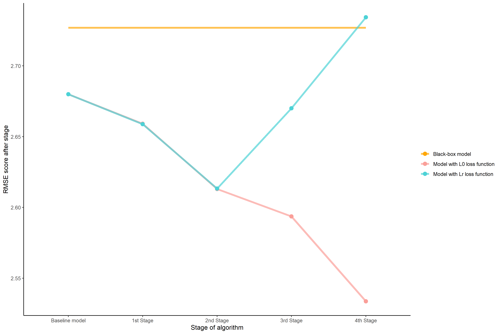

## Can Automated Regression beat linear model?

*Authors: Bartłomiej Granat, Szymon Maksymiuk, (Warsaw University of Technology)*

### Abstract

*Health care is a subject everyone is familiar with, therefore it is clear we want to constantly improve our knowledge about appliances of today's science in medicine. TBD*

### Introduction and Motivation

Health-related problems have been a topic of multiple papers throughout the years and machine learning brought some new methods to modern medicine.[@Obermeyer2016], [@mednature]. We care so much about our lives that every single algorithm and method eventually gets tested on some medical data.

What is unique about health data is that black-box models are completely useless in this subject. Almost always doctors know whether a patient is sick or not. What is important to them is the reason why he is sick. That's why explainable machine learning is the key to make all of us healthier. However XAI methods are not very well defined yet and they lack strong statistical background like tests, etc. That caused strong opposition of Explainable Machine Learning to rise[@Rudin2019]. Unfortunately making a good explainable model for health data might be close to impossible. Medical problems of all kinds can be very unique, complex, or completely random. That's why researchers spend numerous hours on improving their explainable models and that's why we decided to test our approach on `liver disorders` dataset with help. We will try to improve the linear model results with the help of the AutoML black-box model.

There is a big discussion in the scientific world about "what does it mean for a model to be interpretable?"[@Lipton]. Unfortunately there is no clear answer to that question and often it is necessary to specify what is supposed to be meant as interpretable. In this paper we assume that the model is interpretable if it is possible to explicitly track down what contributed to model answer and to do it in a finite time. It means that all transformation of variables or even concatenations are possible as soon as a used type of model is simply structured like a linear model is. However, we understand other's opinions and we will present also results with only simple transformations and without controversial concatenations.

The `liver-disorders` dataset is well known in the field of machine learning[@liverdisorder] and that's exactly the reason why we chose it. It is described in the next chapter. Our goal was to find a relatively clean dataset with many models already done by other researchers. Another advantage is the availability of the dataset. It is published on the OpenML repository and therefore everyone can give a shot to that problem. We don't want to show that properly cleaned data gives better results but to achieve, an explainable model found after a complex analysis that we want to test.

In this paper we do a case study on `liver disorders` dataset and want to prove that by using automated regression it is possible to build an easy to understand prediction that outperforms black-box models on the real dataset and at the same time achieve similar results to other researchers. By automated regression we understand a process when we search through space of available dataset transformation and try to find the one for which linear regression model is best using earlier defined loss function. 

### Data

The dataset we use to test our hypothesis is a well-known `liver-disorders` first created by 'BUPA Medical Research Ltd.' containing a single male patient as a row. The data consists of 5 features which are the results of blood tests a physician might use to inform diagnosis. There is no ground truth in the data set relating to the presence or absence of a disorder. The target feature is attribute drinks, which are numerical. Some of the researchers tend to split the patients into 2 groups: 0 - patients that drink less than 3 half-pint equivalents of alcoholic beverages per day and 1 - patients that drink more or equal to 3 and focus on a classification problem.

All of the features are numerical. The data is available for 345 patients and contains 0 missing values. 

The dataset consists of 7 attributes:

1. mcv - mean corpuscular volume
2. alkphos - alkaline phosphatase
3. sgpt - alanine aminotransferase
4. sgot - aspartate aminotransferase
5. gammagt - gamma-glutamyl transpeptidase 
6. drinks - number of half-pint equivalents of alcoholic beverages drunk per day
7. selector - field created by the BUPA researchers to split the data into train/test sets

For further readings on the dataset and misunderstandings related to the selector column incorrectly treated as target refer to: "McDermott & Forsyth 2016, Diagnosing a disorder in a classification benchmark, Pattern Recognition Letters, Volume 73."


### Methodology

AutoMl Model $M_{aml}$ and the dataset $D$ that consists of $D_{X} = X$ which is set of independent variables and $D_{y} = y$ - dependent variable (ie. target). We assume that $M_{aml}$ is an unknown function $M_{aml}: \mathbb{R}^{p} \to \mathbb{R}$, where p is a snumber of features in the $D$ Dataset, that satisfies $y = M_{aml}(X) + \epsilon$ where $\epsilon$ is an error vector. Automated regression constructs known vector function $$G_{AR} : \mathbb{R}^{n \times p} \to \mathbb{R}^{n \times p_{1}}$$ where $n$ is a number of observations, that satisfies $$y = G_{AR}(X)\beta + \epsilon$$ thus it is linear regression model fitted for transformated data. $p_{1}$ does not have to equal $p$ since we allow conncatenations of variables.

To find $G_{AR}$ we have to put some constraints. First of all we want it to minimize loss function one of two loss functions $L: \mathbb{R}^{n} \to \mathbb{R}$. First of them is $$L_{R} : \frac{\sqrt{\sum_{i=1}^{n}(y_{i}-\hat{y_{i}})^{2}}\sum_{i=1}^{n}(y_{i}-\bar{y_{i}})^{2}}{\sum_{i=1}^{n}(\hat{y_{i}}-\bar{y_{i}})^{2}}$$ which can be interpreted as Root Mean Square Error divided by the R-squred coefficient of determination. R-squared stands as measure of variance explained by the model [@3-7-houseprices-tree] and therfore may be usefull to find best explanation of interactions met in the data. Obviously high coefficient does not always mean excelent model, furthermore even low values of it not alwyays inform us about uselessness of found fit. Therefore minimization will be prefromed independetly using second mesure as well $$L_{0} : \sqrt{\sum_{i=1}^{n}(y_{i}-\hat{y_{i}})^{2}}$$ which is Root of the Mean Squared Error (RMSE). One top of that we also put constrains on domain of valid transformations of particular variables. For given dataset, described in the previous paragraphs we decided to use:

* Feature selection
  + XAI feature Importance
* Continuous transformation
  + Polynomial transformation 
  + Lograthmic transformation
* Discrete transformation
  + SAFE method
* Feature concatenation
  + Multiplication of pair of features.


Obviously, XAI related methods are conducted using AutoML baseline Model. We've decided to omit data imputation as an element of valid transformations set because the liver-disorders dataset does not meet with the problem of missing values. 

The optimization process is conducted based on Bayesian Optimization and the backtracing idea. Each main element of the domain of valid transformations is one step in the process of creation $G_{AR}$ function. Within each step, Bayesian optimization will be used to find the best transformation for the given level. During further steps, if any of transformation did not improve model, ie. $L$ function was only growing, the algorithm takes second, the third, etc. solution from previous steps according to backtracking idea. If for no one of $k$ such iterations, where k is known parameter, a better solution is found, step is omitted.

### Results

Dataset was split on the train and test dataset, and that split will be the same for all experiments covered in this section. To begin with we need to introduce the AutoML model that was used as a goal to beat. H2O AutoML[@H2OAutoML] was used to find the best black-box solution over the provided training dataset. As interpretation R-squared coefficient of determination is not the same for linear models and black-box, we will present a comparison of the found solution to the AutoML model using only $L_{0}$ measure. Table below shows parameters of the back-box model which appears to be Gradient Boosting Machine.

| Num. of trees | Max depth | Min depth | Min leaves | Max leaves | Test RMSE |
|:-------------:|:---------:|:---------:|:----------:|:----------:|:---------:|
|       30      |     8     |     6     |     12     |     18     |    2.73   |

Table: Parameters of Gradient Boosting Machine which is a black-box H2O AutoML Model. RMSE calculated using the test dataset.

After each step of the procedure shown in 3.4.5  we would like to present the score best model had achieved. In this way we can make an assumption about what action is the most crucial for a given dataset. As was mentioned before, to face the problem of interpretability and what does it mean, there will be four final models presented. For each approach, ie. with and without feature concatenation step, two models are found using both $L_{R}$ and $L_{0}$ measures.

Despite multiple approaches, all of them share some common properties. First of all, it turns up that the linear model with all features as active predictors scores 2.68 RMSE and 0.17 R-squared. It means we are already on the level of the black-box model. What is worrisome though,  is a small fraction of variance explained by the model. Therefore, the goal of our further research is to beat the black-box even more. Next, XAI permutation feature importance [@pfi] selected 3 features that may be insignificant. Due to that fact and relatively small dataset we were able to check all combinations of including them into the model and what's interesting, different features were chosen depending on whether $L_{0}$ or $L_{R}$ measures were used. About the second step, polynomial transformation, including the Box-Cox transformation of the target value, made the model fit to data way worse. As a result the only transformation that indeed improved both loss function was log-transformation and discrete transformation using the SAFE method[@gosiewska2019safe]. 

|            Model           | Baseline | Stage 1 | Stage 2 | Stage 3 | Stage 4 | Black-Box | R squared |
|:--------------------------:|:--------:|:-------:|:-------:|:-------:|:-------:|:---------:|:---------:|
|   $L_{0}$ \| With concat.  |   2.680  |  2.660  |  2.613  |  2.594  |  2.533  |   2.727   |   0.193   |
|   $L_{R}$ \| With concat.  |   2.680  |  2.660  |  2.613  |  2.670  |  2.734  |   2.727   |   0.231   |
| $L_{0}$ \| Without concat. |   2.680  |  2.660  |  2.613  |  2.594  |    -    |   2.727   |   0.171   |
| $L_{R}$ \| Without concat. |   2.680  |  2.660  |  2.613  |  2.670  |    -    |   2.727   |   0.193   |

Table: Exact results after each step for both loss functions. In all columns beside R squared value of Root Mean Square Error over test dataset is shown.

Figure 3.1 shows how each step contributed to the final output. For the model described by the red line which is supposed to reach the lowest possible value of RMSE we can spot that the most significant is the last step, which is the concatenation of features. It lowers RMSE in comparison to the previous step by 0.06 which is the highest witnessed growth. The model found a very sophisticated variable which is the multiplication of discretized *alkphos* and *sgot*. One the contrary final RMSE score of model shown using a blue line, which used concatenations of features with a $L_{R}$ loss function was slightly higher than AutoML one and way higher than the result of the most model. The inspection of each step shows that although the first two steps were very similar, after the third and fourth R squared coefficient inflated with the cost of higher RMSE. It means that the model explains more variance of the plain, but returns worse predictions on the average.

```{r echo=FALSE, fig.cap="RMSE of models according to the phase of training. The orange line indicates Root Mean Square Error of the black-box model. The dashed vertical line shows a cutoff point for models without concatenation of features.", fig.show='hold'}


```

### Summary and conclusions 

To summarize all, feature selection and feature transformation steps can be conducted with maintaining a balance between better RMSE and R squared. Moreover, the results are very similar no matter what loss function was used. Things are getting a bit more complicated when we start to discretize variables or, optionally, to merge them. In that cause better coefficient of determination is not being followed up by better Room Mean Square Error. However, we consider proposed $L_{R}$ loss functions as promising, and are looking forward to improving its behavior in the future making the border between its elements smoother.

Automated Regression turned up to be successful for the given task. We were able to significantly improve the model and beat black-box and are more than happy looking at the result. One of the advantages of the proposed method is flexibility. Putting harsher constraints on a set of allowed transformations does not cause any problems. It was shown when we had to stop the training stage after three out of four steps in order to obtain more interpretable results. The effectiveness of the proposed method is the highest for small and medium-sized datasets, but we look forward to a large datasets extension. 

