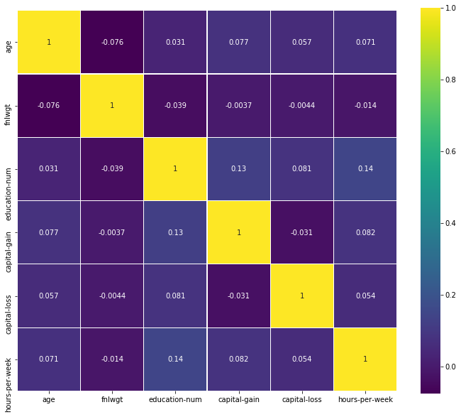
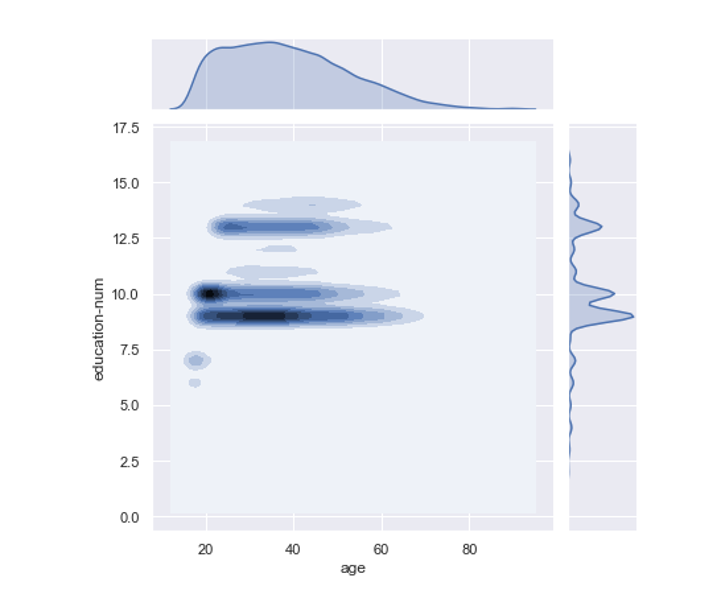
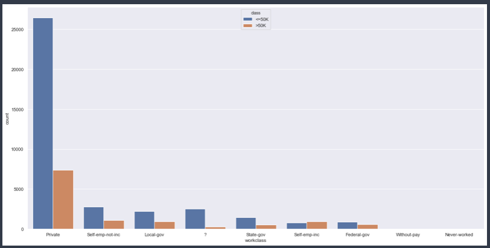
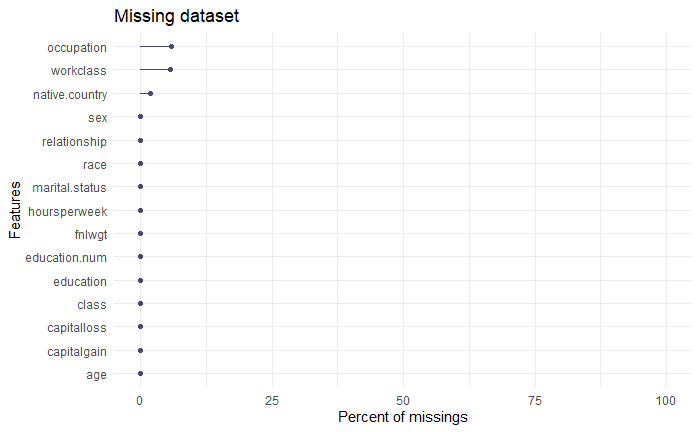
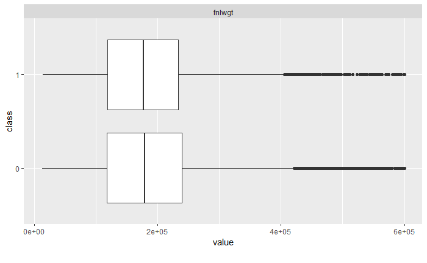
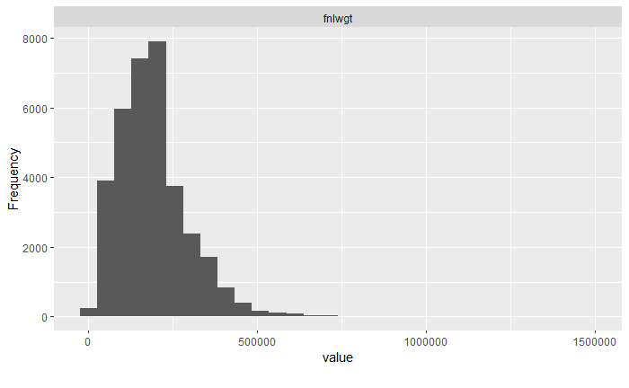

##  Surpassing black box model's performance on unbalanced data with an interpretable one using advanced feature engineering

*Authors: Witold Merkel, Adam Rydelek, Michał Stawikowski (Warsaw University of Technology)*

###  Abstract

Explainability is the most talked about topic of modern predictive models. The article touches on the topic of such models and their benefits. The main focus is to prove that even on complicated data, explainable models can achieve comparable performance to the best black-box models. Not only are there described strategies allowing better results but also greater explainability. The dataset used in experiments is the adult dataset from OpenML which is from Census database. During the experiments there are multiple processing techniques used, SAFE and different imputation methods among others. Every tool used is explained and the results gained from each part are shown and explained. Thanks to the fact that adult dataset is vastly unbalanced there is a perfect opportunity to present techniques which can be used to handle such tasks. All those methods combined allow for a presentation of a clear workflow enhancing explainable models performance with emphasis on decision tree models. The best results we achieved with decision tree model using methods mentioned above. However at first the best score was achieved by logistic regression, which from the start beat the black boxes. On the other hand it was not possible to tune it, to get it any better. For this reason, our final model is a decision tree, that despite starting as one of the worst surpasses all of the other boxes white and black. This shows that everything can be accomplished with adequate feature engineering, while keeping them explainable.

###  Introduction and Motivation

Recently, an increase in demand of interpretable models can be seen. Machine learning models have gained in popularity in recent years among many fields of business science, industry and also more and more often in medicine. Interpretability is a quickly growing part of machine learning, and there have been many works examining all of the aspects of interpretations. [@IMLDEA] The problem, however, turned out to be blackbox models, which did not provide sufficient information about the motivation in making specific decisions by the models. Some of machine learning models are considered as black boxes. This means that we can get accurate predictions from them, but we give up the ability of clearly explaining or identifying the logic behind these decisions. [@IML] Interpretability of models is a desirable feature among specialists in fields other than machine learning, it helps them make better decisions, justify their choices, and combine expert knowledge with the model's indications.

Humans and computers work differently in how they sense, understand and learn. Machines deals with large volume of data and finding hidden patterns in it and people are better at seeing the bigger picture and finding high-level patterns. [@UME] Trust and transparency are also demanded. There are many methods that can help us create an interpretable model. One of the ways to achieve interpretability is to use only a certain subset of algorithms that create interpretable models. Some of the algorithms considered to be interpretable are: linear regression, logistic regression, decision trees or K Nearest Neighbours (KNN). [@christophmonlar] Another way may be to use blackboxes to create an interpretable model. They can help us during transformation of the original data set or, for example, in selecting variables.

In this article, we will discuss the process of creating an interpretable model whose target effectiveness will be comparable to blackbox models. We will present the whole workflow, during which we will get acquainted with the dataset with which we will work, we will use advanced feature engineering methods and compare the results obtained during all phases of process. An additional problem we will face during work will be unbalanced data and creating a model that will take them into account during prediction. We will use machine learning tools and frameworks available in R and Python.

###  Data

The dataset used is the adult dataset from OpenML. The original data comes from UCI and was extracted by Barry Becker from the 1994 Census database. The task is to predict whether a given adult makes more than $50,000 a year based attributes such as:

* age,

* race,

* sex,

* education,

* native country,

* work class,

* weekly work hours,

* capital gain,

* capital loss,

* proximation for the demographic background of people,

* relationship,

* marital status,

* occupation.

In the above mentioned dataset we can observe a problem with target class distribution which is vastly unbalanced. The ratio of positive and negative values is around one to four. The dataset has overall of more than forty eight thousand observations and fifteen features, some of which are scarce.

###  Related work

Many works concerning Explainable Artificial Intelligence have arose during the last few years as the topic got more and more popular. [Explainable Artificial Intelligence (XAI): Concepts, Taxonomies, Opportunities and Challenges toward Responsible AI] [@EAICTOC] is a paper about XAI in general and many challenges concerning the topic. The article addresses all kinds of easily explainable models which set our focus on enhancing kNN and decision tree based models. [SAFE ML: Surrogate Assisted Feature Extraction For Model Learing] [@gosiewska2019safe] on the hand focuses on using Black Box models as surrogate models for improving explainable models.

###  Methodology

As mentioned before we are going to work on an unbalanced dataset. In order to handle this issue and achieve the best possible results during our future work we are going to use two measures: AUPRC and AUC. The former one is designed to take the lack of balance into account. The dataset will be divided into two partitions using stratification in order to handle scarce factor levels. The training part of the dataset is going to be used to compare the effects of many processes used to enhance the results. We are going to use five fold cross-validation. The final results are going to be presented using the test dataset.

Our workflow can be divided into the following steps:

####  EDA

In this part we have gotten accustomed with the dataset. We started with feature distribution and definition analysis and studied the dependency of other variables on the target class. The column correlation was also taken into account.

#####  Distribution of numeric variables

On this plot we can see the distribution of numeric variables. Some of them are normally distributed but there are also highly skewed variables such as capital-gain and capital-loss.

#####  Correlation plot of numeric variables

On this plot we can observe that the numeric variables have weak correlations with each other.

#####  Density of observations by age and education

We can see the density of observations divided by age and education-num features. Education-num is a numeric variable that depicts the education level in an ordered way.

#####  Level of education by target class

We can observe that the highest rate of positive target class is for PHD and professors which does not surprise.

#####  Work class by target class

The highest rate when divided by work class can be observed for self-employed people.

#####  Age by target class

The density of people earning more than $50000 is skewed toward the elderly.

####  Initial Data Preparation

The main focus of this part is to analyze and input the missing data. The side tasks are handling outliers and transformation of skewed variables using logistic functions. A few most popular imputation methods will be compared. We are not only going to use basic aggregation functions like mean and mode but also other machine learning models and advance imputation methods like [@MICE]. The results are going to be compared using a model that is robust to missing data which is a basic decision tree.

#####  Missing Data by Feature

Missing data can be observed in three columns. They account up to eight percent of data.

#####  Missing Data Pattern

The bottom figure shows relation between missing variables, when a certain variables is absent in correspondence to other.

#####  Imputation Results

| Imputation type                	| AUPRC     	| AUC       	|
|--------------------------------	|-----------	|-----------	|
| none                           	| 0.6457237 	| 0.8357408 	|
| Mean and mode basic imputation 	| 0.6472785 	| 0.8362379 	|
| KNN imputation                 	| 0.6547221 	| 0.838437  	|
| MICE imputation                	| 0.6452505 	| 0.834577  	|
| Missing data removal           	| 0.6515376 	| 0.8355305 	|

We can observe that the best results were achieved using KNN imputation so from now on this will be the used method.

#####  Outliers

Some outliers can be observed in fnlwgt columns which is described as proximation for the demographic background of people. The data was cropped to 300000 value.

#####  Skewness

The previously mentioned feature was also skewed. The solution for this problem was a basic logistic transformation.

The transformation was successful and the new feature has an appropriate distribution.

####  Feature Engineering and Tuning

Firstly we are going to compare a few most popular Machine Learning models on our initially prepared dataset. We picked three popular explainable models: **KNN**, **Decision Tree** and **Logistic Regression**.

#####  First comparison of models

The best result was achieved by logistic regression which was surprising and shows how capable explainable models can be even on complex data, non of later modifications had any impact on the model so we decided to exclude it from further considerations. The next best explainable model ranked by AUPRC was **KNN** and **Decision Tree**. Due to the fact that logistic regression obtained a better result than black boxes at the very start, and the **KNN** model is not globally interpretable, we will focus on the decision tree, which is a popular and easily interpretable model. That is the reason why we are going to work mainly with this model and initially with KNN for comparison in our goal to achieve similar results to Black Box models using it, but our final model will be a decision tree. The best Black boxes were **Random Forest** and **Adaboost**, because of that in the later phase of our project we will depend on them to make our results better. During the Feature Engineering we will utilize strategies such as transforming and extracting features using the SAFE algorithm mentioned in the article above. Amongst other strategies we will use variable selection based on random forest feature importance and tuning models with Bayesian optimization - mlrMBO [@BO] based on custom measure: AUPRC and not the typical AUC. Another interesting aspect that we are going to look into is changing the type of target to numeric and by doing so changing our task from classification to regression, surprisingly it improves our results.

##### rSAFE

> The SAFE ML algorithm uses a complex model as a surrogate. New binary
> features are created on the basis of surrogate predictions. These new
> features are used to train a simple refined model. (...) method
> that uses elastic black-boxes as surrogate models to create a simpler,
> less opaque, yet still accurate and interpretable glass-box models.
> New models are created on newly engineered features extracted/learned
> with the help of a surrogate model.

[@gosiewska2019safe]

To extract new variables we will use rSAFE, which will depend on two different Black Box models: Random Forest and Adaboost. Those models were tuned to increase the final result. Based on the initial variables and the new ones created by the rSafe algorithm, we will choose the combination that will be the best for this problem. We will achieve this by analyzing various values ​​of the "regularization penalty" parameter in the data extraction algorithm in the rSafe package and choosing the one that gives us the best result.

| Model         	| From AUPRC 	| To AUPRC 	| From AUC 	| To AUC 	|
|---------------	|----------	|--------	|------------	|----------	|
| decision tree 	| 0.655    	| 0.674  	| 0.842      	| 0.851    	|
| knn           	| 0.698    	| 0.706  	| 0.859      	| 0.868    	|

From the above table it can be observed that this method gave us a significant improvement in terms of AUC and AUPRC. New variables that were extracted and chosen with penalty regularization are:

* "age_new" - new levels: (-Inf, 32] and (32, Inf),
* "fnlwgt_new" - new levels: (-Inf, 11.70863] and (11.70863, Inf),
* "hours.per.week_new - new levels: (-Inf, 40] and (40, Inf),
* "race_new" - new levels: White_Asian-Pac-Islander and Amer-Indian-Eskimo_Other_Black.

##### Change to regression

The next approach we chose based on our previous experience with unbalanced datasets is changing our task from classification to regression and by doing so we improved our prediction. Non of later modifications had any impact on the KNN model so we decided to exclude it from further considerations.

| Model         	| From AUPRC 	| To AUPRC 	| From AUC 	| To AUC 	|
|---------------	|------------	|----------	|----------	|--------	|
| decision tree 	| 0.674      	| 0.716    	| 0.851    	| 0.865  	|

In case of KNN there was no visible improvement.

##### Variable selection

Additionally we carried out a variable selection on those that are currently used. It was based on feature importance from a random forest model, we use ten most important variables from fifteen that were being used before. 

| Model         	| From AUPRC 	| To AUPRC 	| From AUC 	| To AUC 	|
|---------------	|------------	|----------	|----------	|--------	|
| decision tree 	| 0.716      	| 0.720    	| 0.865    	| 0.871  	|

The improvement is slight, but because of this operation we are using a less complicated model, so we decided to use it.

##### Tuning

Last phase was tuning our decision tree model. We based it on mlrMBO, but our method is adjusted to the task. The optimized measure is AUPRC, this proces is slightly different from optimizing AUC. Before using MBO we select the optimal range of parameters like: "minsplit" - the minimum number of observations that must exist in a node in order for a split to be attempted. and "minbucket" - the minimum number of observations in any terminal node.. After selecting ten optimal values of the first one we select ten optimal for the second. For each of those hundred pairs we use MBO to find the optimal "cp" - complexity parameter. Any split that does not decrease the overall lack of fit by a factor of cp is not attempted. The result we achieved:

| Model         	| From AUPRC 	| To AUPRC 	| From AUC 	| To AUC 	|
|---------------	|------------	|----------	|----------	|--------	|
| decision tree 	| 0.720      	| 0.794    	| 0.871    	| 0.912  	|

Results achieved in this phase are really high, we managed to top those from black boxes and the logistic regression one.

#### Results and conclusion

From the above chart, we can see that thanks to our actions the performance of a fully interpretable model surpassed all basic black boxes and logistic regression, which from the start had really high results. It proves that it is possible to achieve comparable or even better results with interpretable models than black boxes even on unbalanced datasets, such as "adult". It requires some work, but there are a lot of methods that make it possible to improve our performance. Some of them may be based on very well-functioning black box models. Probably in comparison with tuned black box model, we would achieve lesser results, but interpretable models have an advantage, people can understand why some choices were made and can be safely use when transparency and ease of understanding are needed. Using models such as logistic regression or decision trees make it possible. In this paper we showed that models built using these algorithms after some modifications are able to get similar results to such powerful models as random forest or adaboost, and even artificial deep neural networks.

