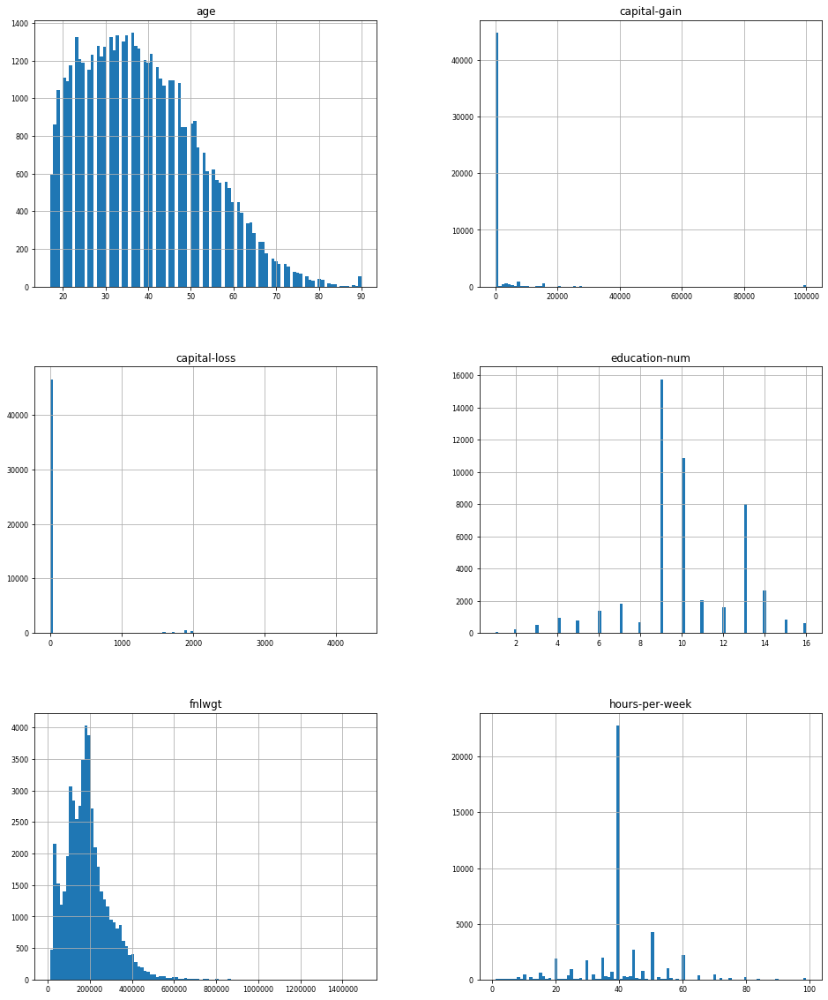
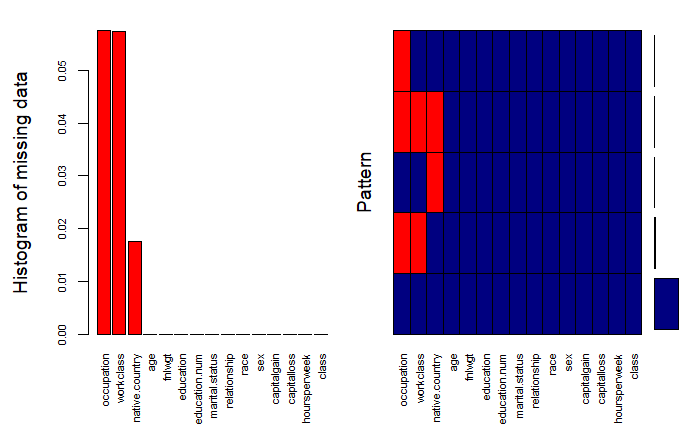
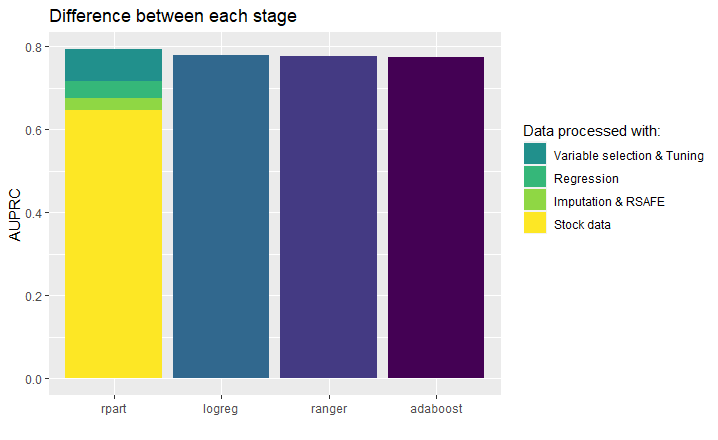

  
##  Surpassing black box model's performance on unbalanced data with an interpretable one using advanced feature engineering

*Authors: Witold Merkel, Adam Rydelek, Michał Stawikowski (Warsaw University of Technology)*

###  Abstract

Explainability is the most talked about topic of modern predictive models. The article touches on the topic of such models and their benefits. The main focus is to prove that even on complicated data, explainable models can achieve comparable performance to the best black-box models. Not only are there described strategies allowing better results but also greater explainability. The dataset used in experiments is the adult dataset from OpenML which is from Census database. During the experiments there are multiple processing techniques used, SAFE and different imputation methods among others. Every tool used is explained and the results gained from each part are shown and explained. Thanks to the fact that adult dataset is vastly unbalanced there is a perfect opportunity to present techniques which can be used to handle such tasks. All those methods combined allow for a presentation of a clear workflow enhancing explainable models performance with emphasis on decision tree models. The best results we achieved with decision tree model using methods mentioned above. However at first the best score was achieved by logistic regression, which from the start beat the black boxes. On the other hand it was not possible to tune it, to get it any better. For this reason, our final model is a decision tree, that despite starting as one of the worst surpasses all of the other boxes white and black. This shows that everything can be accomplished with adequate feature engineering, while keeping them explainable.

###  Introduction and Motivation

Recently, an increase in demand of interpretable models can be seen. Machine learning models have gained in popularity in recent years among many fields of business science, industry and also more and more often in medicine. Interpretability is a quickly growing part of machine learning, and there have been many works examining all of the aspects of interpretations. [@IMLDEA] The problem, however, turned out to be blackbox models, which did not provide sufficient information about the motivation in making specific decisions by the models. Some of machine learning models are considered as black boxes. This means that we can get accurate predictions from them, but we give up the ability of clearly explaining or identifying the logic behind these decisions. [@IML] Interpretability of models is a desirable feature among specialists in fields other than machine learning, it helps them make better decisions, justify their choices, and combine expert knowledge with the model's indications. Many works concerning Explainable Artificial Intelligence have arose during the last few years as the topic got more and more popular. [Explainable Artificial Intelligence (XAI): Concepts, Taxonomies, Opportunities and Challenges toward Responsible AI] [@EAICTOC] is a paper about XAI in general and many challenges concerning the topic. The article addresses all kinds of easily explainable models which set our focus on enhancing kNN and decision tree based models.

Humans and computers work differently in how they sense, understand and learn. Machines deals with large volume of data and finding hidden patterns in it and people are better at seeing the bigger picture and finding high-level patterns. [@UME] Trust and transparency are also demanded. There are many methods that can help us create an interpretable model. One of the ways to achieve interpretability is to use only a certain subset of algorithms that create interpretable models. Some of the algorithms considered to be interpretable are: linear regression, logistic regression, decision trees or K Nearest Neighbours (KNN). [@christophmonlar] Another way may be to use blackboxes to create an interpretable model. They can help us during transformation of the original data set or, for example, in selecting variables. [SAFE ML: Surrogate Assisted Feature Extraction For Model Learing] [@gosiewska2019safe] focuses on using Black Box models as surrogate models for improving explainable models with rSAFE which is going to be an important part of the workflow.

In this article, we will discuss the process of creating an interpretable model whose target effectiveness will be comparable to blackbox models. We will present the whole workflow, during which we will get acquainted with the dataset with which we will work, we will use advanced feature engineering methods and compare the results obtained during all phases of process. An additional problem we will face during work will be unbalanced data and creating a model that will take them into account during prediction. We will use machine learning tools and frameworks available in R and Python.

###  Data

The dataset used is the adult dataset from OpenML. The original data comes from UCI and was extracted by Barry Becker from the 1994 Census database. The task is to predict whether a given adult makes more than $50,000 a year based attributes such as:

| Name              	| Median/Mode          	|
|-------------------	|----------------------	|
| age               	| 37                   	|
| weekly work hours 	| 40                   	|
| capital gain      	| 0                    	|
| capital loss      	| 0                    	|
| fnlwgt            	| 178145               	|
| race              	| white                	|
| sex               	| male                 	|
| native country    	| USA                  	|
| work class        	| private              	|
| relationship      	| husband              	|
| martial status    	| married              	|
| occupation        	| other                	|
| education         	| high school graduate 	|
Table 3.6.1 - data introduction

For numerical variables median is presented and for categorical it is mode. All variables expect fnlwgt, capital-gain and capital-loss are self explanatory. Fnlwgt is an approximation for the demographic background of the people which assigns similar weights to people with similar demographic characteristic. Capital gain (loss) is a rise (fall) in the value of a capital asset that gives it a higher (lower) worth than the purchase price. It concerns only business owners, which is why the median is zero. In the data we can observe a problem with target class distribution which is vastly unbalanced. The ratio of positive and negative values is around one to four. The dataset has overall of more than forty eight thousand observations and fifteen features, some of which are scarce. By observing the distribution of variables in the dataset, there is more information to be gained about the data structure.

Some of the variables presented on *figure 3.6.1* are normally distributed but there are also highly skewed variables such as capital-gain and capital-loss. From the age variable we can see that most of the data describes young people, which is consistent with the distribution of working people in most western countries. From further analysis we discovered that aged people tend to earn more than youth, so age is important for classification. Capital-gain and capital-loss are centered at zero and show little variation. For this reason they will be of lesser relevance for the model. From further analysis we discovered that education-num is highly correlated with target, higher educated individuals usually earn more than $50000. From observation density exploration it can be see that most of the people in the dataset are young with secondary education. Fnlwgt plot is right skewed, which will be dealt with during initial data preparation. From hours-per-week it can be observed that the most popular working time is 40 hours per week.  From further analysis of the dataset it can be observed that only self-employed work class has a higher percentage of positive target value (earning more than $50000) than negative.

Columns of the bottom part of *figure 3.6.2* presents a pattern in which the missing data occurs. Each column stands for one pattern, which describes records containing missing data in red color and complete ones in blue. For example the most popular ones are those in which there is no missing data. The second most popular pattern is one with missing values in columns occupation and work class. Missing data percentage is low, but imputation should improve the results a little bit. 

Numeric variable are generally weakly correlated with each other, the highest dependance can be observed between hours-per-week and education. People with education greater than secondary tend to work more than 40 hours per week. Capital-gain is also correlated with education - the higher the education the bigger the capital-gain. The rest of numeric variables are independent of each other. All of this information combined provides a complete description of the dataset.

###  Methodology

As mentioned before we are going to work on an unbalanced dataset. In order to handle this issue and achieve the best possible results during our future work we are going to use two measures: AUPRC and AUC. The former one is designed to take the lack of balance into account. The dataset will be divided into two partitions using stratification in order to handle scarce factor levels. The training part of the dataset is going to be used to compare the effects of many processes used to enhance the results. We are going to use five fold cross-validation. The final results are going to be presented using the test dataset. 

#### Initial Data Preparation

The first part concerned is Initial Data Preparation which focuses on imputing the missing data. The side tasks are handling outliers and transformation of skewed variables using logistic functions. 

A few most popular imputation methods will be compared. Four different methods were used. The first one was mean and mode imputation - replacing missing data with mean for numeric variables and mode for categorical. The next one was more advanced - KNN imputation - calculates the mean or mode from k nearest neighbours in training data. The third one was MICE imputation - the most advanced one, predictive mean matching. The last one was simply removing the rows containing missing data. After the imputation, the problem with skewness of fnlwgt distribution presented in *figure 3.6.1* was handled. To deal with it a simple logarithmic transformation was conducted. The transformation was successful and the new feature has an appropriate distribution.

#### Feature Engineering and Tuning

Firstly we are going to compare a few most popular Machine Learning models on our initially prepared dataset. We picked three popular explainable models: **KNN**, **Decision Tree** and **Logistic Regression**. During the Feature Engineering we will utilize strategies such as transforming and extracting features using the SAFE algorithm mentioned in the article above. 

> The SAFE ML algorithm uses a complex model as a surrogate. New binary
> features are created on the basis of surrogate predictions. These new
> features are used to train a simple refined model. (...) method
> that uses elastic black-boxes as surrogate models to create a simpler,
> less opaque, yet still accurate and interpretable glass-box models.
> New models are created on newly engineered features extracted/learned
> with the help of a surrogate model.

[@gosiewska2019safe]

To extract new variables we will use rSAFE, which will depend on two different Black Box models: Random Forest and Adaboost. Those models were tuned to increase the final result. Based on the initial variables and the new ones created by the rSafe algorithm, we will choose the combination that will be the best for this problem. We will achieve this by analyzing various values of the "regularization penalty" parameter in the data extraction algorithm in the rSafe package and choosing the one that gives us the best result.

The consecutive step is changing the classification task to regression which is not a common practice, but based on our previous experience it proves to be successful for decision tree models created on unbalanced data. The complexity does suffer from the increase in leaves, but the model retains it's interpretability which was crucial for the task.

Additionally we carried out a variable selection on those that are currently used. It was based on feature importance from a random forest model. We used ten most important variables from fifteen that were being utilised before.

The last phase of this section was tuning our decision tree model. We based it on mlrMBO, but our method is adjusted to the task. The optimized measure is AUPRC, this proces is slightly different from optimizing AUC. Before using MBO we select the optimal range of parameters like: "minsplit" - the minimum number of observations that must exist in a node in order for a split to be attempted and "minbucket" - the minimum number of observations in any terminal node. After selecting ten optimal values of the first one we select ten optimal for the second. For each of those hundred pairs we use MBO to find the optimal "cp" - complexity parameter. Any split that does not decrease the overall lack of fit by a factor of cp is not attempted. 

### Results

####  Initial Data Preparation and Model Comparison

| Imputation type                	| AUPRC     	| AUC       	|
|--------------------------------	|-----------	|-----------	|
| none                           	| 0.6457237 	| 0.8357408 	|
| Mean and mode basic imputation 	| 0.6472785 	| 0.8362379 	|
| KNN imputation                 	| 0.6547221 	| 0.838437  	|
| MICE imputation                	| 0.6452505 	| 0.834577  	|
| Missing data removal           	| 0.6515376 	| 0.8355305 	|
Table 3.6.2 - results of different imputation measured in AUC and AUPRC

From *table 3.6.2* we can observe that the best results were achieved using KNN imputation so from now on this will be the used method. This is not surprising, because it is an advanced mean and mode imputation method. Difference between methods is little and even the KNN method improved AUPRC by less than one percent. Reason behind this is probably the low amount of missing data.

From *figure 3.6.3* we can see that the best result was achieved by logistic regression which was surprising and shows how capable explainable models can be even on complex data. Although being the best on raw data, none of the later modifications had any impact on the model so we decided to exclude it from further considerations. The next best explainable model ranked by AUPRC was **KNN** and **Decision Tree**. Due to the fact that logistic regression obtained a better result than black boxes at the very start, and the **KNN** model is not globally interpretable, we will focus on the decision tree, which is a popular and easily interpretable model. That is the reason why we are going to work mainly with this model and initially with KNN for comparison in our goal to achieve similar results to Black Box models using it, but our final model will be a decision tree. The best Black boxes were **Random Forest** and **Adaboost**, because of that in the later phase of our project we will depend on them to make our results better. 

#### Feature Engineering and Tuning

| Model         	| From AUPRC 	| To AUPRC 	| From AUC 	| To AUC 	|
|---------------	|----------	|--------	|------------	|----------	|
| decision tree 	| 0.655    	| 0.674  	| 0.842      	| 0.851    	|
| knn           	| 0.698    	| 0.706  	| 0.859      	| 0.868    	|
Table 3.6.3 - base models performance before and after applying rSAFE measured in AUC and AUPRC

From *table 3.6.3* it can be observed that this method gave us a significant improvement in terms of AUC and AUPRC. New variables that were extracted and chosen with penalty regularization are:

* "age_new" - new levels: (-Inf, 32] and (32, Inf),
* "fnlwgt_new" - new levels: (-Inf, 11.70863] and (11.70863, Inf),
* "hours.per.week_new - new levels: (-Inf, 40] and (40, Inf),
* "race_new" - new levels: White_Asian-Pac-Islander and Amer-Indian-Eskimo_Other_Black.

After using rSAFE we conducted the rest of the workflow on decision tree models because non of the later modifications had any impact on the KNN model so we decided to exclude it from further considerations.

| Stage                | From AUPRC | To AUPRC | From AUC | To AUC |
|----------------------|------------|----------|----------|--------|
| Change to regression | 0.674      | 0.716    | 0.851    | 0.865  |
| Variable selection   | 0.716      | 0.720    | 0.865    | 0.871  |
| Tuning               | 0.720      | 0.794    | 0.871    | 0.912  |
Table 3.6.4 - model performance before and after each stage measured in AUC and AUPRC

Changing the task improved the performance vastly and so we considered it worth it despite the added complexity. The improvement of variable selection on the other hand is slight, but because of this operation we are using a less complicated model, so we decided to use it and try to minimize the complexity gain generated by chaning the task type. Tuning was the most impactful part which surged the performance, topping all tested black boxes and logistic regession.

### Final Results

From *figure 3.6.4*, we can see that thanks to our actions the performance of a fully interpretable model surpassed all basic black boxes and logistic regression, which from the start had really high results. Each  stage improved the performance, but the most significant part was variable selection and tuning. Changing task to regression gave a surprisingly impactful upswing in AUPRC despite being the easiest one to conduct. On the other hand rSAFE and imputation were the most demanding, but provided the least improvement. 

### Conclusions

Summarizing the work on adult dataset, we were able to create an explainable decision tree surpassing any other model using various data preparation and tuning methods. We were not required to take any compromises concerning explainability to achieve the best performance. Methods used such as rSAFE,  imputation, or hyperparameter tuning do not affect the interpretability. The final results prove that it is possible to achieve comparable or even better results with interpretable models than black boxes even on unbalanced datasets, such as "adult". It requires some work, but there are a lot of methods that make it possible to improve our performance. Some of them may be based on very well-functioning black box models. Probably in comparison with tuned black box model, we would achieve lesser results, but interpretable models have an advantage, people can understand why some choices were made and can be safely use when transparency and ease of understanding are needed. Using models such as logistic regression or decision trees make it possible. In this paper we showed that models built using these algorithms after some modifications are able to get similar results comparable to such powerful models as random forest or adaboost, and even artificial deep neural networks.
