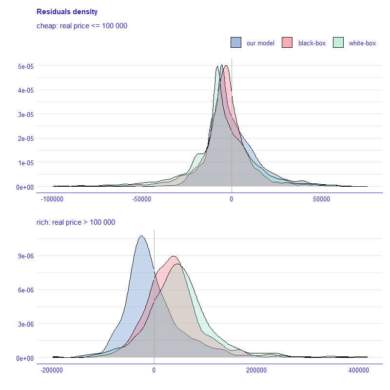
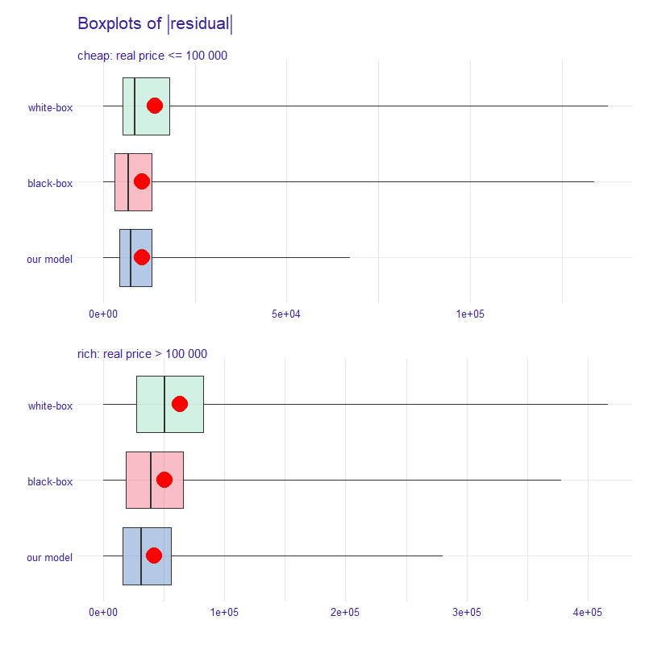

## Which Neighbours Affected House Prices in the '90s? 

*Authors: Hubert Baniecki, Mateusz Polakowski (Warsaw University of Technology)*

### Introduction
  
Real estate value varies over numerous factors. These may be obvious like location or interior design, but also less apparent like the ethnicity and age of neighbours. Therefore, property price estimation is a demanding job that often requires a lot of experience and market knowledge. Is or was, because nowadays, Artificial Intelligence (AI) surpasses humans in this task. Interested parties more often use tools like supervised Machine Learning (ML) models to precisely evaluate the property value and gain a competitive advantage.

The dilemma is in blindly trusting the prediction given by so-called black-box models. These are ML algorithms that take loads of various real estate data as input and return a house price estimation without giving their reasoning. Black-box complex nature is its biggest strength and weakness at the same time. This trait regularly entails high effectiveness but does not allow for interpretation of model outputs. Because of that, specialists interested in supporting their work with automated ML decision-making are more eager to use white-box models like linear regression or decision trees. These do not achieve state-of-the-art performance efficiently, but instead, provide valuable information about the relationships present in data through model interpretation.

For many years houses have been the most popular properties; thus, they are of particular interest for ordinary people. What exact influence had the demographic characteristics of the house neighbourhood on its price in the '90s? Although in the absence of current technology, it has been hard to answer such question years ago, now we can.

In this paper, we perform a case study on the actual US. Census data from 1990 and deliver an interpretable white-box model that estimates the median house price by the region. We present multiple approaches to this problem and choose the best model, which achieves similar performance to complex black-boxes. Finally, using its interpretable nature, we answer various questions that give a new life to this historical data. 

**TODO** add citations

### Related Work

**TODO**

https://arxiv.org/abs/1901.01774

https://arxiv.org/abs/1808.02547

https://arxiv.org/abs/1909.00704


### Data

For this case study we use the *house_8L* dataset crafted from the data collected in 1990 by the US. Census Bureau.
Each record stands for a distinct US. state while the target value is a median house price in a given region.
The variables are presented in Table \@ref(tab:3-7-dataset).

```{r 3-7-dataset, echo = FALSE}
library(kableExtra)
text_tbl <- data.frame(
  "Original name" = c("price", "P3", "H15.1", "H5.2", "H40.4", "P11.3", "P16.2", "P19.2", "P6.4"),
  "New name" = c("price", "house_n", "avg_room_n", "forsale_h_pct", "forsale_6mplus_h_pct",
                 "age_25_64_pct", "family_2plus_h_pct", "black_h_pct", "asian_p_pct"),
  "Description" = c(
    "median price of the house in the region",
    "total number of households",
    "average number of rooms in an owner-occupied Housing Units", 
    "percentage of vacant Housing Units which are for sale only",
    "percentage of vacant-for-sale Housing Units vacant more then 6 months",
    "percentage of people between 25-64 years of age",
    "percentage of households with 2 or more persons which are family households",
    "percentage of households with black Householder",
    "percentage of people which are of Asian or Pacific Islander race"
  )
)
colnames(text_tbl) <- c("Original name", "New name", "Description")
kable(text_tbl, align=c('c', 'c', 'c'), caption="Description of variables present in the house_8L dataset.") %>%
  kable_styling("bordered", full_width = F) %>%
  column_spec(1, width = "10em", bold = F) %>%
  column_spec(2, width = "10em", bold = T) %>%
  column_spec(3, width = "40em", background = "white") 
```

Furthermore, we will apply our Metodology (Section 4) on a corresponding *house_16H* dataset, which has the same target but a different set of variables.
More correlated variables of a higher variance make it significantly harder to estimate the median house price in a given region.
Such validation will allow us to evaluate our model on a more demanding task.
The comprehensive description of used data can be found in [@housepricesdata].


### Methodology

In this section, we are going to focus on developing the best white-box model, which provides interpretability of features. Throughout this case study, we use the Mean Absolute Error (MAE) measure to evaluate the model performance, because we focus on the residuals while the mean of absolute values of residuals is the easiest to interpret.

#### EDA

The main conclusions from the Exploratory Data Analysis are as follows:

1. The target value is very skewed (See Figure \@ref(fig:3-7-eda)).
2. There are 6 percentage and 2 count variables.
3. The dataset has over 22k data points.
4. There are 46 data points with unnaturally looking target value. 
5. There are no missing values.

```{r 3-7-eda, cache=FALSE, out.width="800", fig.align="center", echo=FALSE, eval = is.html, fig.cap="(L) Histogram of the target values. (R) Examplary variable correlation with the target."}
knitr::include_graphics('images/3-7-eda.png')
```

Therefore we decided that:

1. We will not transform the skewed target because this might provide less interpretability.
2. There are not many possibilities for feature engineering.
3. We can reliably split the data into train and test using 2:1 ratio.
4. We suspect that the target value of *500001* is artificially made, so we remove these outliers.

Throughout this case study, we use the Mean Absolute Error (MAE) measure to evaluate the model performance, because we later focus on the residuals while the mean of absolute values of residuals is the easiest to interpret.

#### SAFE 

The first approach was using the SAFE [@gosiewska2019safe] technique to engineer new features and produce a linear regression model. We trained a well-performing black-box `ranger` [@ranger] model and extracted new interpretable features using its Partial Dependence Profiles [@pdp]. Then we used these features to craft a new linear model which indeed was better than the baseline linear model by about 10%. It is worth noting that both of these linear models had a hard time succeeding because of target skewness.

#### Divide-and-conquer

In this section, we present the main contribution of this paper.
The divide-and-conquer idea has many computer science applications, e.g. in sorting algorithms, natural language processing, or parallel computing.
We decided to make use of its core principles in constructing the method for fitting the enhanced white-box model.
The final result is multiple tree models combined which decisions are easily interpretable.

The proposed algorithm presented in the Figure \@ref(fig:3-7-algorithm) is:

1. Divide the target variable with `k` middle points into `k+1` groups.
2. Fit a black-box classifier on train data which predicts the belonging to the `i-th` group.
3. Use this classifier to divide the train and test data into `k+1` train and test subsets.
4. For every `i-th` subset fit a white-box estimator of target variable on the `i-th` train data.
5. Use the `i-th` estimator to predict the outcome of the `i-th` test data.

```{r 3-7-algorithm, cache=FALSE, out.width="800", fig.align="center", echo=FALSE, eval = is.html, fig.cap="The divide-and-conquer algorithm used to construct an enhanced white-box model."}
knitr::include_graphics('images/3-7-algorithm.png')
```

**pytanie: czy dodawać wypunktowanie w caption schematu? W paper tak, a w książce lepiej wygląda bez (?)**

The final product is a stacked model with one classifier and `k+1` estimators. For the house price task, we chose `k = 1`, and the middle point was arbitrary chosen as `100k`, which divides the data into two groups in about a 10:1 ratio. We used the `ranger` random forest model as a black-box classifier and the `rpart` [@rpart] decision tree model as a white-box estimator. Such a solution allows us to achieve competitive performance with interpretable features. 

### Results

#### Final model

**TODO** add info about the parameters. describe the plot

```{r cache=FALSE, out.width="800", fig.align="center", echo=FALSE, eval = is.html}
knitr::include_graphics('images/3-7-tree-cheap.svg')
```

```{r cache=FALSE, out.width="800", fig.align="center", echo=FALSE, eval = is.html}
knitr::include_graphics('images/3-7-tree-rich.svg')
```

#### Comparison

We next compare our stacked model with baseline `ranger` and `rpart` models, respectively referred to as black-box and white-box.

**TODO** describe the plots

```{r cache=FALSE, out.width="800", fig.align="center", echo=FALSE, eval = is.html}

```

```{r cache=FALSE, out.width="800", fig.align="center", echo=FALSE, eval = is.html}

```

```{r 3-7-table-results, echo = FALSE}
library(kableExtra)
text_tbl <- data.frame(
  'Model' = c('ranger', "xgboost", 'linear model', "SAFE on ranger", 'rpart', "stacked model"),
  'house_8L' = c(14829, 16035, 23057, 21408, 19195, 14605),
  'house_16H' = c(15602, 16499, 24051, 22601, 22145, 15273)
)
text_tbl <- text_tbl[c(3,4,5,2,1,6),]
text_tbl$house_8L <- paste0(signif(text_tbl$house_8L, 3)/1000, "k")
text_tbl$house_16H <- paste0(signif(text_tbl$house_16H, 3)/1000, "k")
rownames(text_tbl) <- NULL
kable(text_tbl, align=c('c', 'c', 'c'), caption="Comparison of the MAE score for all of the used models on test datasets.") %>%
  kable_styling("bordered", full_width = F) %>%
  column_spec(1, width = "20em", bold = T) %>%
  column_spec(2, width = "10em", bold = F) %>%
  column_spec(3, width = "10em", bold = F) %>%
  row_spec(c(4,5), background = "#f05a71", color = "black") %>%
  row_spec(c(1,2,3, 6), background = "#8bdcbe", color = "black") %>%
  add_header_above(c(" " = 1, "Dataset (test)" = 2)) 
  #row_spec(c(6), background = "#4378bf", color = "white")
```


### Conclusions

**TODO** 
