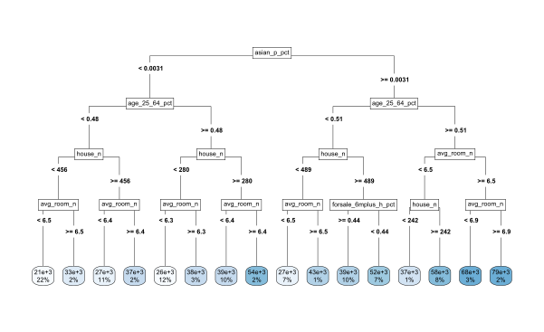

## Which Neighbours Affected House Prices in the '90s? 

*Authors: Hubert Baniecki, Mateusz Polakowski (Warsaw University of Technology)*

<!-- Which Neighbours Affected the Price Of a House in the '90s? -->
<!-- What Affects The Price Of A House? US Census Data Revisited After 30 Years.-->

### Introduction
  
Real estate value varies over numerous factors. These may be obvious like location or interior design, but also less apparent like the ethnicity and age of neighbours. Therefore, property price estimation is a demanding job that often requires a lot of experience and market knowledge. Is or was, because nowadays, Artificial Intelligence (AI) surpasses humans in this task. Interested parties more often use tools like supervised Machine Learning (ML) models to precisely evaluate the property value and gain a competitive advantage.

The dilemma is in blindly trusting the prediction given by so-called black-box models. These are ML algorithms that take loads of various real estate data as input and return a house price estimation without giving their reasoning. Black-box complex nature is its biggest strength and weakness at the same time. This trait regularly entails high effectiveness but does not allow for interpretation of model outputs. Because of that, specialists interested in supporting their work with automated ML decision-making are more eager to use white-box models like linear regression or decision trees. These do not achieve state-of-the-art performance efficiently, but instead, provide valuable information about the relationships present in data through model interpretation.

For many years houses have been the most popular properties; thus, they are of particular interest for ordinary people. What exact influence had the demographic characteristics of the house neighbourhood on its price in the '90s? Although in the absence of current technology, it has been hard to answer such question years ago, now we can.

In this paper, we perform a case study on the actual US. Census data from 1990 and deliver an interpretable white-box model that estimates the median house price by the region. We present multiple approaches to this problem and choose the best model, which achieves similar performance to complex black-boxes. Finally, using its interpretable nature, we answer various questions that give a new life to this historical data. 

**TODO** add citations

### Related Work

**TODO**

https://arxiv.org/abs/1901.01774

https://arxiv.org/abs/1808.02547

https://arxiv.org/abs/1909.00704


### Data

<!-- http://www.cs.toronto.edu/~delve/data/census-house/censusDetail.html -->

For this case study we use the *house_8L* dataset crafted from data collected in US. in 1990 by the US. Census Bureau.
Each record stands for a distinct state while the target value is a median house price in a given region.
The variables are:
`house_n` - total number of households,
`avg_room_n` - average number of rooms in an owner-occupied Housing Units,
`forsale_h_pct` - percentage of vacant Housing Units which are for sale only,
`forsale_6mplus_h_pct` - percentage of vacant-for-sale Housing Units vacant more then 6 months,
`age_25_64_pct` - percentage of people between 25-64 years of age,
`family_2plus_h_pct` - percentage of households with 2 or more persons which are family households,
`black_h_pct` - percentage of households with black Householder,
`asian_p_pct` - percentage of people which are of Asian or Pacific Islander race.

Furthermore, we will apply our Metodology (Section 4) on a corresponding *house_16H* dataset, which has the same target but different set of variables.
More correlated variables of a higher variance make it significantly harder to estimate the median house price in a given region.
Such validation will allow us to evaluate our model on a more demanding task.
The comprehensive description of used data can be found in <>.


### Methodology

In this section, we are going to focus on developing the best white-box model, which provides interpretability of features. Throughout this case study, we use the Mean Absolute Error (MAE) measure to evaluate the model performance, because we later focus on the residuals while the mean of absolute values of residuals is the easiest to interpret.

#### EDA

**TODO** introduction

The main conclusions from the Exploratory Data Analysis (EDA) are as follows:

1. There are no missing values.
2. The target value is very skewed.
3. There are six percentage and two count variables.
4. The dataset has over 22k data points.

Therefore we decided that:

1. There is no need to impute missing values.
2. We will not transform the skewed target because this might provide less interpretability.
3. There are not many possibilities for feature engineering.
4. We can reliably split the data into train and test using 2:1 ratio.

#### rSAFE 

The first approach was using the SAFE [@safe] technique to engineer new features and produce a linear regression model. We took a well-performing black-box `ranger` [@ranger] model and extracted new interpretable features using its Partial Dependence Profiles. Then we used these features to craft a new linear model which indeed was better than the baseline linear model by about 10%. It is worth noting that both of these linear models had a hard time succeeding because of target skewness.

#### Divide-and-conquer

In this section, we present the main contribution of this paper.
The divide-and-conquer idea has many computer science applications, so we decided to make use of its core principles in delivering the best white-box model that estimates the median house price.
The algorithm is:

1. Divide the target variable with `k` middle points into `k+1` groups.
2. Fit a black-box classifier on train data which predicts the belonging to the `i-th` group.
3. Use this model to divide the train and test data into `k+1` train and test subsets.
4. For each `i-th` subset fit a white-box estimator on the `i-th` train data and predict the outcome on the `i-th` test data.

For this simple task, we chose `k = 1`, and the middle point was arbitrary chosen as 100k, which divides the data in about a 10:1 ratio. We used the `ranger` random forest model as a black-box classifier and the `rpart` [@rpart] tree as a white-box estimator. Such a solution allows us to achieve competitive performance with interpretable features.

### Results

#### Final model

**TODO** describe plots

```{r cache=FALSE, out.width="800", fig.align="center", echo=FALSE, eval = is.html}

```

```{r cache=FALSE, out.width="800", fig.align="center", echo=FALSE, eval = is.html}
knitr::include_graphics('images/3-7-tree_rich.svg')
```

#### Comparison

Finally, we will compare our model with the black-box `ranger` and the white-box `rpart`.

**TODO** describe the plots + add the table with all scores

```{r cache=FALSE, out.width="800", fig.align="center", echo=FALSE, eval = is.html}
knitr::include_graphics('images/3-7-density.png')
```

```{r cache=FALSE, out.width="800", fig.align="center", echo=FALSE, eval = is.html}
knitr::include_graphics('images/3-7-boxplot.png')
```

#### Harder task ???


### Conclusions

**TODO**

add citations to bib

https://arxiv.org/abs/1902.11035

https://www.jstatsoft.org/article/view/v077i01

https://github.com/bethatkinson/rpart

https://journal.r-project.org/archive/2019/RJ-2019-036/index.html